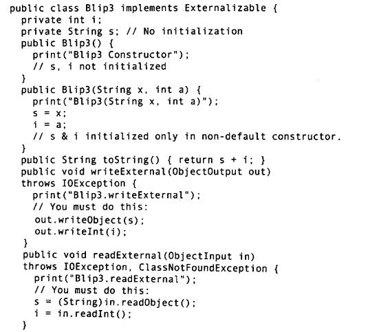

#### 对象的序列化

JAVA中实现serialization主要靠两个类:

ObjectOuputStream

ObjectInputStream

（创建 OutputStream 和 InputStream 包装在 ObjectOuputStream/ObjectInputStream中）

方法：

1. 对象实现serialization接口

自动最终对象的引用。注意在还原过程中，没有调用任何的构造器。包括默认的构造器。直接从InputStream 恢复来的。
还原过程中必须保证jvm找到 .class 文件。

2. 序列化控制 Externalizable

对象的构造函数必须是public, 反序列化的时候，所有普通默认构造函数会被（必须）调用。后调用readExternal().



transient 关键字

防止对象的属性被序列化。一般和serialization 一起使用。因为Externalizable对象在默认的情况下不保存任何字段。

3. Externalizable 的替代方法


```java
private void writeObject(ObjectOuputStream stream) throws IOException;

private void readObject(ObjectInputStream stream) throws IOException,  ClassNotFoundExcption;

```


