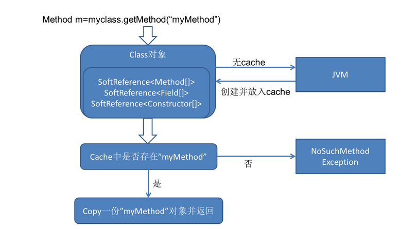
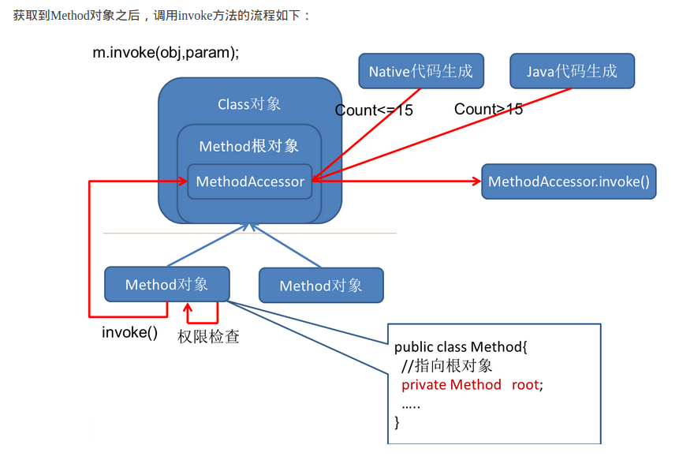

反射机制:反射机制是在运行状态中，对于任意一个类，都能够知道这个类的所有属性和方法；对于任意一个对象，都能够调用它的任意一个方法和属性.

作用：

在运行时判断任意一个对象所属的类；

在运行时构造任意一个类的对象；

在运行时判断任意一个类所具有的成员变量和方法；

在运行时调用任意一个对象的方法；

生成动态代理。

获得类对象的三种方法

```java
class1 = Class.forName("完整路径名称");
class2 = new TestReflect().getClass();
class3 = TestReflect.class;
```
```java
package reflection;
import util.Print;
import java.io.Serializable;
import java.lang.reflect.*;
import java.util.ArrayList;
import java.util.Calendar;
import java.util.List;

/**
 * Created by atmlinux on 17-4-15.
 */
public class TestReflect implements Serializable{
    public static void main(String[] args) throws ClassNotFoundException, IllegalAccessException, InstantiationException, InvocationTargetException, NoSuchMethodException, NoSuchFieldException {
        Class<?> c1 = TestReflect.class; // 1
        TestReflect  t1 = new TestReflect();
        Class<?> c2 = t1.getClass();// 2
        Class<?> c3 = Class.forName("reflection.TestReflect");
        //get class name
        Print.print(c1.getName());
        // get superclass name , interface
        Class<?> superClass = c1.getSuperclass();
        Print.print(superClass.getName());
        // get interface
        Class<?>[] interfaces  = c1.getInterfaces();
        for(Class<?> c : interfaces){
            Print.print(c.getName());
        }
        // get constructor and  create object
        Class<?> userClass = Class.forName("reflection.User");
        Constructor<?>[] constructors = userClass.getConstructors();
        for(Constructor<?> constructor : constructors){
            Print.prinnb(constructor.getName()+"(");
            Class<?>[] clazzs = constructor.getParameterTypes();
            for(Class<?> type:clazzs){
                Print.prinnb(type.getName()+",");
            }
            Print.print(")");
        }
        // 默认构造函数
        User user1 = (User)userClass.newInstance();
        user1.setAge(10);
        user1.setName("xiaoming");
        //使用构造函数进行创建对象
        User user2 = (User)constructors[2].newInstance("xiaodong");
        User user3 = (User)constructors[1].newInstance(13,"mingming");
        Print.print(user1.toString());
        Print.print(user2.toString());
        Print.print(user3.toString());
        // get all type
        Field[] fields1 = userClass.getFields();// 取得实现的接口或者父类的属性
        Field[] fields = userClass.getDeclaredFields(); //  get all field
        for(Field f: fields){
            Print.print(Modifier.toString(f.getModifiers())+"  "+f.getType().getName()+"  "+f.getName());
        }
        for(Field f: fields1){
            Print.print(Modifier.toString(f.getModifiers())+"  "+f.getType().getName()+"  "+f.getName());
        }
        //get all methods
        Method[] methods = userClass.getMethods();
        StringBuffer stringBuffer = new StringBuffer();
        for(Method m:methods){
            for(Class<?> type:m.getParameterTypes()){
                stringBuffer.append(type.getName()+" ");
            }
            Print.prinnb(Modifier.toString(m.getModifiers()) +" "+ m.getReturnType().getName() +" "+ m.getName()+
            "(" + stringBuffer+") ");
            stringBuffer = new StringBuffer();
            // get Exception types
            Class<?>[] exceptionTypes = m.getExceptionTypes();
            for(Class<?> exception: exceptionTypes){
                Print.prinnb(exception.getName()+" ");
            }
            Print.print();
        }
        // get a method
        Method m = userClass.getMethod("getAge");
        m.invoke(userClass.newInstance());

        Method m1 = userClass.getMethod("setAge",int.class);
        User user4 = (User) userClass.newInstance();
        m1.invoke(user4,19);
        Print.print(user4.toString());

        // 操作某个类的属性 ,应用于sprring ioc

        Field f = userClass.getDeclaredField("age"); // 获取当前类中某个属性

        f.setAccessible(true);// 设置可访问, 否则private 无法访问
        f.set(user4,20);// 设置某个对象的属性
        Print.print(user4.toString()); //此处可以用于spring ioc

        //　动态代理

        MyProxyClass myProxyClass = new MyProxyClass(new User("sch"));
        UserOne userOne = (UserOne) myProxyClass.getProxyObject();
        userOne.talk();

        //在泛型为Integer的ArrayList中存放一个String类型的对象
        List<Integer> list = new ArrayList<>();

        Method m3 = list.getClass().getMethod("add",Object.class);
        m3.invoke(list,"string");
        Print.print(list.get(0));

        // 取得并修改数组的元素
        int[] temp = {1,3,3,4};
        Class<?> tempClass = temp.getClass().getComponentType();
        Array.set(temp,0,100);
        Print.print(temp[0]);

        // 修改数组的大小
        Object obj = Array.newInstance(tempClass,20);

        System.arraycopy(temp,0,obj,0,Array.getLength(temp));
        for(int i:(int[])obj){
            Print.prinnb(i+" ");
        }

        // 应用于工厂类
        Print.print();
        UserFactory.getInstance("reflection.User").talk();
        UserFactory.getInstance("reflection.User2").talk();
    }
}
class User implements UserOne{
    private int  age;
    private String name;
    public User(){
        age = 0;
        name = "";
    }

    public  User(int age , String name){
        this.age = age;
        this.name =  name;
    }

    public User(String name){
        this.name = name;
    }

    public int getAge() {
        return age;
    }

    public void setAge(int age) {
        this.age = age;
    }

    public String getName() {
        return name;
    }

    public void setName(String name) {
        this.name = name;
    }
    @Override
    public String toString() {
        return "name:"+ name + "  age:" + age;
    }
    @Override
    public void talk() {
        Print.print("User1 is talking");
    }
}
class User2  implements UserOne{
    @Override
    public void talk() {
        Print.print("user2 is talking");
    }
}
class UserFactory{

    public static UserOne getInstance(String name){
        try {
            return (UserOne) Class.forName(name).newInstance();
        } catch (InstantiationException e) {
            e.printStackTrace();
        } catch (IllegalAccessException e) {
            e.printStackTrace();
        } catch (ClassNotFoundException e) {
            e.printStackTrace();
        }
        return null;
    }
}
interface UserOne{
     int count = 1;
     void talk();
}
class MyProxyClass implements InvocationHandler{

    private Object object;

    public MyProxyClass(Object object) {
        this.object = object;
    }

    @Override
    public Object invoke(Object o, Method method, Object[] objects) throws Throwable {

        Print.print("before method ");
        Object  result = method.invoke(object,objects);// method is the interface method
        Print.print("after method  ");
        return result;
    }

    public Object  getProxyObject(){
        return Proxy.newProxyInstance(object.getClass().getClassLoader(),
                object.getClass().getInterfaces(),this);
    }
}
```

##### 反射的缺点

但反射有两个缺点。第一个是 **性能问题**。用于字段和方法接入时反射要**远慢于直接代码**。性能问题的程度取决于程序中是如何使用反射的。如果它作为程序运行中相 对很少涉及的部分，缓慢的性能将不会是一个问题。即使测试中最坏情况下的计时图显示的反射操作只耗用几微秒。仅反射在性能关键的应用的核心逻辑中使用时性 能问题才变得至关重要。

一个缺点是 **使用反射会模糊程序内部实际要发生的事情**。程序人员希望在源代码中看到程序的逻辑，反射等绕过了源代码的技术会带来维护问题。反射代码比相应的直接代码更复杂，正如性能比较的代码实例中看到的一样。解决这些问题的最佳方案是保守地使用反射——**仅在它可以真正增加灵活性的地方** ——记录其在目标类中的使用。

#### java的反射机制如何实现?

Class对象是在加载类时由JVM构造的，JVM为每个类管理一个独一无二的Class对象，这份Class对象里维护着该类的所有Method，Field，Constructor的cache，这份cache也可以被称作根对象。

每次getMethod获取到的Method对象都持有对根对象的引用，因为一些重量级的Method的成员变量（主要是MethodAccessor），
我们不希望每次创建 Method对象 都要重新初始化，于是所有代表同一个方法的Method对象都共享着根对象的MethodAccessor，每一次创建都会调用根对象的copy方法复制一份.  





调用Method.invoke之后，会直接去调MethodAccessor.invoke。MethodAccessor就是上面提到的所有同名method共享的一个实例，由ReflectionFactory创建。

如果该方法的累计调用次数<=15，会创建出NativeMethodAccessorImpl，它的实现就是直接调用native方法实现反射；如果该方法的累计调用次数>15，会由java代码创建出字节码组装而成的MethodAccessorImpl。
