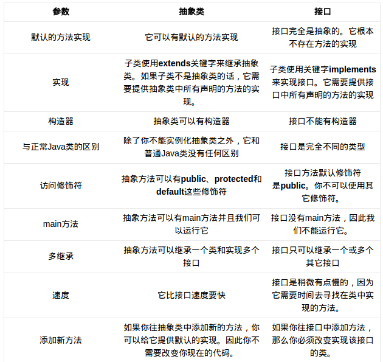

####　抽象类和接口的区别

默认方法 　抽象类有

实现　　一个是extends 一个是 implements

继承关系　抽象类可以继承一个类或实现多个接口,另一是继承多个接口

构造器　抽象类有

与java类的区别：抽象类除了不能实例化抽象类之外，和普通的java类
没有什么区别，接口是完全不同的类型

修饰符号　抽象类方法可以有public,protected,default，private等修饰符，而接口只能是public

main方法　抽象类里面可以main并且可以运行, 静态的方法可以执行, 只是不能实例化, 接口没有main方法。

添加方法：往抽象类中添加方法，可以提供默认的实现。因此不需要改变你现在的代码。但是添加接口中的方法就必须实现这些方法。

##### 什么时候使用抽象类和接口

如果你拥有一些方法并且想让它们中的**一些有默认实现**，那么使用抽象类吧。

如果你想实现**多重继承**，那么你必须使用接口。由于Java不支持多继承，子类不能够继承多个类，但可以实现多个接口。因此你就可以使用接口来解决它。

如果基本功能在不断改变，那么就需要使用抽象类。如果不断改变基本功能并且使用接口，那么就需要改变所有实现了该接口的类。

Java8中的默认方法和静态方法从而实现他们之间的差异。
