#### java 并发编程（三）

##### 对象的组合

将现有的安全组件组合成为规模更大的组件或程序。

设计线程安全的类

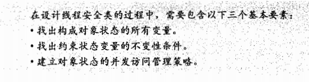

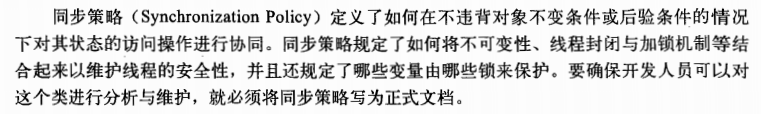

收集同步需求

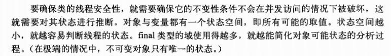

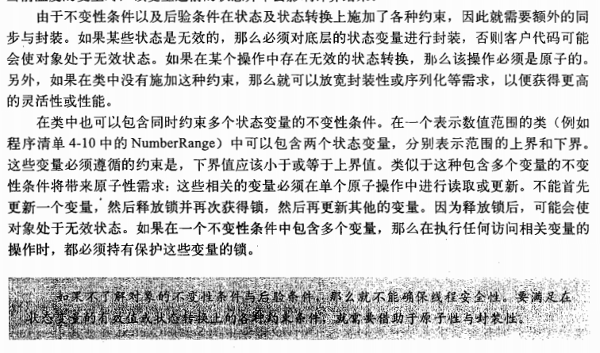

依赖状态的操作

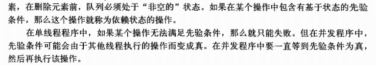

状态所有权

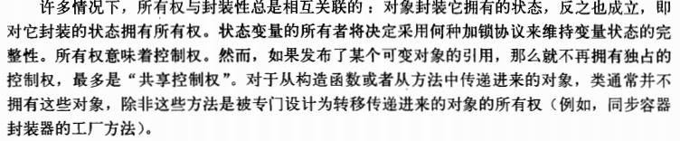

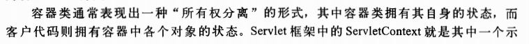

实例封闭

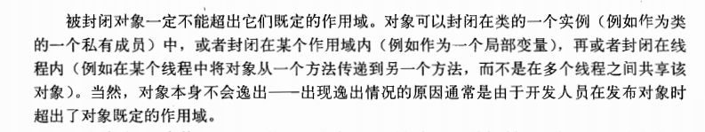

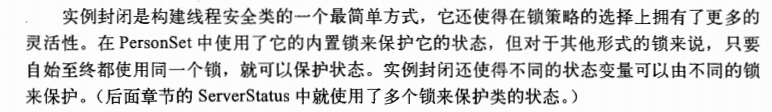

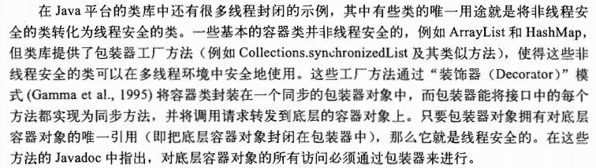

java 监视器模式 （java内置锁）

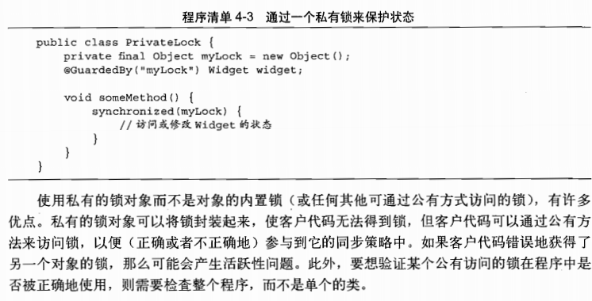

线程安全性委托

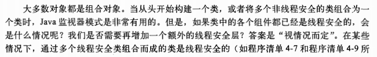

委托模型的例子

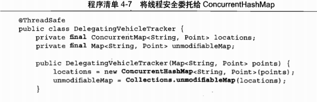

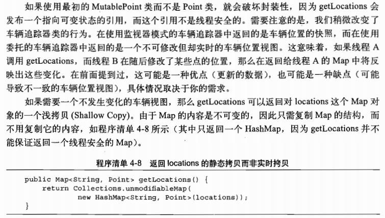

Collections.unmodifiableMap 保证了一个Map不会被修改

独立的状态变量

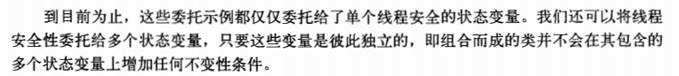

当委托失效

仅当一个变量参与到包含其他状态变量的不变性时，才可以声明为volatile

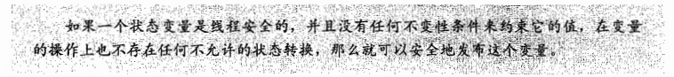

在现有的线程安全的类中添加功能

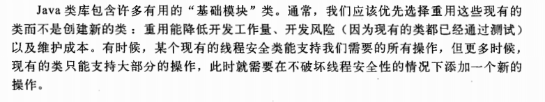

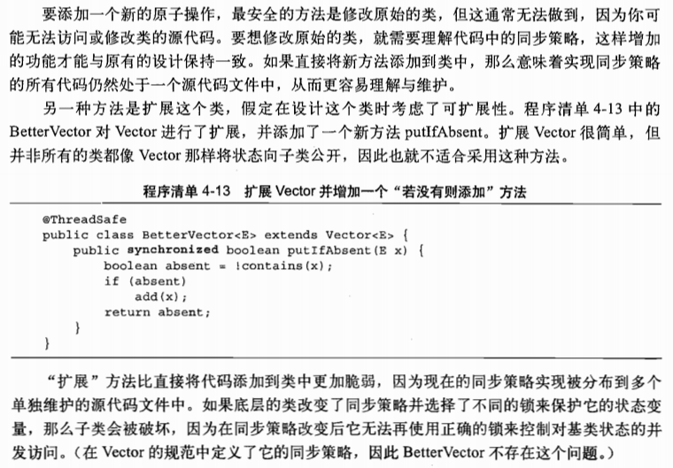

客户端加锁

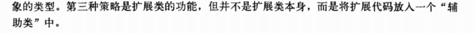

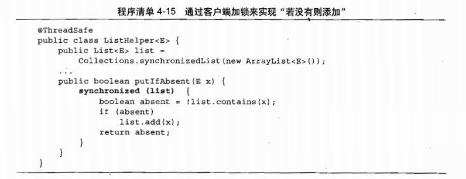
注意，加的锁要相同

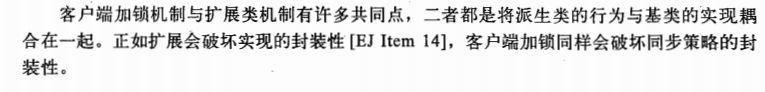

组合

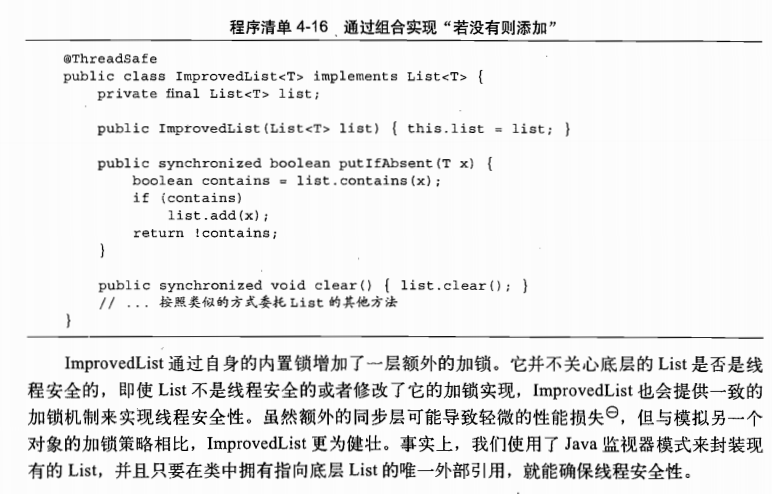

将同步策略文档化

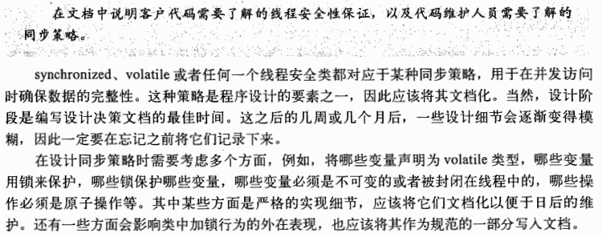
