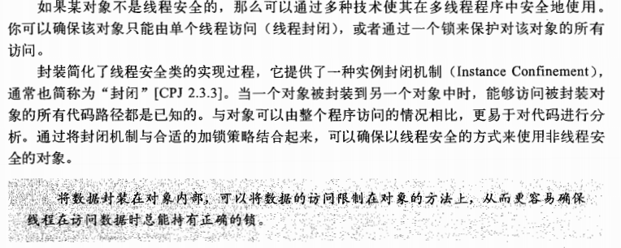
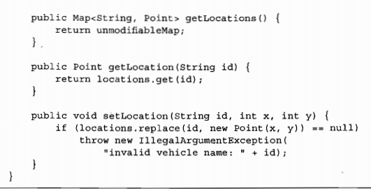

#### java 并发编程（三）

##### 对象的组合

将现有的安全组件组合成为规模更大的组件或程序。

设计线程安全的类

收集同步需求

依赖状态的操作

状态所有权

实例封闭

java 监视器模式 （java内置锁）

线程安全性委托

委托模型的例子

Collections.unmodifiableMap 保证了一个Map不会被修改

独立的状态变量

当委托失效

仅当一个变量参与到包含其他状态变量的不变性时，才可以声明为volatile

在现有的线程安全的类中添加功能

客户端加锁

注意，加的锁要相同

组合

将同步策略文档化

