#### java 并发编程（二）

​	编写线程安全的代码，核心在于要对状态访问操作进行正确管理，特别是对共享和可变的状态的访问。

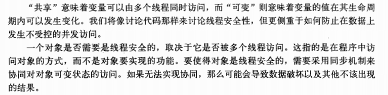

​同步： synchronized (独占加锁), volatile， 显示锁， 原子变量。

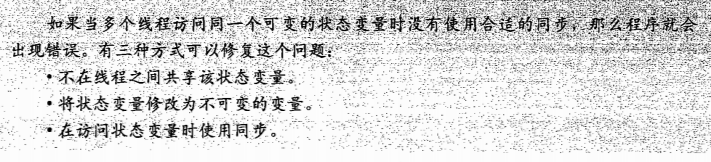

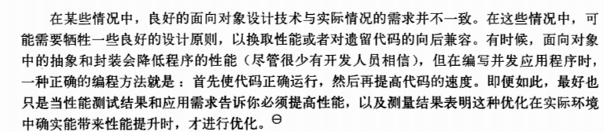

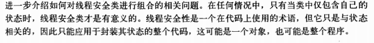

线程安全性：核心的概念是正确性（某个类的行为和其规范完全一致）。

规范：不变性条件约束对象的状态，后验条件描述对象的操作结果。

当多个线程访问某个类时，这个类始终都能表现出正确的行为。主调代码不需要任何额外的同步或协同。

无状态的对象一定是线程安全的。

竞争条件:当计算的正确性取决于多个线程的交替执行执行时序，那么就会发生竞争条件。

大多数竞争条件的本质：基于一种可能失效的观察结果来做出判断或执行某个计算。（先检查后执行等）

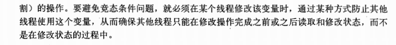

避免竞争条件的方式是原子操作。

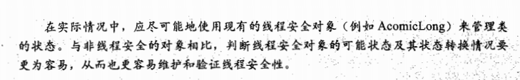

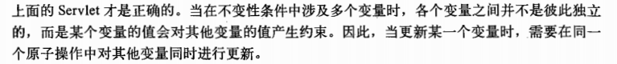

要保持状态的一致性，需要在单个原子操作中更新所有相关的的状态变量。

内置锁：同步代码块。

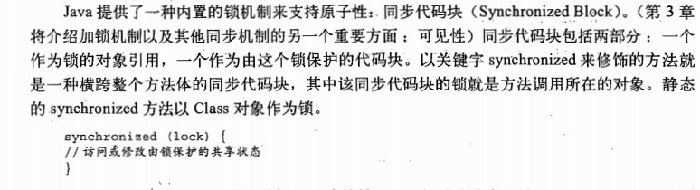

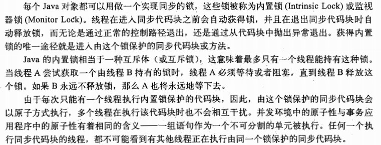

重入：内置锁是可重入的。获取锁的粒度是线程，而不是调用。(可避免死锁的发生)

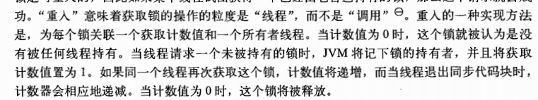

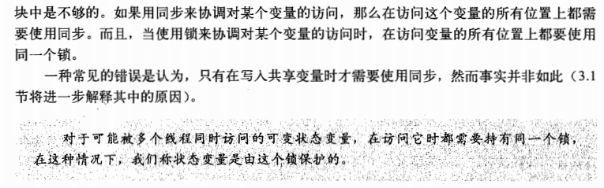

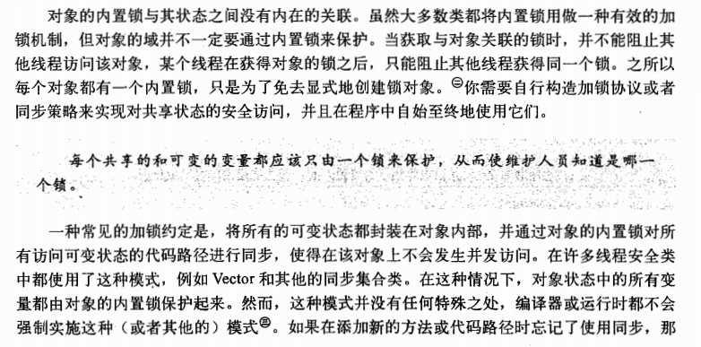

只有被多个线程访问的可变数据才需要通过锁来保护。

每个包含多个变量的不变性条件，其中涉及的变量都需要由同一个锁来保护。

缩小同步代码块的范围，提高并发性。

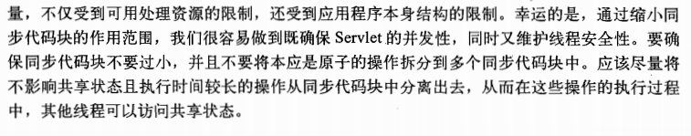

要判断同步代码块的合理大小，需要在各种设计需求之间进行权衡，包括安全性，简单性，性能。

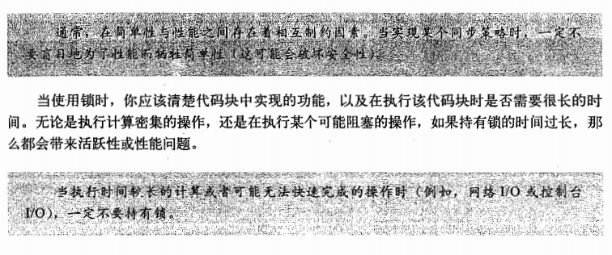

##### java 并发（三）

对象共享和发布对象，从而使他们能够安全的由多个线程同时访问。

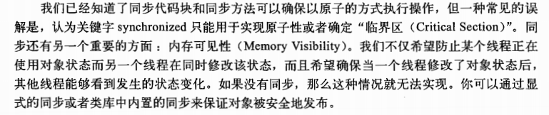

可见性（使用同步机制）

重排序：程序中的操作不按程序中指定的顺序执行。

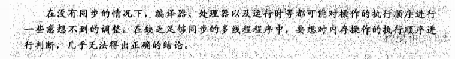

非volatile类型的64位数值变量(long, double)是非原子性的。

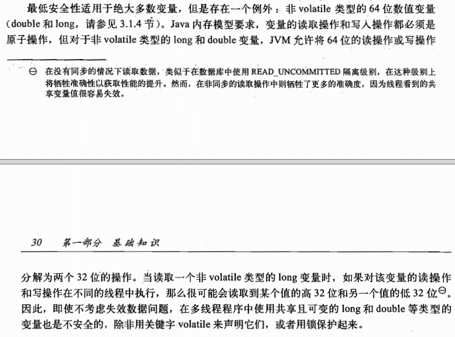

加锁和可见性

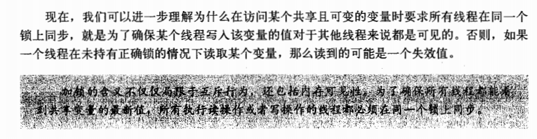

volatile变量：确保变量的更新操作通知到其他线程上。

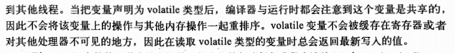

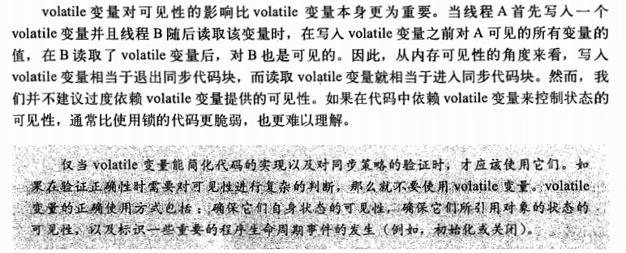

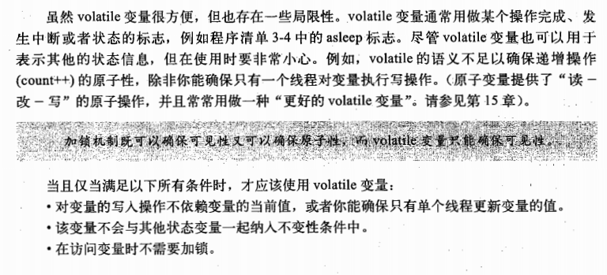

发布和逸出

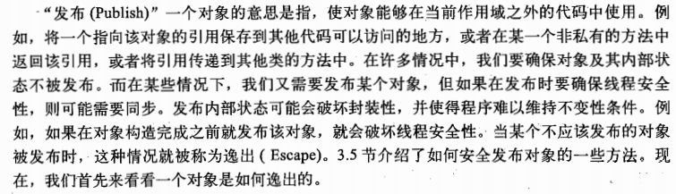

安全的对象构造过程:不要在构造过程中使用this引用。

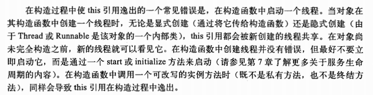

线程封闭

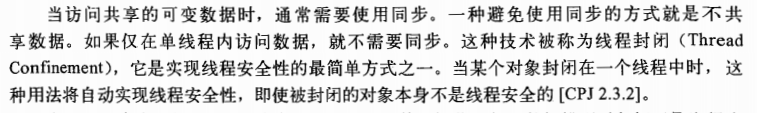

JDBC 线程封闭，再处理请求时，线程池将Connection其分配给一个请求线程，实现了线程封闭。

Ad-hoc 封闭

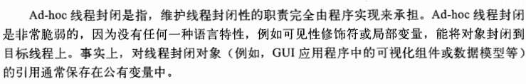

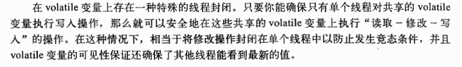

栈封闭 局部变量访问

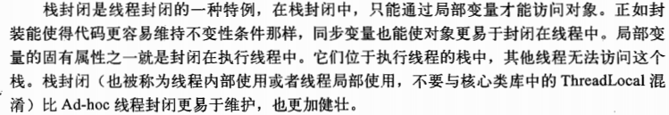

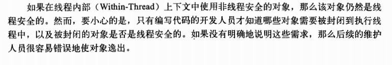

ThreadLocal类

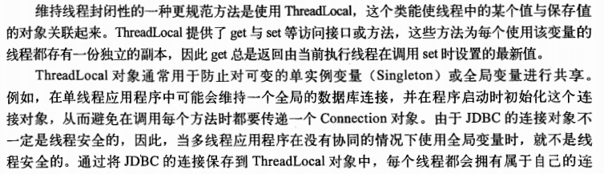

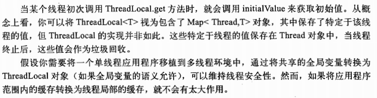

不变性

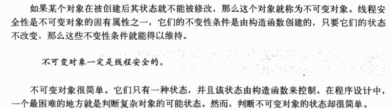

不可变性不等于将对象所有的域都声明为final类型。有可能是可变的。final 域中保存对可变对象的引用。

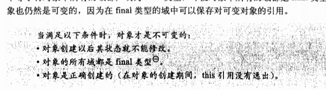

Final域 不可变，访问无需同步

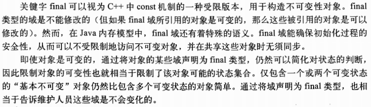

不可变对象提供了一种弱形式的原子性。

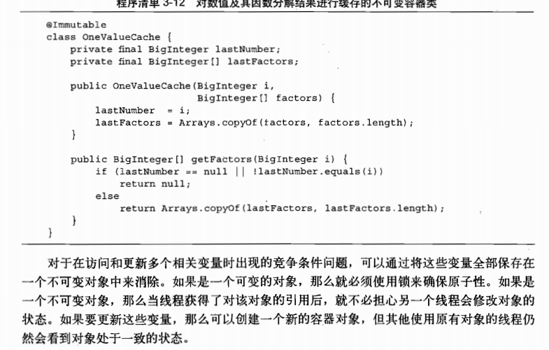

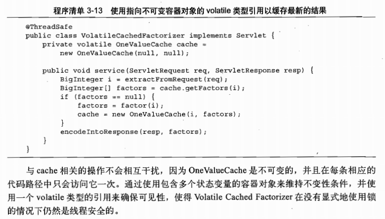

安全发布

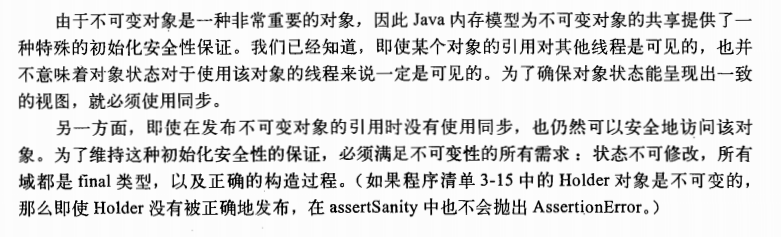

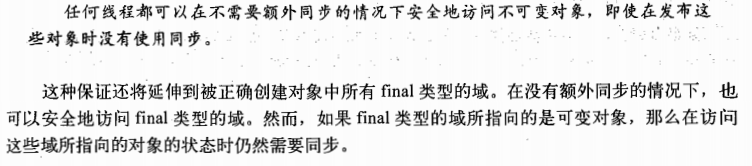

安全发布的常用模式

可变对象安全发布。

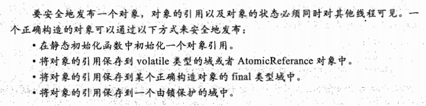

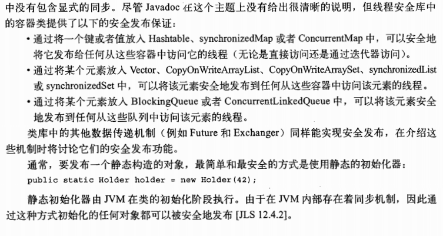

事实不可变对象

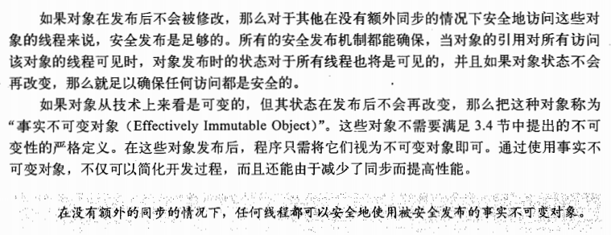

可变对象

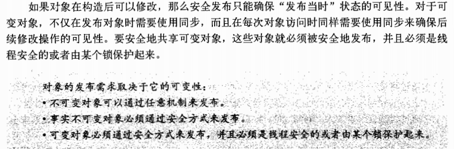

安全共享变量

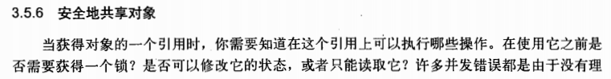

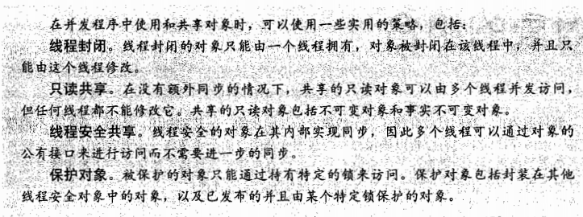
