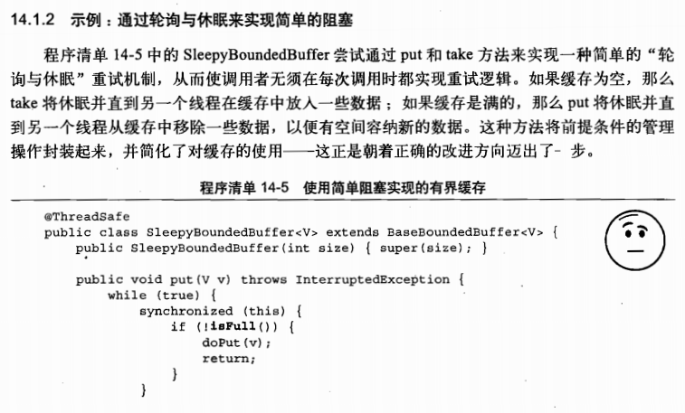
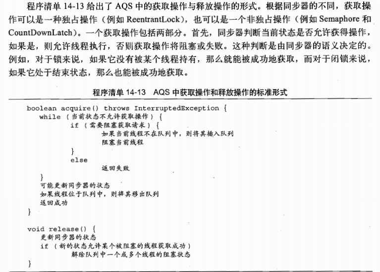

### 显示锁

###### Lock 与 ReentrantLock

lock 的用法:

###### 轮询锁和定时锁

trylock， 避免死锁的发生

可中断的锁获取操作

###### 非块结构的加锁

###### 性能考虑因素

###### 公平性

非公平性锁性能高的原因：

######  在synchronized和ReentrantLock 之间进行选择

ReentrantLock 使用场景

###### 读写锁

#### 构架自定义的同步工具

###### 状态依赖性的管理

轮询解决状态依赖问题

外部自己进行处理

条件队列（条件变量）

######  使用条件队列

条件谓词

过早唤醒

丢失的信号

通知

阀门类

子类的安全性问题

封装条件队列

人口协议和出口协议

显示的Condition 对象

await, signal, signalAll

synchronizer 剖析

AbstractQueueSynchronizer

一个简单的闭锁

java.util.concurrent 同步类中达到AQS

ReentrantLock

Semaphore 和 CountDownLatch

FutureTask

ReentrantReadWriteLock

