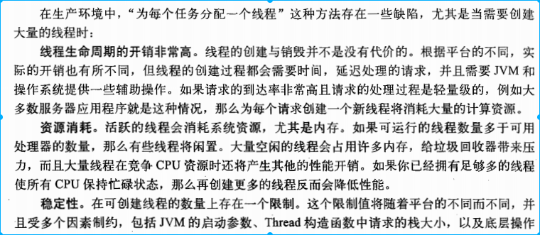
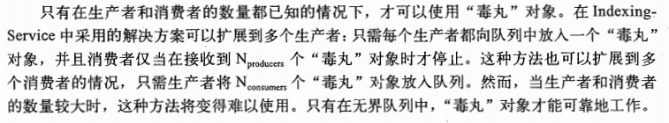
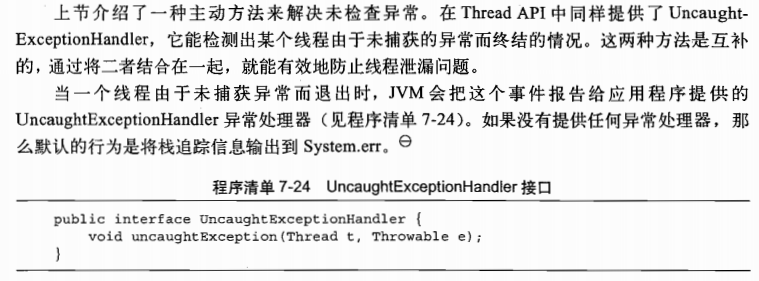
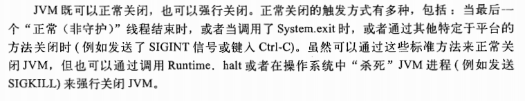

### 结构化并发应用程序

###### 六 任务执行

显示为任务创建线程

无限创建线程的不足

Executor 框架

任务是一组逻辑单元，而线程是使任务异步执行的机制。

提交和执行解耦

执行策略

**线程池**

Executor的生命周期

JVM 只有在所有（非守护）线程结束全部终止后才会退出。

延迟任务和周期任务

找出可利用的并行性

在异构任务并行化中存在的局限

CompletionService

使用Future将图片下载和html文本的渲染分离开

为任务设定时限

invokeAll

#### （六）取消与关闭

任务取消

中断

中断策略

响应中断

计时运行

通过Future来实现取消

处理不可中断的阻塞

采用newTaskFor来封装非标准的取消

停止基于线程的服务

日志服务

生产者 queue，消费者是 writer

关闭ExecutorService

毒丸对象

毒丸对象的使用注意点

shutdownNow的局限性

处理非正常的线程终止

未捕获异常的处理

JVM关闭

关闭钩子

守护线程

终结器

