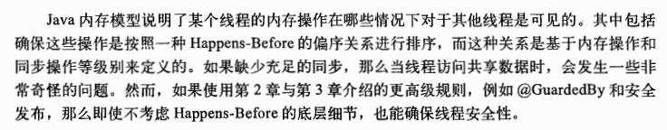

### 原子变量和非阻塞同步机制

锁的劣势

硬件对并发的支持

比较并交换

CAS （compare and swap）

非阻塞的计数器

JVM 对CAS的支持

原子变量类

原子变量是一种更好的 volatile

非阻塞算法

非阻塞的栈

非阻塞的链表

原子的域更新器

ABA问题

### java 内存模型

###### 平台的内存模型

###### 重排序

借助同步

发布

安全的发布对象

安全初始化模式

单例模式

双重检查加锁

初始化过程的安全性

