### java 并发编程 (六)

##### 线程池的使用

在任务与执行的策略之间的隐形耦合

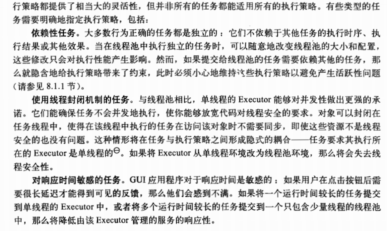
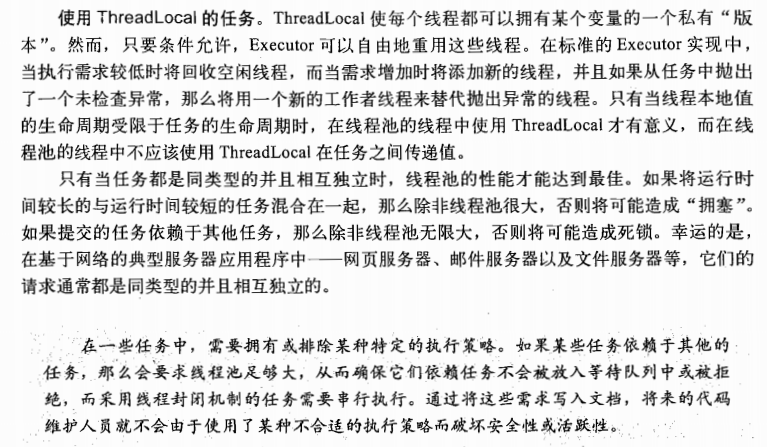

饥饿死锁

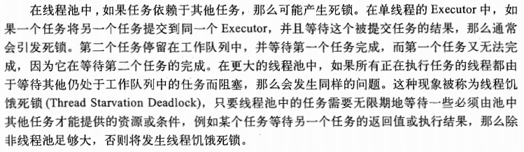

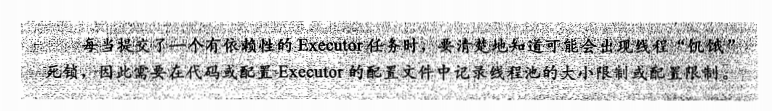

运行时间较长的任务

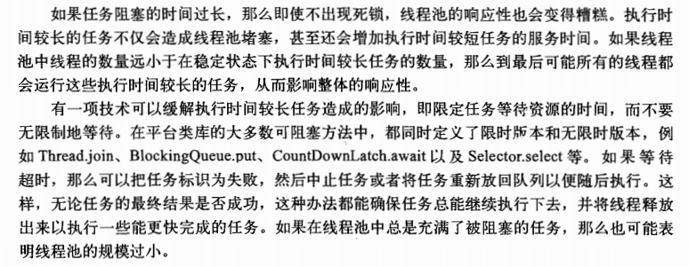

##### 设置线程池的大小

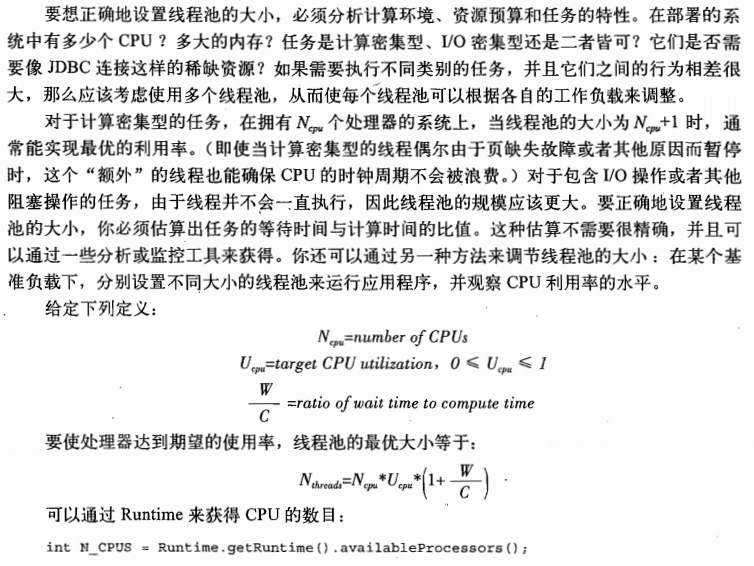

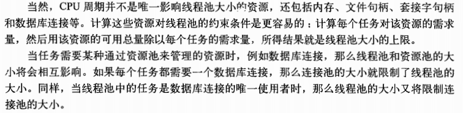

##### 配置ThreadPoolExecutor

线程的创建和销毁

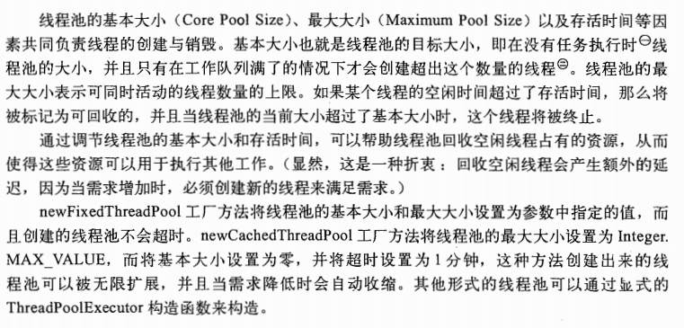

管理队列任务

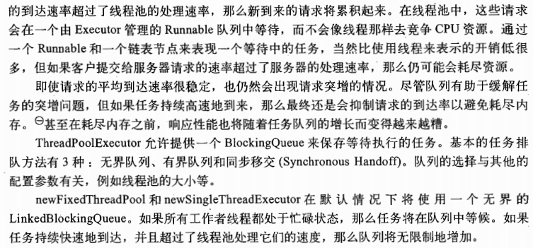

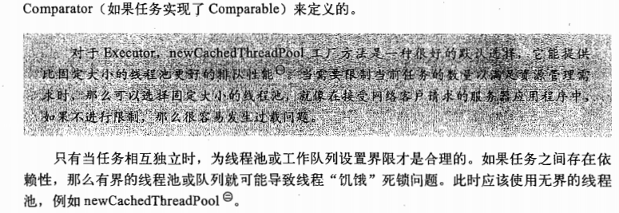

饱和策略

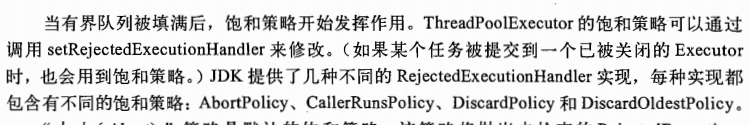

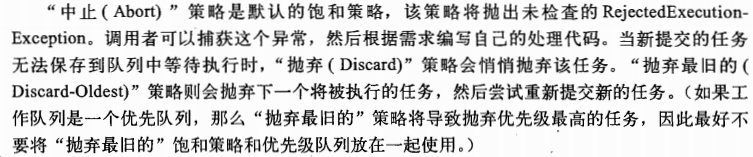

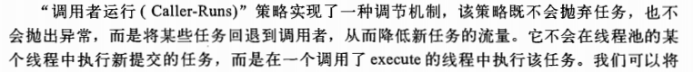

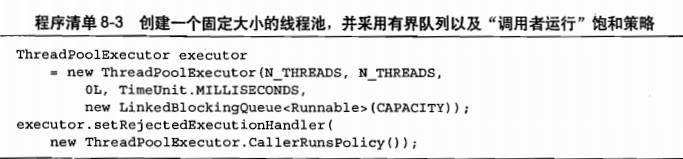

线程工厂

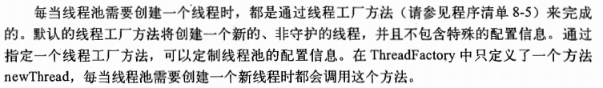

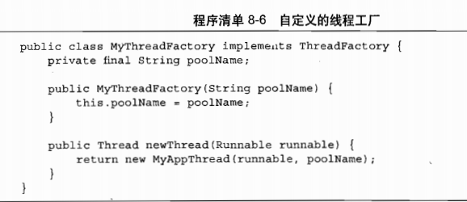

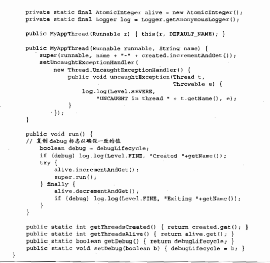

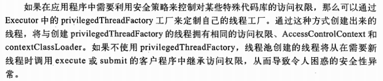

在调用构造函数后再定制ThreadPoolExecutor

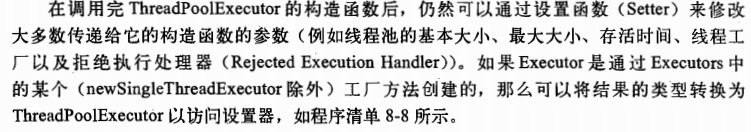

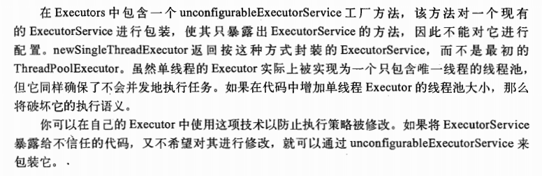

扩展ThreadPoolExecutor

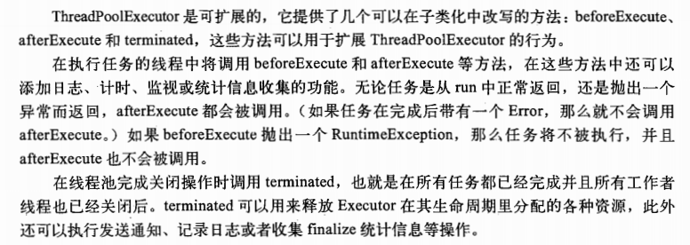

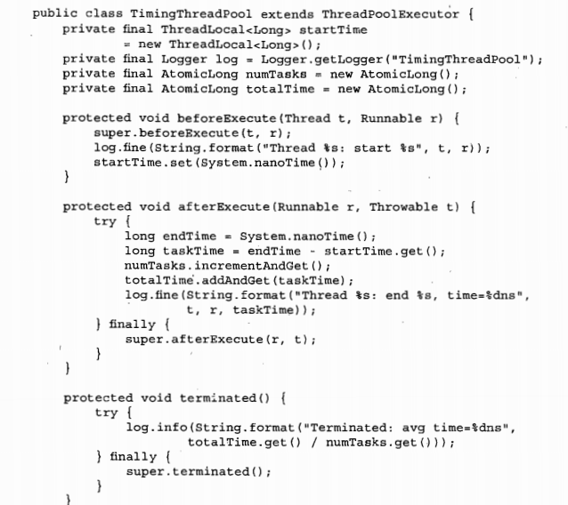

递归算法的并行性

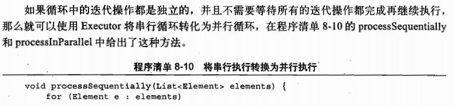

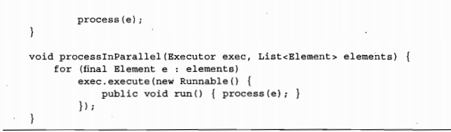

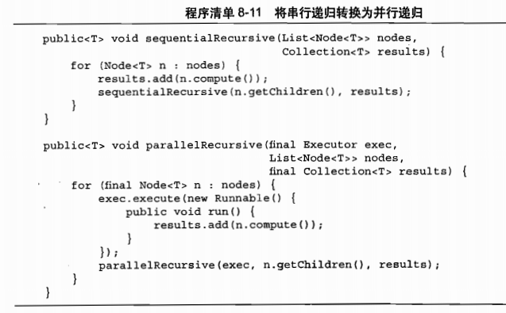

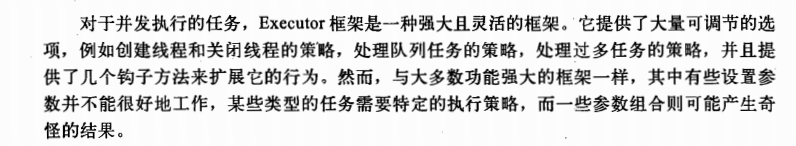

#### 避免活跃性危险（死锁，饥饿，活锁，糟糕的相应）

##### 死锁

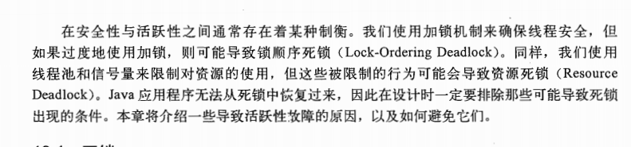

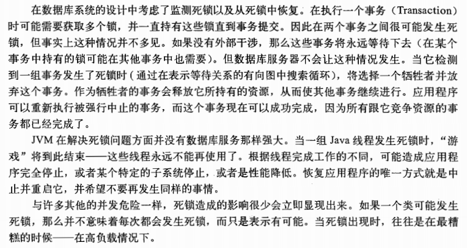

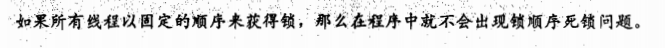

动态锁顺序死锁

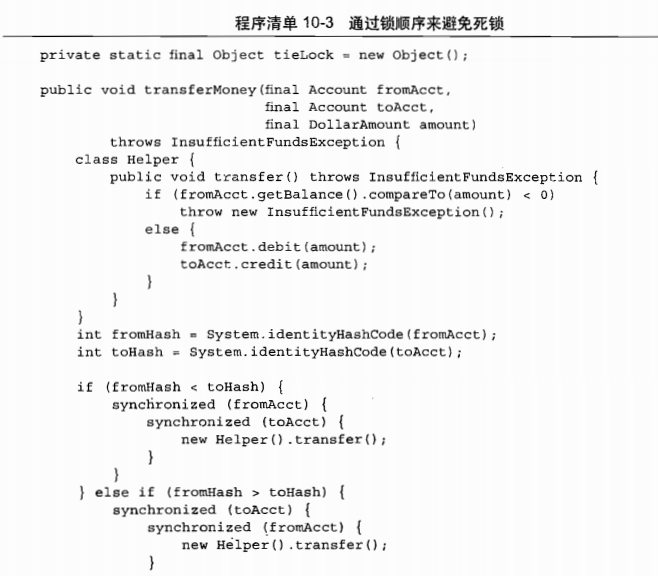
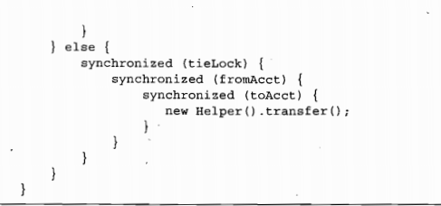

在协作对象之间发生的死锁

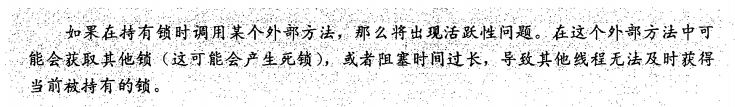

开放调用

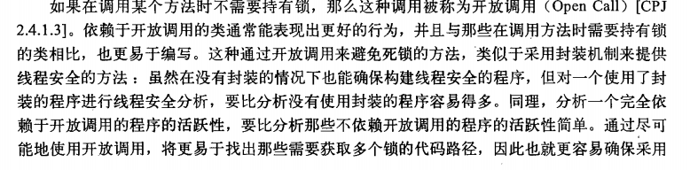

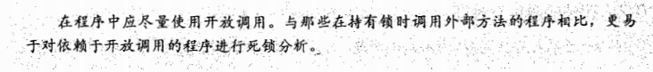

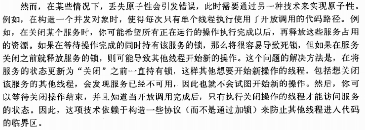

资源死锁

死锁的避免与诊断

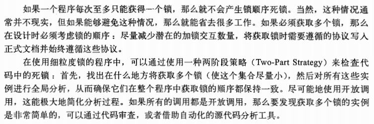

支持定时的锁

通过线程转储信息来分析死锁

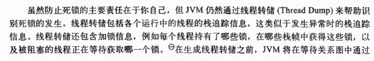

其他活跃性的危险

饥饿：

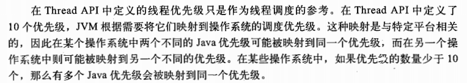

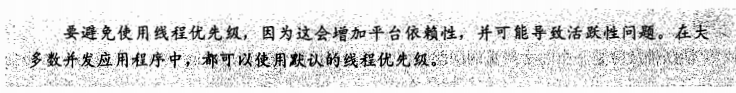

糟糕的响应性

活锁

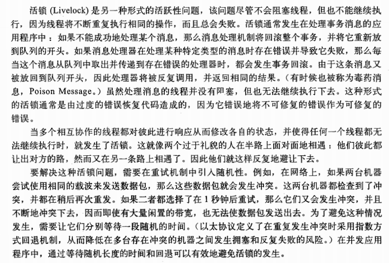

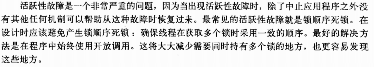

### 性能与可伸缩性

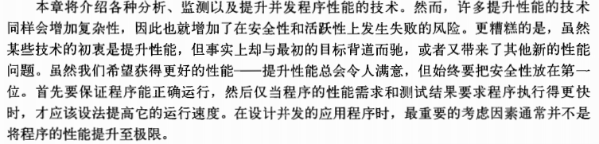

对性能的思考

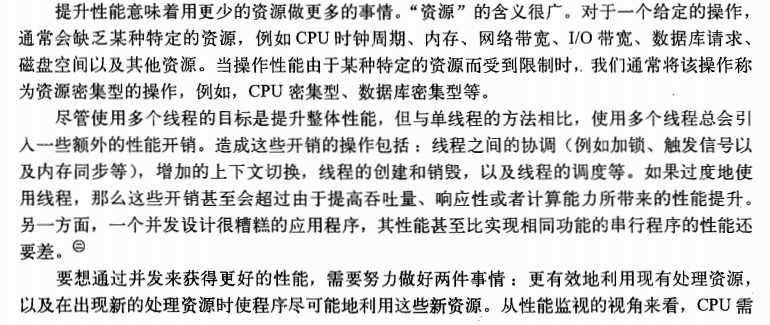

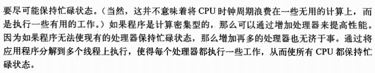

性能与可伸缩性

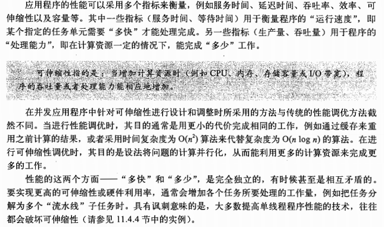

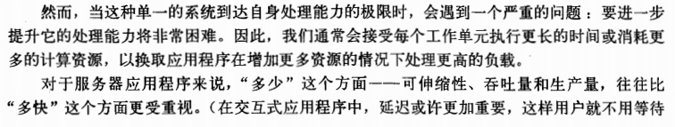

评估各种性能权衡因素

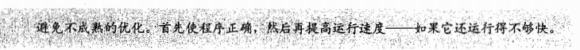

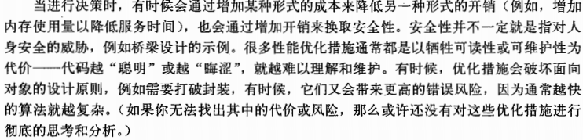

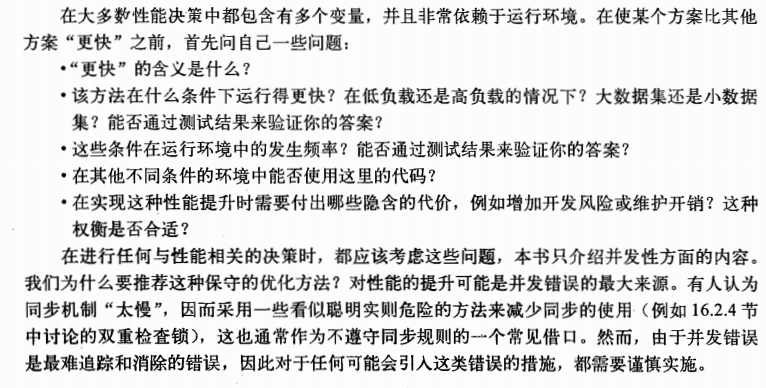

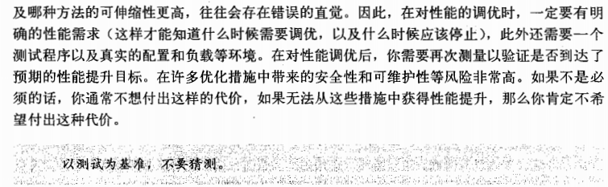

##### Amdahl 定律

Amdahl 定律的应用

##### 线程引入的开销

并行带来的性能提升必须超过并发带来的开销

上下文切换

内存同步

阻塞

##### 减少锁的竞争

减少锁的竞争会提高性能和可伸缩性

缩小锁的请求范围（“快进快出”）

减小锁的粒度

降低线程请求锁的频率

锁分段

避免热点区域

使不同的线程在不同的数据上操作

一些替代独占锁的方法

检测cpu的利用率

对对象池说不

比较Map的性能

减少上下文的切换

#### 并发程序的测试

正确性测试

对阻塞操作的测试

资源管理的测试

使用回调

性能测试

多种算法的比较

响应性衡量

避免性能测试的陷阱

垃圾回收

动态编译

对代码的路径的不真实采样

不真实的竞争

无用代码的消除

其他的测试方法

代码审查

静态分析工具

FindBugs

面向方向的测试技术

