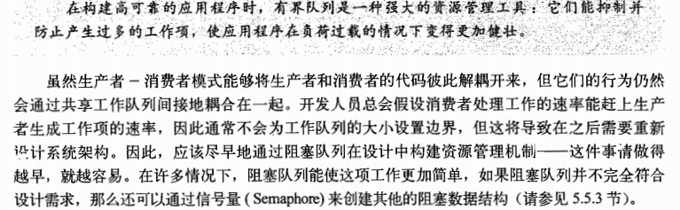

#### java 并发编程（四）

####### 基础构建模块

并发构建模块

同步类

同步类的问题

客户端加锁，降低了伸缩性，和并发性

迭代器

隐藏迭代器

所有间接的迭代操作都可能抛出ConcurrentModificationException异常

并发容器

ConcurrentHashMap

CopyOnwriteArrayList

阻塞队列的生产者-消费者模式

串行线程封闭

双端队列和工作密取

Deque 和 BlockingDeque

实现：ArrayDeque 和 LinkedBlockingDeque

阻塞方法和中断方法

同步工作类

**闭锁**

FutureTask 也可以用做闭锁

信号量

栅栏

构建高效且可伸缩的结果缓存

if 处依然有可能出现问题。非原子“先检查后执行”

最终实现:

小结：

