##### 锁

Lock接口（以及相关实现类）用来实现锁功能，拥有了锁获取与释放的可操作性、可中断的获取锁以及超时获取锁等多种synchronized关键字所不具备的同步特性。

使用synchronized关键字将会**隐式地获取锁**，但是它将锁的获取和释放固化了，也就是先获取再释放。当然，这种方式简化了同步的管理，可是扩展性没有显示的锁获取和释放来的好。

锁的基本使用：

```java
Lock lock = new ReentrantLock();
lock.lock();
try {

} finally {
  lock.unlock();
}
```

在finally块中释放锁，目的是保证在获取到锁之后，最终能够被释放。不要将获取锁的过程写在try块中，因为如果在获取锁（自定义锁的实现）时发生了异常，异常抛出的同时，也会导致锁无故释放。(锁要写外面,否则无故释放锁)

lock锁的优势
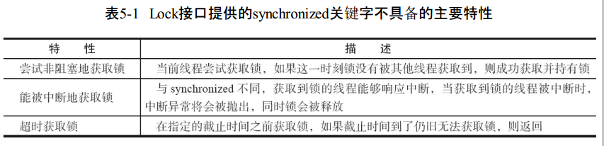

除此之外,lock 粒度会更加细,便于控制并发, 提高并发的效率.(便于缩小临界区)

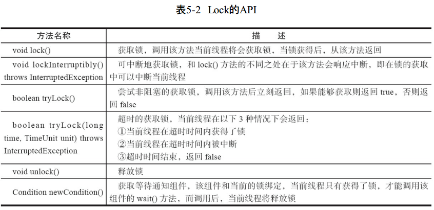

Lock接口的实现基本都是通过 **聚合了一个同步器的子类** 来完成线程访问控制的。

##### 同步队列器 (重点)

队列同步器AbstractQueuedSynchronizer（以下简称同步器），是用来构建锁或者其他同步组件的基础框架，它使用了**一个int成员变量表示同步状态，通过内置的FIFO队列**来完成资源获取线程的排队工作。

同步器的主要使用方式是继承(推荐静态)，子类通过继承同步器并实现它的抽象方法来管理同步状态，在抽象方法的实现过程中免不了要对同步状态进行更改，这时就需要使用同步器提供的3个方法（getState()、setState(int newState)和compareAndSetState(int expect,int update)）来进行操作，因为它们能够保证状态的改变是安全的。

同步器既可以支持独占式地获取同步状态，也可以支持共享式地获
取同步状态.

同步器面向的是**锁的实现者**，它简化了锁的实现方式，屏蔽了同步状态管理、线程的排队、等待与唤醒等底层操作。锁和同步器很好地隔离了使用者和实现者所需关注的领域。(双面服务思想)

##### 同步器的设计　

同步器的设计是基于**模板方法**模式的，也就是说，使用者需要继承同步器并**重写指定的方法**，随后**将同步器组合在自定义同步组件的实现中**，并调用**同步器提供的模板方法，而这些模板方法将会调用使用者重写的方法**.

**重写同步器指定的方法** 时，需要使用同步器提供的如下3个方法来访问或修改同步状态。

·getState()：获取当前同步状态。

·setState(int newState)：设置当前同步状态。

·compareAndSetState(int expect,int update)：使用CAS设置当前状态，该方法能够保证状态设置的原子性。

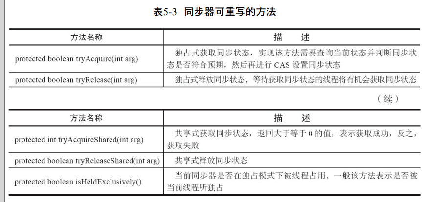

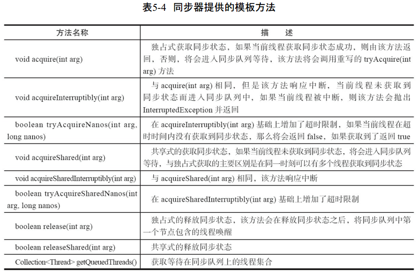

同步器提供的模板方法基本上分为3类：**独占式获取与释放同步状态、共享式获取与释放同步状态和查询同步队列中的等待线程** 情况。自定义同步组件将使用同步器提供的模板方法来实现自己的同步语义.

在tryAcquire(int acquires)方法中，如果经过CAS设置成功（同步状态设置为1），则代表获取了同步状态，而在tryRelease(int releases)方法中只是将同步状态重置为0。

###### 队列同步器

同步队列、独占式同步状态获取与释放、共享式同步状态获取与释放以及超时获取同步状态.

同步队列

同步器依赖内部的**同步队列（一个FIFO双向队列）** 来完成同步状态的管理，当前线程获取同步状态失败时，同步器会将当前线程以及等待状态等信息构造成为一个节点（Node）并将其加入同步队列，同时**会阻塞当前线程**，当同步状态释放时，会把首节点中的线程唤醒，使其再次尝试获取同步状态.

Node的结构

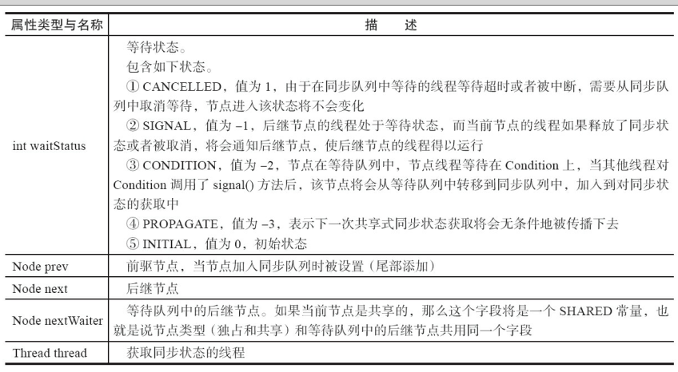

同步器拥有首节点（head）和尾节点（tail），没有成功获取同步状态的线程将会成为节点加入该队列的尾部。

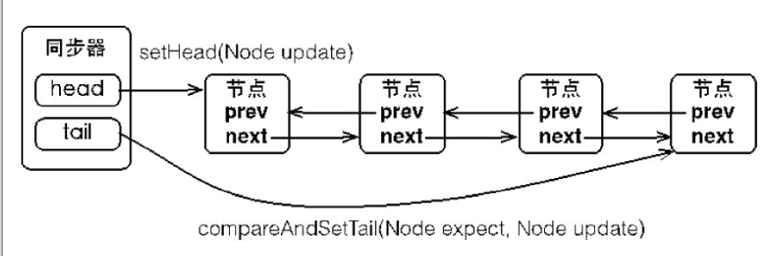

同步队列遵循FIFO，**首节点是获取同步状态成功** 的节点，首节点的线程在释放同步状态时，将会唤醒后继节点，而后继节点将会在获取同步状态成功时将自己设置为首节点。

设置首节点是通过获取同步状态成功的线程来完成的，由于只有一个线程能够成功获取到同步状态，因此设置头节点的方法并不需要使用CAS来保证，它只需要将首节点设置成为原首节点的后继节点并断开原首节点的next引用即可.

##### 独占式同步状态获取与释放

通过调用同步器的acquire(int arg)方法可以获取同步状态，该方法对中断不敏感，也就是由于线程获取同步状态失败后进入同步队列中，后续对线程进行中断操作时，线程不会从同步队列中移出

```java
public final void acquire(int arg) {
  if (!tryAcquire(arg) &&
      acquireQueued(addWaiter(Node.EXCLUSIVE), arg))
    selfInterrupt();
}
```
同步状态获取、节点构造、加入同步队列以及在同步队列中自旋

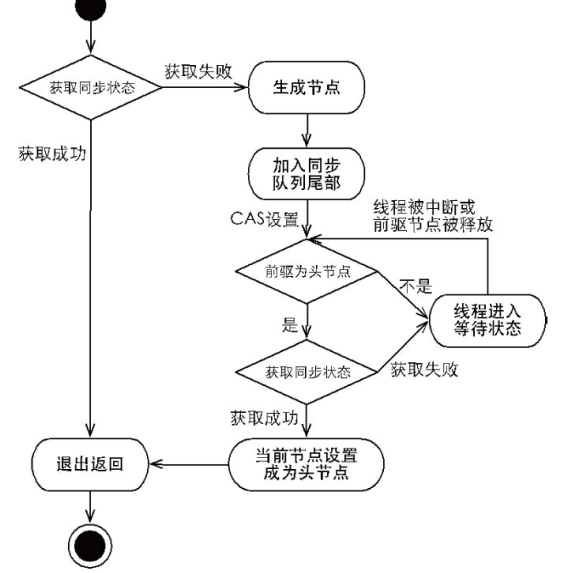

在获取同步状态时，同步器维护一个**同步队列**，获取状态**失败**的线程都会被加入到队列中并在队列中进行**自旋**；移出队列dd
（或停止自旋）的条件是**前驱节点为头节点且成功获取了同步状态**。在释放同步状态时，同步器调用**tryRelease(int arg)方法释放同步状态**，然后**唤醒头节点的后继节点**。

#### 共享式同步状态获取与释放

通过调用同步器的acquireShared(int arg)方法可以共享式地获取同步状态

在acquireShared(int arg)方法中，同步器调用tryAcquireShared(int arg)方法尝试获取同步状态，tryAcquireShared(int arg)方法返回值为int类型，当返回值大于等于0时，表示能够获取到同步状态。

在共享式获取的自旋过程中，成功获取到同步状态并退出自旋的条件就是tryAcquireShared(int arg)方法返回值大于等于0

与独占式一样，共享式获取也需要释放同步状态，通过调用releaseShared(int arg)方法可以释放同步状态.

对于能够支持多个线程同时访问的并发组件（比如Semaphore），它和独占式主要区别在于tryReleaseShared(int arg)方法必须确保同步状态（或者资源数）线程安全释放，一般是通过循环和CAS来保证的，因为释放同步状态的操作会同时来自多个线程。

#### 独占式超时获取同步状态

通过调用同步器的doAcquireNanos(int arg,long nanosTimeout)方法可以超时获取同步状态，即在指定的时间段内获取同步状态，如果获取到同步状态则返回true，否则，返回false。

同步器提供了acquireInterruptibly(int arg)方法，这个方法在等待获取同步状态时，如果当前线程被中断，会立刻返回，并抛出InterruptedException。

超时获取同步状态过程可以被视作响应中断获取同步状态过程的“增强版”，doAcquireNanos(int arg,long nanosTimeout)方法在支持响应中断的基础上，增加了超时获取的特性。


同步器作为一个桥梁，连接线程访问以及同步状态控制等底层技术与不同并发组件（比如Lock、CountDownLatch等）的接口语义。


##### 重入锁（synchronized ，ReentrantLock 支持可重入）

重入锁ReentrantLock，顾名思义，就是**支持重进入的锁**，它表示该锁能够支持一个线程对资源的**重复加锁**。除此之外，该锁的还支持获取锁时的公平和非公平性选择。

synchronized关键字**隐式的支持重进入**，比如一个synchronized修饰的递归方法，在方法执行时，执行线程在获取了锁之后仍能连续多次地获得该锁，而不像Mutex由于获取了锁，而在下一次获取锁时出现阻塞自己的情况。

ReentrantLock虽然没能像synchronized关键字一样支持隐式的重进入，但是在调用lock()方法时，已经获取到锁的线程，能够再次调用lock()方法获取锁而不被阻塞。

一个锁获取的 **公平性问题**，如果在绝对时间上，先对锁进行获取的请求一定先被满足，那么这个锁是公平的，反之，是不公平的。公平的获取锁，也就是 **等待时间最长的线程最优先获取锁，也可以说锁获取是顺序。** ReentrantLock提供了一个构造函数，能够控制锁是否是公平的.(默认是非公平的)

并不是任何场景都是以TPS作为唯一的指标，公平锁**能够减少“饥饿”** 发生的概率，等待越久的请求越是能够得到优先满足。

#####  可重入锁的实现原理

1）线程再次获取锁。锁需要去 **识别获取锁的线程是否为当前占据锁的线程**（获取锁时候会记录当前持有锁的线程），如果是，则再次成功获取。计数器增加1。

2）锁的最终释放。线程**重复n次获取了锁，随后在第n次释放该锁后，其他线程能够获取到该锁**。锁的最终释放要求锁对于获取进行计数自增，计数（volatile state）表示当前锁被重复获取的次数，而锁被释放时，计数自减，当**计数等于0**时表示锁已经成功释放。

通过判断当前线程是否为获取锁的线程(获取锁的同时会记录所持有的线程)来决定获取操作是否成功，如果是获取锁的线程再次请求，则将同步状态值进行增加并返回true，表示获取同步状态成功。

成功获取锁的线程再次获取锁，只是**增加了同步状态值**，这也就要求ReentrantLock在释放同步状态时**减少同步状态值**。

公平性与否是针对获取锁而言的，如果一个锁是公平的，那么锁的获取顺序就应该符合请求的绝对时间顺序，也就是FIFO。

该方法与nonfairTryAcquire(int acquires)比较，唯一不同的位置为判断条件多了hasQueuedPredecessors()方法，即加入了同步队列中当前节点是否有前驱节点的判断

**非公平性锁可能使线程“饥饿”，为什么它又被设定成默认的实现呢？**

非公平性锁虽然可能造成线程“饥饿”，但**极少的线程切换**，保证了其更大的**吞吐量**。

#### 读写锁

读写锁维护了一对锁，**一个读锁和一个写锁**，通过分离读锁和写锁，使得并发性相比一般的排他锁有了很大提升。

一般情况下，读写锁的性能都会比排它锁好，因为大多数场景**读是多于写的**。在读多于写的情况下，读写锁能够提供比排它锁更好的并发性和吞吐量。

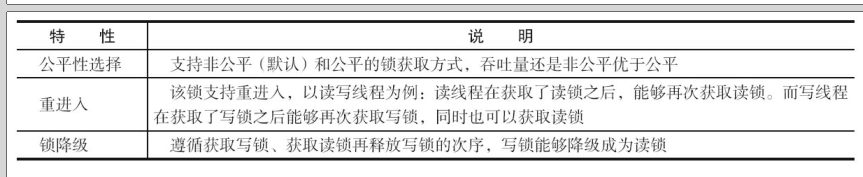

ReadWriteLock仅定义了获取读锁和写锁的两个方法，即readLock()方法和writeLock()方法，而其实现——ReentrantReadWriteLock

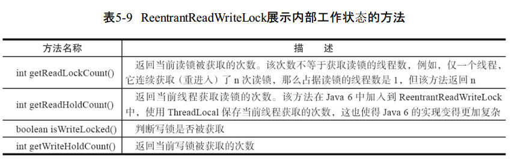

手写一个 cache
##### 使用范例
```java
public class Cache { // 静态, 共享

    private static Map<String, Object> map = new HashMap<>();
    private static ReentrantReadWriteLock lock = new ReentrantReadWriteLock(); // 读写锁
    private static Lock r = lock.readLock();
    private static Lock w = lock.writeLock();

    public static Object get(String key) {
        r.lock(); // 不可放try　里面否则无故释放
        try {
            return map.get(key);
        } finally {
            r.unlock();
        }
    }

    public static void put(String key, Object o) {
        w.lock();
        try {
            map.put(key, o);
        } finally {
            w.unlock();
        }
    }

    public void clear() {
        w.lock();
        try {
            map.clear();
        } finally {
            w.unlock();
        }
    }
}
```

同步状态表示**锁被一个线程重复获取的次数**，而读写锁的自定义同步器需要在同步状态（一个整型变量）上维护**多个读线程和一个写线程的状态**，使得该状态的设计成为读写锁实现的关键。

如果在一个整型变量上维护多种状态，就一定需要“按位切割使用”这个变量，读写锁将变量切分成了两个部分，高16位表示读，低16位表示写，

当前同步状态表示一个线程已经获取了写锁，且重进入了两次，同时也连续获取了两次读锁。读写锁是如何迅速确定读和写各自的状态呢？答案是**通过位运算**.

S不等于0时，当写状态（S&0x0000FFFF）等于0时，则读状态（S>>>16）大于0，即读锁已被获取

写锁是一个支持重进入的排它锁。如果当前线程已经获取了写锁，则增加写状态。

写锁的释放与ReentrantLock的释放过程基本类似，每次释放均减少写状态，当写状态为0时表示写锁已被释放，从而等待的读写线程能够继续访问读写锁，同时前次写线程的修改对后续读写线程可见。

在tryAcquireShared(int unused)方法中，如果其他线程已经获取了写锁，则当前线程获取读锁失败，进入等待状态。如果当前线程获取了写锁或者写锁未被获取，则当前线程（线程安全，　依靠CAS保证）增加读状态，成功获取读锁。

读锁的每次释放（线程安全的，可能有多个读线程同时释放读锁）均减少读状态，减少的值是（1<<16）。

锁降级是**指把持住（当前拥有的）写锁，再获取到读锁，随后释放（先前拥有的）写锁的过程**。

写锁 --> 读锁 --> 释放写锁;(从写锁到读锁的降级).

###### 锁降级

降级中读锁的获取是否必要呢？答案是必要的。主要是为了保证数据的可见性，如果当前线程不获取读锁而是直接释放写锁，假设此刻另一个线程（记作线程T）获取了写锁并修改了数据，那么当前线程无法感知线程T的数据更新。

如果当前线程获取读锁，即遵循锁降级的步骤，则线程T将会被阻塞，直到当前线程使用数据并释放读锁之后，线程T才能获取写锁进行数据更新

RentrantReadWriteLock**不支持锁升级**（把持读锁、获取写锁，最后释放读锁的过程），可见性无法保证。

##### LockSupport工具

需要**阻塞或唤醒一个线程**的时候，都会使用LockSupport工具类来完成相应工作。LockSupport定义了一组的公共静态方法，这些方法提供了**最基本的线程阻塞和唤醒功能**，而LockSupport也成为构建同步组件的基础工具。

LockSupport定义了一组以park开头的方法用来阻塞当前线程，以及unpark(Thread thread)方法来唤醒一个被阻塞的线程。

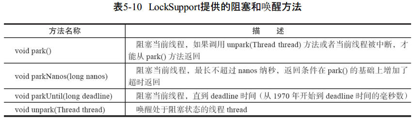

锁对应同步 synchronized, Object 对应 Condition

##### Condition接口  

任意一个Java对象，都拥有一组监视器方法（定义在java.lang.Object上），主要包括wait()、wait(long timeout)、notify()以及notifyAll()方法，这些方法与synchronized同步关键字配合，可以实现等待/通知模式。

Condition接口也提供了类似Object的监视器方法，与Lock配合可以实现等待/通知模式，但是这两者在使用方式以及功能特性上还是有差别的

主要差别在于Condition，还支持**等待状态不响应中断，限时等待**。

Condition定义了等待/通知两种类型的方法，当前线程调用这些方法时，需要提**前获取到Condition对象关联的锁**。Condition对象是由Lock对象（调用Lock对象的newCondition()方法）创建出来的，换句话说，Condition是**依赖Lock对象的**。

用法：

一般都会将Condition对象作为成员变量。先获取锁, 当调用await()方法后， 当前线程会释放锁并在此等待，而其他线程调用Condition对象的signal()方法，通知当前线程后，当前线程才从await()方法返回，并且在返回前已经获取了锁。

```java
public class BlockedQueue<T> {

    /**
     *
     * 经典的有限队列, 非常经典.
     *
     */
    private Object[] items;
    private Lock lock = new ReentrantLock();
    private int addIndex, count, removeIndex;
    private Condition notEmpty = lock.newCondition(); //　条件变量: 队列为空
    private Condition notFull = lock.newCondition(); //　条件变量:　队列满

    public BlockedQueue(int size) {
        items = new Object[size];
    }


    public void add(T t) throws InterruptedException {
        lock.lock();
        try {
            while (count == items.length) {
                notFull.await(); // 队列已经满了
            }

            items[addIndex] = t;
            if (++addIndex == items.length) {
                addIndex = 0;
            }
            ++count;
            notEmpty.signal(); // 通知所有在空条件队列上等待的线程
        }finally {
            lock.unlock();
        }
    }

    public T remove() throws InterruptedException {
        lock.lock();
        T t = null;
        try {
            while (count == 0) {
                notEmpty.wait();
            }
            t = (T)items[removeIndex];
            if (++removeIndex == items.length) {
                removeIndex = 0;
            }
            --count;
            notFull.signal();
        } finally {
            lock.unlock();
        }
        return t;
    }
}

```

#### 实现分析

ConditionObject 是同步器 AbstractQueuedSynchronizer 的内部类，因为Condition的操作需要获取相关联的锁，所以作为同步器的内部类也较为合理。每个Condition对象都包含着**一个队列（以下称为等待队列），该队列是Condition对象实现等待/通知功能的关键**。

等待队列是一个FIFO的队列，在队列中的每个节点都包含了一个线程引用，该线程就是在Condition对象上等待的线程，如果一个线程调了Condition.await()方法，那么该线程将会释放锁、构造成节点加入等待队列并进入等待状态。

一个Condition包含一个等待队列，Condition拥有首节点（firstWaiter）和尾节点（lastWaiter）。当前线程调用Condition.await()方法，将会以当前线程构造节点，并将节点从尾部加入等待队列

并发包中的Lock（更确切地说是同步器）拥有一个同步队列和多个等待队列，

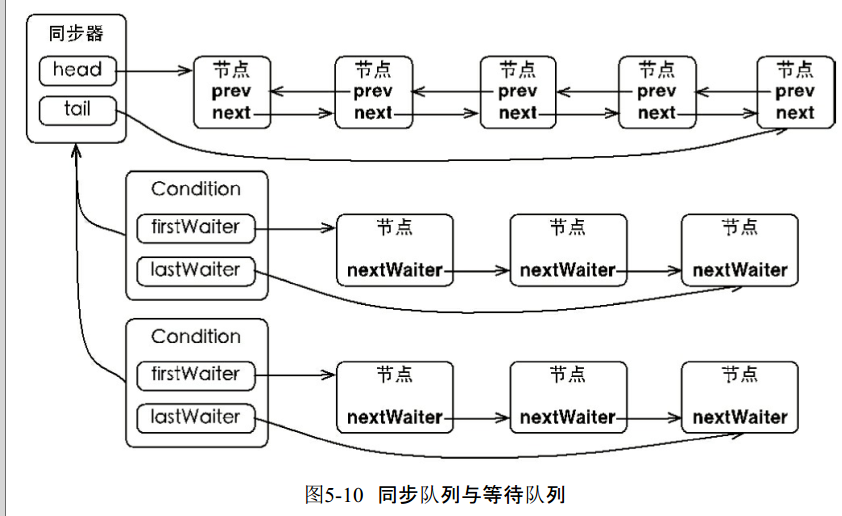

Condition的实现是同步器的内部类，因此每个Condition实例都能够访问同步器提供的方法，相当于每个Condition都拥有所属同步器的引用。

###### await()方法

调用该方法的线程成功获取了锁的线程，也就是同步队列中的首节点，该方法会将当前线程构造成一个新的节点并加入**等待队列中**，然后释放**同步状态**，**唤醒同步队列中的后继节点**，然后当
前线程会进入等待状态。

对等待线程进行中断，则会抛出InterruptedException。非condition。

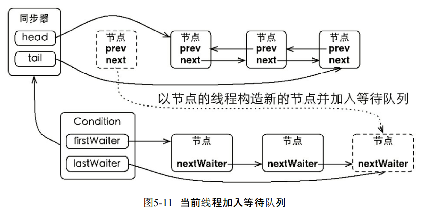

##### signal()方法

将会唤醒在等待队列中等待时间最长的节点（首节点），在唤醒节点之前，会将节点移到同步队列中。

signal()方法进行了isHeldExclusively()检查，也就是**当前线程必须是获取了锁的线程**。接着获取等待队列的首节点，将其移动到同步队列并使用LockSupport唤醒节点中的线程。

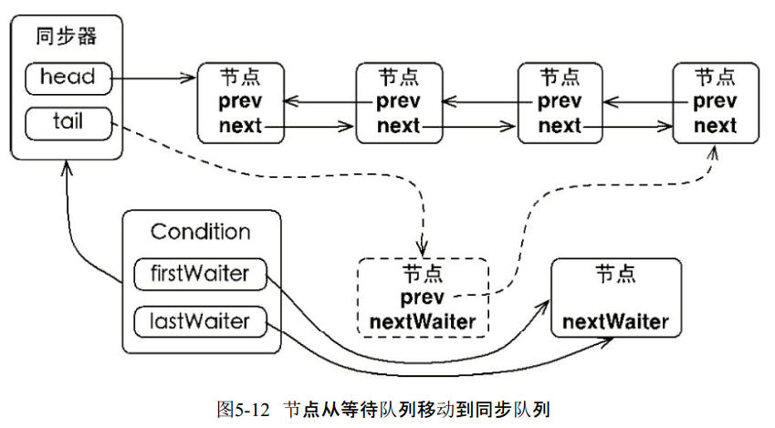

通过调用同步器的enq(Node node)方法，等待队列中的头节点线程安全地**移动到同步队列**。当节点移动到同步队列后，当前线程再使用**LockSupport(唤醒和阻塞线程)唤醒该节点的线程**。

被唤醒后的线程，将从await()方法中的while循环中退出（isOnSyncQueue(Node node)方法返回true，节点已经在同步队列中），进而调**用同步器的acquireQueued()方法加入到获取同步状态的竞争中**。

成功获取同步状态（或者说锁）之后，被唤醒的线程将从先前调用的await()方法返回，此时该线程已经成功地获取了锁。
