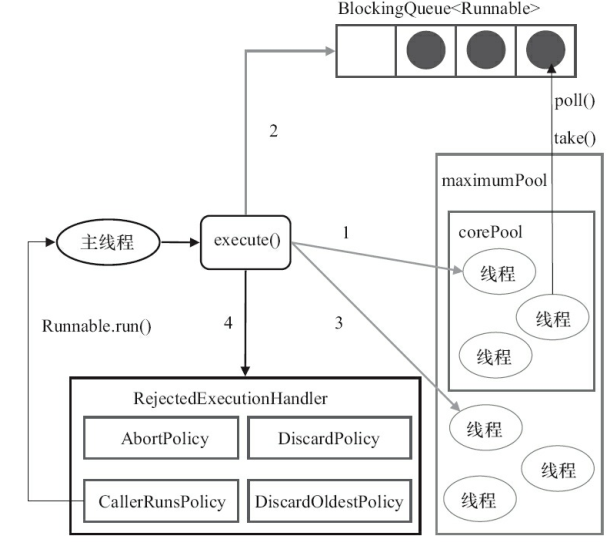
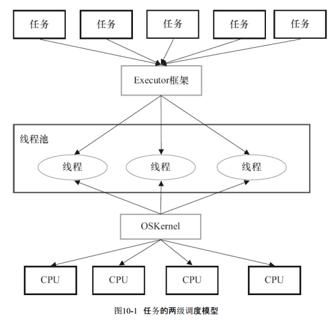

####  java 并发编程的艺术（四）

Doug Lea  java并发的大师

###### ConcurrentHashMap

ConcurrentHashMap是线程安全且高效的HashMap。

hashMap 为什么不是线程安全

HashMap在并发执行put操作时会引起死循环，是因为多线程会导致HashMap的Entry链表形成环形数据结构，一旦形成环形数据结构，Entry的next节点永远不为空，就会产生死循环获取Entry。

ConcurrentHashMap的锁分段技术可有效提升并发访问率

首先将数据分成一段一段地存储，然后给每一段数据配一把锁，当一个线程占用锁访问其中一个段数据的时候，其他段的数据也能被其他线程访问。

一个ConcurrentHashMap里包含一个**Segment数组**。Segment的结构和HashMap类似，是一种数组和链表结构。**一个Segment里包含一个HashEntry数组**，每个HashEntry是　**一个链表结构的元素**，每个Segment守护着一个HashEntry数组里的元素，当对HashEntry数组的数据进行修改时，必须首先获得与它对应的Segment锁

ConcurrentHashMap会首先使用Wang/Jenkins hash的变种算法对元素的hashCode进行一次再散列。之所以进行再散列，目的是减少散列冲突，使元素能够均匀地分布在不同的Segment上，从而提高容器的存取效率。

get操作的高效之处在于整个get过程不需要加锁，除非读到的值是空才会加锁重读, get方法里将要使用的共享变量都定义成volatile类型.

定义成volatile的变量，能够在线程之间保持可见性，能够被多线程同时读，并且保证不会读到过期的值，但是只能被单线程写.

由于put方法里需要对共享变量进行写入操作，所以为了线程安全，在操作共享变量时必须加锁。put方法首先定位到Segment，然后在Segment里进行插入操作。插入操作需要经历两个步骤，第一步判断是否需要对Segment里的HashEntry数组进行扩容，第二步定位添加元素的位
置，然后将其放在HashEntry数组里。

ConcurrentHashMap的做法是 **先尝试2次** 通过不锁住Segment的方式来统计各个Segment大小，如果统计的过程中，容器的count发生了变化，则再采用加锁的方式来统计所有Segment的大小。

使用阻塞算法的队列可以用一个锁（入队和出队用同一把锁）或两个锁（入队和出队用不同的锁）等方式来实现。非阻塞的实现方式则可以使用循环CAS的方式来实现。

阻塞队列（BlockingQueue）是一个支持两个附加操作的队列。这两个附加的操作支持阻塞的插入和移除方法。

1）支持阻塞的插入方法：意思是当队列满时，队列会阻塞插入元素的线程，直到队列不满。

2）支持阻塞的移除方法：意思是在队列为空时，获取元素的线程会等待队列变为非空。


##### Fork/Join框架

大体思路: 是一个把大任务分割成若干个小任务，最终汇总每个小任务结果后得到大任务结果的框架。

工作窃取（work-stealing）算法是指某个线程从其他队列里窃取任务来执行。　

而在这时它们会访问同一个队列，所以为了减少窃取任务线程和被
窃取任务线程之间的竞争，通常会使用 **双端队列**，被窃取任务线程永远从双端队列的 **头部** 拿任务执行，而 **窃取任务的线程永远从双端队列的尾部** 拿任务执行。

1. ForkJoinTask：我们要使用ForkJoin框架，必须首先创建一个ForkJoin任务。它提供在任务中执行 **fork()和join()** 操作的机制。通常情况下，我们不需要直接继承ForkJoinTask类，只需要继
承它的子类，Fork/Join框架提供了以下两个子类。

·RecursiveAction：用于没有返回结果的任务。

·RecursiveTask：用于有返回结果的任务。

2. ForkJoinPool：ForkJoinTask需要通过ForkJoinPool来执行。

ForkJoinTask与一般任务的主要区别在于它需要 **实现compute** 方法，在这个方法里，首先需要判断任务是否足够小，如果足够小就直接执行任务。如果不足够小，就必须分割成两个子任务，每个子任务在 **调用fork方法时，又会进入compute方法**，看看当前子任务是否需要继续分割成子任务，如果不需要继续分割，则执行当前子任务并返回结果。使用 **join方法** 会等待子任务执行完并得到其结果。

ForkJoinPool由ForkJoinTask数组和ForkJoinWorkerThread数组组成.

##### 原子基本类型

AtomicBoolean：原子更新布尔类型。

AtomicInteger：原子更新整型。

AtomicLong：原子更新长整型。

int addAndGet（int delta）：以原子方式将输入的数值与实例中的值（AtomicInteger里的value）相加，并返回结果。

boolean compareAndSet（int expect，int update）：如果输入的数值等于预期值，则以原子方式将该值设置为输入的值。

int getAndIncrement()：以原子方式将当前值加1，注意，这里返回的是自增前的值。

void lazySet（int newValue）：最终会设置成newValue，使用lazySet设置值后，可能导致其他线程在之后的一小段时间内还是可以读到旧的值。

int getAndSet（int newValue）：以原子方式设置为newValue的值，并返回旧值。

AtomicIntegerArray：原子更新整型数组里的元素。
·AtomicLongArray：原子更新长整型数组里的元素。
·AtomicReferenceArray：原子更新引用类型数组里的元素。
·AtomicIntegerArray类主要是提供原子的方式更新数组里的整型，

AtomicReference：原子更新引用类型。
·AtomicReferenceFieldUpdater：原子更新引用类型里的字段。
·AtomicMarkableReference：原子更新带有标记位的引用类型。

·AtomicIntegerFieldUpdater：原子更新整型的字段的更新器。
·AtomicLongFieldUpdater：原子更新长整型字段的更新器。
·AtomicStampedReference：原子更新带有版本号的引用类型。


#####　CountDownLatch

CountDownLatch的构造函数接收一个int类型的参数作为计数器，如果你想等待N个点完成，这里就传入N。

当我们调用CountDownLatch的countDown方法时，N就会减1，CountDownLatch的await方法会阻塞当前线程，直到N变成零。由于countDown方法可以用在任何地方，所以这里说的N个点，可以是N个线程，也可以是1个线程里的N个执行步骤。用在多个线程时，只需要把这个CountDownLatch的引用传递到线程里即可。

await方法——await（long time，TimeUnit unit）

计数器必须 **大于等于0**，只是等于0时候，计数器就是零，调用await方法时不会阻塞当前线程。CountDownLatch **不可能重新初始化或者修改** CountDownLatch对象的内部计数器的值。一个线程调用 **countDown** 方法happen-before，另外一个线程调用**await方法**。

CyclicBarrier

CyclicBarrier默认的构造方法是CyclicBarrier（int parties），其参数表示屏障拦截的线程数量，每个线程调用await方法告诉CyclicBarrier我已经到达了屏障，然后当前线程被阻塞。

CountDownLatch的计数器 **只能使用一次**，而CyclicBarrier的计数器可以使用reset()方法重置。所以CyclicBarrier能处理更为复杂的业务场景。

Semaphore（信号量）是用来控制同时访问特定资源的线程数量，它通过协调各个线程，以保证合理的使用公共资源。

首先线程使用Semaphore的acquire()方法获取一个许可证，使用完之后调用release()方法归还许可证。还可以用tryAcquire()方法尝试获取许可证.

Exchanger（交换者）是一个用于线程间协作的工具类。Exchanger用于进行线程间的数据交换。它提供一个同步点，在这个同步点，两个线程可以交换彼此的数据。

如果两个线程有一个没有执行exchange()方法，则会一直等待，如果担心有特殊情况发生，避免一直等待，可以使用exchange（V x，longtimeout，TimeUnit unit）设置最大等待时长。

##### 线程池的实现原理





ThreadPoolExecutor来创建一个线程池

```java
new ThreadPoolExecutor(corePoolSize, maximumPoolSize, keepAliveTime,milliseconds,runnableTaskQueue, handler);
```
1）如果当前运行的线程少于corePoolSize，则创建新线程来执行任务（注意，执行这一步骤需要获取全局锁）。

2）如果运行的线程等于或多于corePoolSize，则将任务加入BlockingQueue。

3）如果无法将任务加入BlockingQueue（队列已满），则创建新的线程来处理任务（注意，执行这一步骤需要获取全局锁）。

4）如果创建新线程将使当前运行的线程超出maximumPoolSize，任务将被拒绝，并调用RejectedExecutionHandler.rejectedExecution()方法。

工作线程：线程池创建线程时，会将线程封装成工作线程Worker，Worker在执行完任务后，还会循环获取工作队列里的任务来执行。


线程池中的线程执行任务分两种情况

1）在execute()方法中创建一个线程时，会让这个线程执行当前任务。

2）这个线程执行完上图中1的任务后，会反复从BlockingQueue获取任务来执行。

runnableTaskQueue（任务队列）：用于保存等待执行的任务的阻塞队列。可以选择以下几个阻塞队列。

ArrayBlockingQueue：是一个基于数组结构的有界阻塞队列，此队列按FIFO（先进先出）原则对元素进行排序。

LinkedBlockingQueue：一个基于链表结构的阻塞队列，此队列按FIFO排序元素，吞吐量通常要高于ArrayBlockingQueue。静态工厂方法Executors.newFixedThreadPool()使用了这个队列。

SynchronousQueue：一个不存储元素的阻塞队列。每个插入操作必须等到另一个线程调用移除操作，否则插入操作一直处于阻塞状态，吞吐量通常要高于Linked-BlockingQueue，静态工
厂方法Executors.newCachedThreadPool使用了这个队列。

PriorityBlockingQueue：一个具有优先级的无限阻塞队列。

RejectedExecutionHandler（饱和策略）：当 **队列和线程池都满了**，说明线程池处于饱和状态，那么必须采取一种策略处理提交的新任务。这个策略默认情况下是AbortPolicy，表示无法处理新任务时抛出异常。在JDK 1.5中Java线程池框架提供了以下4种策略。

·AbortPolicy：直接抛出异常。

·CallerRunsPolicy：只用调用者所在线程来运行任务。

·DiscardOldestPolicy：丢弃队列里最近的一个任务，并执行当前任务。

·DiscardPolicy：不处理，丢弃掉

execute()方法用于提交 **不需要返回值的任务** ，所以无法判断任务是否被线程池执行成功。

submit()方法用于提交 **需要返回值的任务**。线程池会返回一个future类型的对象，通过这个future对象可以判断任务是否执行成功，并且可以通过future的 **get()** 方法来获取返回值，get()方法会阻塞当前线程直到任务完成，而使用 **get（long timeout，TimeUnit unit）** 方法则会阻塞当前线程一段时间后立即返回，这时候有可能任务没有执行完。

关闭线程池

通过调用线程池的shutdown或shutdownNow方法来关闭线程池。它们的原理是 **遍历线程池中的工作线程**，然后逐个调用线程的interrupt方法来中断线程，所以无法响应中断的任务可能永远无法终止

它们存在一定的区别，shutdownNow首先**将线程池的状态设置成
STOP，然后尝试停止所有的正在执行或暂停任务的线程，并返回等待执行任务的列表**，而shutdown只是将线程池的状态设置成 **SHUTDOWN** 状态，然后**中断所有没有正在执行任务的线程**。

只要调用了这两个关闭方法中的任意一个，**isShutdown方法就会返回true。** 当所有的任务都已关闭后，才表示线程池关闭成功，这时调用 **isTerminaed方法会返回true** 。至于应该调用哪一种方法来关闭线程池，应该由提交到线程池的任务特性决定，通常调用shutdown方法来 **关闭线程池，如果任务不一定要执行完，则可以调用shutdownNow方法**。


**CPU密集型** 任务应配置尽可能**小**的线程，如配置**Ncpu+1**个线程的线程池。由于 **IO密集型任务** 线程并不是一直在执行任务，则应配置尽可能多的线程，如 **2*Ncpu** 。混合型的任务，如果可以拆分，将其拆分成一个CPU密集型任务和一个IO密集型任务，只要这两个任务执行的时间相差不是太大，那么分解后执行的吞吐量将高于串行执行的吞吐量。如果这两个任务执行时间相差太大，则没必要进行分解。可以通过Runtime.getRuntime().availableProcessors()方法获得当前设备的CPU个数。

优先级不同的任务可以使用优先级队列PriorityBlockingQueue来处理。它可以让优先级高的任务先执行。

执行时间不同的任务可以交给不同规模的线程池来处理，或者可以使用优先级队列，让执行时间短的任务先执行


#### Executor 框架

Java的线程既是**工作单元，也是执行机制**.

##### Executor框架的两级调度模型

应用程序通过Executor框架控制上层的调度；而下层的调度由操作系统内核控制，下层的调度不受应用程序的控制。



Executor框架主要由3大部分组成如下。

·任务。包括被执行任务需要实现的接口：Runnable接口或Callable接口。

·任务的执行。包括任务执行机制的核心接口Executor，以及继承自Executor(仅仅含有execute接口)的**ExecutorService**接口。Executor框架有两个关键类实现了ExecutorService接口
（ThreadPoolExecutor和ScheduledThreadPoolExecutor）。

·异步计算的结果。包括接口Future和实现Future接口的FutureTask类

任务的执行：
Executor是一个接口，它是Executor框架的基础，它将任务的提交与任务的执行分离开来。

ThreadPoolExecutor是 **线程池的核心实现类**，用来执行被提交的任务。

ScheduledThreadPoolExecutor是一个实现类，可以在 **给定的延迟后运行命令，或者定期执行命令**。ScheduledThreadPoolExecutor比Timer更灵活，功能更强大。定时执行任务。

异步计算的结果：
Future接口和实现Future接口的FutureTask类，代表异步计算的结果。

任务：

Runnable接口和Callable接口的实现类，都可以被ThreadPoolExecutor或ScheduledThreadPoolExecutor执行。


使用方法

主线程首先要创建实现Runnable或者Callable接口的任务对象。**工具类Executors可以把一个Runnable对象封装为一个Callable对象（Executors.callable（Runnable task）或Executors.callable（Runnable task，Object resule））。**

然后可以把Runnable对象直接交给ExecutorService执行 （ExecutorService.execute（Runnable
command））；或者也可以把Runnable对象或Callable对象提交给ExecutorService执行（ExecutorService.submit（Runnable task）或ExecutorService.submit（Callable<T>task））。

如果执行ExecutorService.submit（…），ExecutorService将返回一个实现Future接口的对象（到目前为止的JDK中，返回的是FutureTask对象）。由于FutureTask实现了Runnable，程序员也可以创建FutureTask，然后直接交给ExecutorService执行。

ThreadPoolExecutor、ScheduledThreadPoolExecutor、
Future接口、Runnable接口、Callable接口和Executors。

###### ThreadPoolExecutor

ThreadPoolExecutor通常使用工厂类Executors来创建。Executors可以创建3种类型的ThreadPoolExecutor：

SingleThreadExecutor

FixedThreadPool

CachedThreadPool

FixedThreadPool。下面是Executors提供的，创建**使用固定线程数**的FixedThreadPool的API.

适用于为了满足资源管理的需求，而需要限制当前线程数量的应用场景，它适用于负载比较重的服务器。

SingleThreadExecutor。下面是Executors提供的，创建使用**单个线程**的SingleThreadExecutor的API.

适用于需要保证顺序地执行各个任务；并且在任意时间点，不会有多个线程是活动的应用场景。

CachedThreadPool。下面是Executors提供的，创建一个**会根据需要创建新线程**的CachedThreadPool的API。

大小无界的线程池，适用于执行很多的**短期异步任务的小程序**，或者
是**负载较轻**的服务器

###### ScheduledThreadPoolExecutor
ScheduledThreadPoolExecutor通常使用工厂类Executors来创建。Executors可以创建2种类型的ScheduledThreadPoolExecutor

ScheduledThreadPoolExecutor。包含**若干个线程**的ScheduledThreadPoolExecutor。

SingleThreadScheduledExecutor。只包含**一个线程**的ScheduledThreadPoolExecutor。

ScheduledThreadPoolExecutor适用于需要多个后台线程执行**周期任务**，同时为了满足资源管理的需求而需要**限制后台线程的数量**的应用场景。

SingleThreadScheduledExecutor适用于需要**单个后台线程执行周期任务**，同时需要保证顺序地执行各个任务的应用场景。

###### Future接口　获取任务执行的结果

Future接口和实现Future接口的FutureTask类用来表示异步计算的结果。当我们把Runnable接口或Callable接口的实现类提交（submit）给ThreadPoolExecutor或ScheduledThreadPoolExecutor时，ThreadPoolExecutor或ScheduledThreadPoolExecutor会向我们返回一个**FutureTask**对象


##### Runnable接口和Callable接口

Runnable接口和Callable接口的实现类，都可以被ThreadPoolExecutor或ScheduledThreadPoolExecutor执行。它们之间的区别是Runnable不会返回结果，而Callable可以返回结果。

工厂类Executors来把一个Runnable包装成一个Callable
public static Callable<Object> callable(Runnable task)

##### ThreadPoolExecutor　线程池创造的核心类

Executor框架最核心的类是ThreadPoolExecutor，它是线程池的实现类

####### FixedThreadPool

``` java
public static ExecutorService newFixedThreadPool(int nThreads) {
    return new ThreadPoolExecutor(nThreads, nThreads,
    0L, TimeUnit.MILLISECONDS,
    new LinkedBlockingQueue<Runnable>());
}
```

keepAliveTime设置为0L，意味着多余的空闲线程会被立即终止。


FixedThreadPool使用无界队列LinkedBlockingQueue作为线程池的工作队列（队列的容量为Integer.MAX_VALUE）

由于使用无界队列，运行中的FixedThreadPool（未执行方法shutdown()或shutdownNow()）不会拒绝任务（不会调用RejectedExecutionHandler.rejectedExecution方法）。

SingleThreadExecutor是使用单个worker线程的Executor。


``` java

public static ExecutorService newSingleThreadExecutor() {
  return new FinalizableDelegatedExecutorService(new ThreadPoolExecutor(1, 1, 0L, TimeUnit.MILLISECONDS,
    new LinkedBlockingQueue<Runnable>()));
}

```


##### CachedThreadPool详解

``` java

public static ExecutorService newCachedThreadPool() {
    return new ThreadPoolExecutor(0, Integer.MAX_VALUE, 60L, TimeUnit.SECONDS, new SynchronousQueue<Runnable>());
}

```

FixedThreadPool和SingleThreadExecutor使用无界队列 **LinkedBlockingQueue作为线程池的工作队列** 。CachedThreadPool使用 **没有容量的SynchronousQueue** 作为线程池的工作队列，但CachedThreadPool的maximumPool是无界的。这意味着，如果主线程提交任务的速度高于maximumPool中线程处理任务的速度时，CachedThreadPool会 **不断创建新线程**。极端情况下，CachedThreadPool会因为创建过多线程而耗尽CPU和内存资源


新创建的线程将任务执行完后，会执行SynchronousQueue.poll（keepAliveTime，TimeUnit.NANOSECONDS）。这个poll操作会让空闲线程最多 **在SynchronousQueue中等待60秒钟**。如果60秒钟内主线程提交了一个新任务（主线程执行步骤1）），那么 **这个空闲线程将执行主线程提交的新任务** ；否则，这个空闲线程将终止。由于空闲60秒的空闲线程会被终止，因此长时间保持空闲的CachedThreadPool不会使用任何资源。

##### ScheduledThreadPoolExecutor

ScheduledThreadPoolExecutor可以在构造函数中指定多个对应的后台线程数。


ScheduledThreadPoolExecutor为了实现周期性的执行任务，对ThreadPoolExecutor做了如下的修改。

·使用DelayQueue作为任务队列。

·获取任务的方式不同（后文会说明）。

·执行周期任务后，增加了额外的处理（后文会说明）

ScheduledThreadPoolExecutor会把待调度的任务（ScheduledFutureTask）放到一个DelayQueue中。

ScheduledFutureTask主要包含3个成员变量，如下。

·long型成员变量time，表示这个任务将要被执行的具体时间。

·long型成员变量sequenceNumber，表示这个任务被添加到ScheduledThreadPoolExecutor中的序号。

·long型成员变量period，表示任务执行的间隔周期。

DelayQueue封装了一个PriorityQueue，这个PriorityQueue会对队列中的ScheduledFutureTask进行排序。排序时，time小的排在前面（时间早的任务将被先执行）。如果两个ScheduledFutureTask的time相同，就比较sequenceNumber，sequenceNumber小的排在前面（也就是说，如果两个任务的执行时间相同，那么先提交的任务将被先执行）。


1）线程1从DelayQueue中获取已到期的ScheduledFutureTask（DelayQueue.take()）。到期任务是指ScheduledFutureTask的time大于等于当前时间。

2）线程1执行这个ScheduledFutureTask。

3）线程1修改ScheduledFutureTask的**time变量为下次将要被执行的时间。**

4）线程1把这个 **修改time** 之后的ScheduledFutureTask放回DelayQueue中（DelayQueue.add()）。

##### FutureTask详解　

代表异步计算的结果

FutureTask除了实现Future接口外，还实现了Runnable接口。因此，FutureTask可以交给Executor执行，也可以由调用线程直接执行（FutureTask.run()）。根据FutureTask.run()方法被执行的时机，FutureTask可以处于下面3种状态。

1）未启动。FutureTask.run()方法还没有被执行之前，FutureTask处于未启动状态。当创建一个FutureTask，且**没有执行FutureTask.run()方法之前**，这个FutureTask处于 **未启动状态**。

2）已启动。FutureTask.run()方法 **被执行的过程** 中，FutureTask处于 **已启动状态**。

3）已完成。**FutureTask.run()方法执行完后正常结束，或被取消（FutureTask.cancel（…））**，或执行FutureTask.run()方法时抛出异常而异常结束，FutureTask处于**已完成状态**。

当FutureTask处于 **未启动或已启动状态** 时，执行FutureTask.get()方法将导致**调用线程阻塞**；当FutureTask处于已完成状态时，执行FutureTask.get()方法将导致调用线程立即返回结果或抛出异常。

当FutureTask处于未启动状态时，执行FutureTask.cancel()方法将导致此任务永远不会被执行；当FutureTask处于已启动状态时，执行 **FutureTask.cancel（true）** 方法将以中断执行此任务线程的方式来试图**停止任务**；当FutureTask处于已启动状态时，执行 **FutureTask.cancel（false）** 方法将不会对正在执行此任务的线程产生影响（让正在执行的任务运行完成）；当FutureTask处于已完成状态时，执行FutureTask.cancel（…）方法将返回false。


##### FutureTask的实现

FutureTask的实现基于AbstractQueuedSynchronizer。

AQS是一个同步框架，它提供通用机制来**原子性管理同步状态、阻塞和唤醒线程，以及维护被阻塞线程的队列** 。

ReentrantLock、Semaphore、ReentrantReadWriteLock、CountDownLatch和FutureTask

每一个基于AQS实现的同步器都会包含两种类型的操作，如下。

·至少一个acquire操作。这个操作**阻塞调用线程**，除非/直到**AQS的状态允许这个线程继续执行**。FutureTask的acquire操作为get()/get（long timeout，TimeUnit unit）方法调用。

·至少一个release操作。这个操作改变AQS的状态，改变后的状态可允许一个或多个阻塞线程被解除阻塞。FutureTask的release操作包括run()方法和cancel（…）方法。
