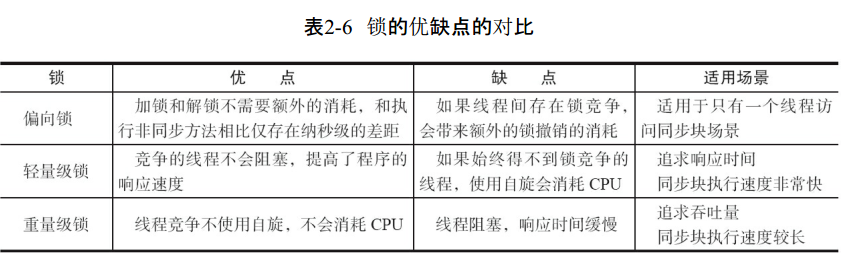
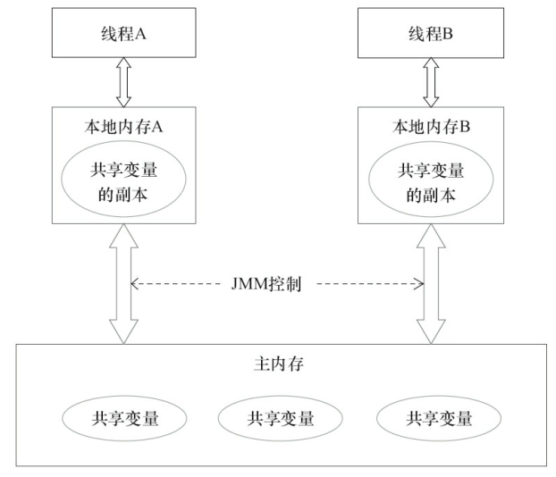
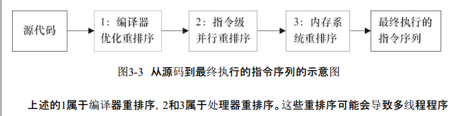
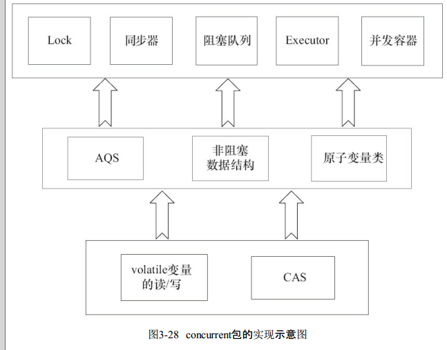

## java 并发编程的艺术

#### volatile　

在多线程并发编程中 synchronized和volatile 都扮演着重要的角色，volatile是轻量级的synchronized，它在多处理器开发中保证了**共享变量的“可见性”** 。可见性的意思是当一个线程修改一个共享变量时，另外一个线程能读到这个修改的值。如果volatile变量修饰符使用恰当的话，它比synchronized的使用和执行成本更低，因为它 **不会引起线程上下文的切换和调度。**

Java编程语言允许线程访问共享变量，为了确保共享变量能被准确和一致地更新，线程应该确保通过排他锁单独获得这个变量。Java语言提供了volatile，在某些情况下比锁要更加方便。如果一个字段被声明成volatile，Java线程内存模型确保所有线程看到这个变量的值是一致的。(原子性读写 volatile 变量)

##### volatile 的实现原理

有volatile变量修饰的共享变量进行写操作的时候会多出第二行汇编代码，通过查IA-32架构软件开发者手册可知，**Lock前缀的指令** 在多核处理器下会引发了两件事情。

1）将当前处理器缓存行的数据写回到系统内存。

2）这个写回内存的操作会使在其他CPU里缓存了该内存地址的数据无效。

如果对声明了volatile的变量进行写操作，JVM就会向处理器发送一条Lock前缀的指令，将这个变量所在缓存行的数据写回到系统内存。

volatile读的实现：

在多处理器下，为了保证各个处理器的缓存是一致的，就会实现**缓存一
致性协议**，每个处理器通过**嗅探在总线上传播的数据来检查自己缓存的值是不是过期了**，当处理器发现自己缓存行对应的内存地址被修改，就会将当前处理器的缓存行设置成无效状态，当处理器对这个数据进行修改操作的时候，会重新从系统内存中把数据读到处理器缓存里。　

volatile写的实现原则：

1. **Lock前缀指令** 会引起处理器缓存回写到内存

2. 一个处理器的缓存回写到内存会导致其他处理器的缓存无效

使用volatile变量时都应该追加到**64字节**

#### synchronized　实现方式 (重点)

从JVM规范中可以看到synchonized在JVM里的实现原理，**JVM基于进入和退出Monitor对象来** 实现方法同步和代码块同步，但两者的实现细节不一样。

**代码块同步是使用monitorenter和monitorexit指令实现的**，
而 **方法同步是使用另外一种方式实现的，细节在JVM规范里并没有详细说明。但是，方法的同步同样可以使用这两个指令来实现。**

monitorenter指令是在编译后插入到同步代码块的开始位置，而monitorexit是插入到方法结束处和异常处，JVM要保证每个monitorenter必须有对应的monitorexit与之配对。**任何对象都有一个monitor与之关联，当且一个monitor被持有后，它将处于锁定状态。线程执行到monitorenter指令时，将会尝试获取对象所对应的monitor的所有权，即尝试获得对象的锁.**

##### java 锁的实现  

四种锁， 无锁，偏性锁(单线程), 轻量级锁(自旋枪锁, 忙等待), 重量级锁(阻塞等待)

Java SE 1.6为了减少获得锁和释放锁带来的性能消耗，引入了**“偏向锁”和“轻量级锁”**

级别从低到高依次是：**无锁状态、偏向锁状态、轻量级锁状
态和重量级锁状态**，这几个状态会随着竞争情况逐渐升级。锁可以升级但不能降级，意味着偏向锁升级成轻量级锁后不能降级成偏向锁。

###### 偏向锁 （单线程）

为了让线程获得锁的代价更低而引入了偏向锁。当一个线程访问同步块并
获取锁时，会在**对象头和栈帧中的锁记录里存储锁偏向的线程ID**，以后该线程在进入和退出同步块时不需要进行CAS操作来加锁和解锁，只需简单地测试一下对象头的Mark Word里是否存储着指向当前线程的偏向锁。如果测试成功，表示线程已经获得了锁。如果测试失败，则需要再测试一下Mark Word中偏向锁的标识是否设置成1（表示当前是偏向锁）：如果没有设置，则使用CAS竞争锁；如果设置了，则尝试使用CAS将对象头的偏向锁指向当前线程。

偏向锁的撤销

偏向锁使用了一种等到竞争出现才释放锁的机制，所以当其他线程尝试竞争偏向锁时，
持有偏向锁的线程才会释放锁。偏向锁的撤销，需要等待全局安全点（在这个时间点上没有正
在执行的字节码）。它会首先暂停拥有偏向锁的线程，然后检查持有偏向锁的线程是否活着，
如果线程不处于活动状态，则将对象头设置成无锁状态；如果线程仍然活着，拥有偏向锁的栈
会被执行，遍历偏向对象的锁记录，栈中的锁记录和对象头的Mark Word要么重新偏向于其他
线程，要么恢复到无锁或者标记对象不适合作为偏向锁，最后唤醒暂停的线程。

###### 轻量级锁  （忙等待）

线程在执行同步块之前，JVM会先**在当前线程的栈桢中创建用于存储锁记录的空间**，并 **将对象头中的Mark Word复制到锁记录中**，官方称为Displaced Mark Word。然后线程尝试使用CAS将对象头中的Mark Word替换为指向锁记录的指针。如果成功，当前线程获得锁，如果失败，表示其他线程竞争锁，当前线程便尝试使用**自旋**来获取锁。(循环判断锁的状态)

轻量级锁解锁

轻量级解锁时，会使用原子的CAS操作将Displaced Mark Word替换回到对象头，如果成功，则表示没有竞争发生。如果失败，表示当前锁存在竞争，锁就会膨胀成重量级锁

锁不可降级：

因为自旋会消耗CPU，为了避免无用的自旋（比如获得锁的线程被阻塞住了），一旦锁升级成重量级锁，就不会再恢复到轻量级锁状态。当锁处于这个状态下，其他线程试图获取锁时，都会被阻塞住，当持有锁的线程释放锁之后会唤醒这些线程，被唤醒的线程就会进行新一轮的夺锁之争。



重量级锁阻塞线程（阻塞等待），轻量级锁会自旋。（竞争锁的方式的不同）

##### 原子操作的实现原理

####### cpu的实现方式对 **缓存加锁或总线加锁** 的方式来实现 **多处理器之间的原子操
作**。首先处理器会自动保证基本的内存操作的原子性。处理器保证从系统内存中读取或者写入一个字节是原子的，意思是当一个处理器读取一个字节时，其他处理器不能访问这个字节
的内存地址

**总线锁定** 就是使用处理器提供的一个LOCK＃信号，当一个处理器在总线上输出此信号时，其他处理器的请求将被阻塞住，那么该处理器可以独占共享内存

**"缓存锁定"** 是指内存区域如果被缓存在处理器的缓存行中，并且在Lock操作期间被锁定，那么当它执行锁操作回写到内存时，处理器不在总线上声言LOCK＃信号，而是 **修改内部的内存地址，并允许它的缓存一致性机制** 来保证操作的原子性，因为缓存一致性机制会阻止同时修改由两个以上处理器缓存的内存区域数据，当其他处理器回写已被锁定的缓存行的数据时，会使缓存行无效。

######## java的原子操作的实现

可以通过 **锁和循环CAS的方式** 来实现原子操作。

JVM中的 **CAS操作正是利用了处理器提供的CMPXCHG指令实现的**。自旋CAS实现的基本思路就是 **循环进行CAS操作直到成功为止**。

CAS（CompareAndSet） 三大问题

ABA问题。如果一个值原来是A，变成了B，又变成了A。解决思路就是使用版本号。

循环时间长开销大。自旋CAS如果长时间不成功，会给CPU带来非常大的执行开销。

只能保证一个共享变量的原子操作。

除了偏向锁，JVM**实现锁的方式都用了循环CAS**，即当一个线程想进入同步块的时候使用**循环CAS的方式来获取锁**，当它退出同步块的时候使用**循环CAS释放锁**。

##### Java 内存模型（重点）

在并发编程中，需要处理两个关键问题： 线程之间如何通信 及 线程之间如何同步。

通信是指线程之间以何种机制来交换信息。在命令式编程中，线程之间的通信机制有两种：　**共享内存　和　消息传递**。

通信：信息的传递和同步。在`共享内存`的并发模型里，线程之间共享程序的公共状态，通过写-读内存中的公共状态进行**隐式通信**。在**消息传递的并发模型**里，线程之间没有公共状态，线程之间必须通过发送消息来**显式进行通信**。

同步是指程序中用于控制不同线程间**操作发生相对顺序的机制（协同步调）** 。在**共享内存**并发模型里，**同步是显式进行的**。程序员必须显式指定 **某个方法或某段代码** 需要在线程之间互斥执行。在 **消息传递** 的并发模型里，由于消息的发送必须在消息的接收之前，因此 **同步是隐式** 进行的

Java的并发采用的是 **共享内存模型**，Java线程之间的通信总是**隐式**进行，同步是显式，整个通信过程对程序员完全透明。如果编写多线程程序的Java程序员不理解隐式进行的线程之间通信的工作机制，很可能会遇到各种奇怪的**内存可见性问题**。

注意: **所有实例域、静态域和数组元素都存储在堆内存中，堆内存在线程之间共享**（本章用“共享变量”这个术语代指实例域，静态域和数组元素）。**局部变量（Local Variables），方法定义参数（Java语言规范称之为Formal Method Parameters）和异常处理器参数（ExceptionHandler Parameters）不会在线程之间共享**，它们不会有内存可见性问题，也不受内存模型的影响。

Java线程之间的通信由Java内存模型（本文简称为JMM）控制，JMM决定一个线程对共享变量的写入何时对另一个线程可见。从抽象的角度来看，**JMM定义了线程和主内存（堆内存）之间的抽象关系**：线程之间的 **共享变量存储在主内存（Main Memory）** 中，每个线程都有一个 **私有的本地内存（Local Memory）**，本地内存中**存储了该线程以读/写共享变量的副本**。本地内存是JMM的一个抽象概念，并不真实存在。它涵盖了缓存、写缓冲区、寄存器以及其他的硬件和编译器优化。



**JMM通过控制主内存与每个线程的本地内存之间的交互（具体是通过重排序来实现，见下文），来为Java程序员提供内存可见性保证。** （内存模型的本质作用。）

##### 重排序

编译器和处理器常常会对指令做重排序.



对于编译器重排，JMM的编译器重排序规则会禁止特定类型的编译器重排序（不是所有的编译器重排序都要禁止）。

对于处理器重排序，JMM的处理器重排序规则会要求Java编译器在生成指令序列时，**插入特定类型的内存屏障（Memory Barriers，Intel称之为Memory Fence）指令，通过内存屏障指令来禁止特定类型的处理器重排序。**

JMM属于语言级的内存模型，**它确保在不同的编译器和不同的处理器平台之上，通过禁止特定类型的编译器重排序和处理器重排序，为程序员提供一致的内存可见性保证.**

由于写缓冲区仅对自己的处理器可见，它会导致处理器执行内存操作的顺序可能会与内存实际的操作执行顺序不一致.

##### happen-before （重点）

happens-before的概念来阐述 **操作之间的 内存可见性**。

**在JMM中，如果一个操作执行的结果需要对另一个操作可见，那么这两个操作之间必须要存在 happens-before 关系**。 这里提到的两个操作既可以是在一个线程之内，也可以是在不同线程之间.

规则如下：

程序顺序规则：一个线程中的每个操作，happens-before于该线程中的任意后续操作。

监视器锁规则：对一个锁的解锁，happens-before于随后对这个锁的加锁。

volatile变量规则：对一个volatile域的写，happens-before于任意后续对这个volatile域的读。

传递性：如果A happens-before B，且B happens-before C，那么A happens-before C。

happens-before仅仅要求**前一个操作（执行的结果）对后一个操作可见，且前一个操作按顺序排在第二个操度作之前**

##### 数据依赖性

如果两个操作访问同一个变量，且这两个操作中有一个为写操作，此时这两个操作之间就存在数据依赖性。 写后读，　写后写，　读后写。

编译器和处理器在重排序时，会遵守数据依赖性，编译器和处理器 **不会改变存在数据依赖关系的两个操作的执行顺序**。仅针对 **单个处理器中执行的指令序列和单个线程中执行的操作** ，不同处理器之间和不同线程之间的数据依赖性不被编译器和处理器考虑。

##### as-if-serial语义

as-if-serial语义的意思是：不管怎么重排序（编译器和处理器为了提高并行度），（单线程）程序的执行结果不能被改变。

单线程程序中，对存在**控制依赖**的操作重排序，不会改变执行结果（这也是as-if-serial语义允许对存在控制依赖的操作做重排序的原因）；但在多线程程序中，对存在控制依赖的操作重排序，可能会改变程序的执行结果。

单线程可以 as-if-serial ，但是 多线程（如果没有显式同步）会有问题。

####　内存一致性

在设计的时候，处理器的内存模型和编程语言的内存模型都会 **以顺序一致性内存模型作为参照** 。（以执行结果作为参照）

当程序未正确同步时，就可能会存在数据竞争。Java内存模型规范对数据竞争的定义如下。

在一个线程中写一个变量，在另一个线程读同一个变量，而且写和读没有通过同步来排序  

如果一个多线程程序能正确同步，这个程序将是一个没有 **数据竞争** 的程序。

JMM对正确同步的多线程程序的内存一致性做了如下保证。

如果程序是正确同步的，程序的执行将具有顺序一致性（Sequentially Consistent）——即程序的执行结果与该程序在顺序一致性内存模型中的执行结果相同。

#### 顺序一致性内存模型

顺序一致性内存模型有两大特性。

1）一个线程中的所有操作必须按照程序的顺序来执行。(单一线程必须一致)

2）（不管程序是否同步）所有线程都只能看到一个单一的操作执行顺序。在顺序一致性内存模型中，**每个操作都必须原子执行且立刻对所有线程可见**。

在JMM中就没有这个保证。未同步程序在JMM中不但整体的执行顺序是无序的，而且所有线程看到的操作执行顺序也可能不一致。

顺序一致性模型中，所有操作完全按程序的顺序串行执行。而在JMM中，**临界区内的代码可以重排序（但 JMM不允许临界区内的代码“逸出”到临界区之外，那样会破坏监视器的语义）**。JMM会在退出临界区和进入临界区这两个关键时间点做一些特别处理，使得线程在这两个时间点具有与顺序一致性模型相同的内存视图。

对于未同步或未正确同步的多线程程序，JMM只提供最小安全性：线程执行时读取到的值，要么是之前某个线程写入的值，要么是默认值（0，Null，False），JMM保证线程读操作读取到的值不会无中生有（Out Of Thin Air）的冒出来。为了实现最小安全性，JVM在堆上分配对象时，首先会对内存空间进行清零，然后才会在上面分配对象（JVM内部会同步这两个操作）。因此，在已清零的内存空间（Pre-zeroed Memory）分配对象时，域的默认初始化已经完成了。

JMM不保证未同步程序的执行结果与该程序在顺序一致性模型中的执行结果一致

JMM **不保证对64位的long型和double型变量的写操作具有原子性** ，而顺序一致性模型保证对所有的内存读/写操作都具有原子性。

当JVM在这种处理器上运行时，可能会把一个64位long/double型变量（需要设置成volatile）的写操作拆分为两个32位的写操作来执行。这两个32位的写操作可能会被分配到不同的总线事务中执行，此时对这个64位变量的写操作将不具有原子性。

#### volatile的特性

理解volatile特性的一个好方法是把 **对volatile变量的单个读/写**，看成是使用同一个锁对这些单个读/写操作做了同步。

锁的happens-before规则保证释放锁和获取锁的两个线程之间的内存可见性，这意味着对一个volatile变量的读，总是能看到（任意线程）对这个volatile变量最后的写入。

锁的语义决定了临界区代码的执行具有原子性。这意味着，即使是64位的long型和double型变量，只要它是volatile变量，对该变量的读/写就具有原子性。如果是多个volatile操作或**类似于volatile++这种复合操作**，这些操作整体上不具有原子性。

volatile变量自身具有下列特性:

* 可见性。对一个volatile变量的读，总是能看到（任意线程）对这个volatile变量最后的写入。

* 原子性：**对任意单个volatile变量的读/写具有原子性**，但类似于volatile++这种复合操作不具有原子性。

####### volatile写-读建立的happens-before关系

从内存语义的角度来说，volatile的写-读与锁的释放-获取有相同的内存效果：volatile写和锁的释放有相同的内存语义；volatile读与锁的获取有相同的内存语义。

**A线程写一个volatile变量后，B线程读同一个volatile变量。A线程在写volatile变量之前所有可见的共享变量，在B线程读同一个volatile变量后，将立即变得对B线程可见。**

###### volatile 建立的内存定义：

volatile写的内存语义：当写一个volatile变量时，JMM会把该线程对应的本地内存中的共享变量值(所有的)刷新到主内存。(volatile 之前的所有的共享变量都刷到主内存当中)

volatile读的内存语义：当读一个volatile变量时，JMM会把该线程对应的本地内存置为无效。线程接下来将从主内存中读取共享变量。

总结:

·线程A写一个volatile变量，实质上是线程A向接下来将要读这个volatile变量的某个线程发出了（其对共享变量所做修改的）消息。
·线程B读一个volatile变量，实质上是线程B接收了之前某个线程发出的（在写这个volatile变量之前对共享变量所做修改的）消息。
·线程A写一个volatile变量，随后线程B读这个volatile变量，这个过程实质上是线程A通过主内存向线程B发送消息。

由于volatile **仅仅保证对单个volatile变量的读/写具有原子性**，而锁的互斥执行的特性可以确保对整个临界区代码的执行具有**原子性**。在功能上，锁比volatile更强大；在可伸缩性和执行性能上，volatile更有优势。如果读者想在程序中用volatile代替锁，请一定谨慎。

##### volatile 禁止的重排序

当第二个操作是volatile写时，不管第一个操作是什么，都不能重排序。这个规则确保volatile写之前的操作不会被编译器重排序到volatile写之后。(写之前的其他的操作不能重排序到volatile写之后)

当第一个操作是volatile读时，不管第二个操作是什么，都不能重排序。这个规则确保volatile读之后的操作不会被编译器重排序到volatile读之前. (读之后的其他的操作不能重排序到volatile读之前)

当第一个操作是volatile写，第二个操作是volatile读时，不能重排序.

实现: 编译器在生成字节码时，会在指令序列中插入内存屏障来禁止特定类型的处理器重排序。

在每个volatile写操作的前面插入一个StoreStore屏障。

·在每个volatile写操作的后面插入一个StoreLoad屏障。(避免volatile写与后面可能有的volatile读/写操作重排序。)

·在每个volatile读操作的后面插入一个LoadLoad屏障。

·在每个volatile读操作的后面插入一个LoadStore屏障。

##### 锁的内存定义

###### 锁的释放-获取建立的happens-before关系　

锁是Java并发编程中最重要的同步机制。锁除了让**临界区互斥执行**外，还可以**让释放锁的线程向获取同一个锁的线程发送消息**。

线程A在释放锁之前所有可见的共享变量，在线程B获取同一个锁之后，将立刻变得对B线程可见.

当线程释放锁时，**JMM会把该线程对应的本地内存中的共享变量刷新到主内存中**.

**锁释放与volatile写** 有相同的内存语义；**锁获取与volatile读** 有相同的内存语义。

对锁释放和锁获取的内存的定义：

线程A释放一个锁，实质上是线程A向接下来将要获取这个锁的某个线程发出了（线程A对共享变量所做修改的）消息。

线程B获取一个锁，实质上是线程B接收了之前某个线程发出的（在释放这个锁之前对共享变量所做修改的）消息。

线程A释放锁，随后线程B获取这个锁，这个过程实质上是线程A通过主内存向线程B发送消息。

##### 锁内存语义的实现

ReentrantLock的实现依赖于Java同步器框架AbstractQueuedSynchronizer（本文简称之为AQS）。AQS使用一个整型的 **volatile变量（命名为state）** 来维护同步状态.这个volatile变量是ReentrantLock内存语义实现的关键。

ReentrantLock分为 公平锁 和 非公平锁

公平锁的实现

1）ReentrantLock:lock()。

2）FairSync:lock()。

3）AbstractQueuedSynchronizer:acquire(int arg)。

4）ReentrantLock:tryAcquire(int acquires)。

``` java
protected final boolean tryAcquire(int acquires) {
    final Thread current = Thread.currentThread();
    int c = getState(); // 获取锁的开始，首先读volatile变量state
    if (c == 0) {
        if (isFirst(current) &&
            compareAndSetState(0, acquires)) {
                setExclusiveOwnerThread(current);
                return true;
        }
    } else if (current == getExclusiveOwnerThread()) {
        int nextc = c + acquires;
        if (nextc < 0)
          throw new Error("Maximum lock count exceeded");
        setState(nextc);
        return true;
    }
    return false;
}
```

加锁方法首先读volatile变量state。

unlock()方法

1）ReentrantLock:unlock()。

2）AbstractQueuedSynchronizer:release(int arg)。

3）Sync:tryRelease(int releases)。

```java
protected final boolean tryRelease(int releases) {
    int c = getState() - releases;
    if (Thread.currentThread() != getExclusiveOwnerThread())
        throw new IllegalMonitorStateException();
    boolean free = false;
    if (c == 0) {
        free = true;
        setExclusiveOwnerThread(null);
    }
    setState(c); // 释放锁的最后，写volatile变量state，set 之前的定义，get Volatile　都可以看到。
    return free;
}
```

公平锁在释放锁的最后 **写volatile变量state**，在获取锁时首先读这个volatile变量。根据volatile的happens-before规则，释放锁的线程在写volatile变量之前可见的共享变量，在获取锁的线程读取同一个volatile变量后将立即变得对获取锁的线程可见。

非公平锁

非公平锁的释放和公平锁完全一样，所以这里仅仅分析非公平锁的获取。

1）ReentrantLock:lock()。

2）NonfairSync:lock()。

3）AbstractQueuedSynchronizer:compareAndSetState(int expect,int update)。

本文把Java的compareAndSet()方法调用简称为CAS。如果当前状态值等于预期值，则以原子方式将同步状态设置为给定的更新值。**此操作具有volatile读和写的内存语义。**

CAS如何同时具有volatile读和volatile写的内存语义。

编译器不能对CAS与CAS前面和后面的任意内存操作重排序。

程序会根据当前处理器的类型来决定是否为cmpxchg指令添加lock前缀。如果程序是在 **多处理器** 上运行，就为cmpxchg指令加上lock前缀（Lock Cmpxchg）。反之，如果程序是在 **单处理器** 上运行，就省略lock前缀（单处理器自身会维护单处理器内的顺序一致性，不需要lock前缀提供的内存屏障效果）。

2）禁止该指令，与之前和之后的读和写指令重排序。

3）把写缓冲区中的所有数据刷新到内存中

公平锁和非公平锁释放时，最后都要写一个volatile变量state。

·公平锁获取时，首先会去读volatile变量。

·非公平锁获取时，首先会用CAS更新volatile变量，这个操作同时具有volatile读和volatile写的内存语义

Java线程之间的通信现在有了下面4种方式。

1）A线程写volatile变量，随后B线程读这个volatile变量。

2）A线程写volatile变量，随后B线程用CAS更新这个volatile变量。

3）A线程用CAS更新一个volatile变量，随后B线程用CAS更新这个volatile变量。

4）A线程用CAS更新一个volatile变量，随后B线程读这个volatile变量。

volatile变量的读/写和CAS可以实现线程之间的通信。把这些特性整合在一起，就形成了整个concurrent包得以实现的基石。

(重点)

分析concurrent包的源代码实现，会发现一个通用化的实现模式。

首先，声明共享变量为volatile。

然后，使用CAS的原子条件更新来实现线程之间的同步。

同时，配合以volatile的读/写和CAS所具有的volatile读和写的内存语义来实现线程之间的通信。



##### final域的内存语义

对final域的读和写更像是**普通的变量访问。**

对于final域，编译器和处理器要遵守两个重排序规则。

1）写：**在构造函数内** 对一个final域的写入，与随后把这个被构造对象的引用赋值给一个引用变量，这两个操作之间不能重排序。(final 写不能重排序到构造函数之外).

2）读： **初次读一个包含 final域 的对象的引用，与随后初次读这个final域** ，这两个操作之间不能重排序(存在依赖关系,只是针对某些处理器而言来进行禁止).

写：

1）JMM禁止编译器 **把final域的写重排序到构造函数之外**。

2）编译器会在final域的写之后，构造函数return之前，**插入一个StoreStore屏障**。这个屏障禁止处理器把final域的写重排序到构造函数之外。

写final域的重排序规则可以确保：在对象引用为任意线程可见之前，对象的final域已经被正确初始化过了，而普通域不具有这个保障。

读：

读final域的重排序规则是，**在一个线程中，初次读对象引用与初次读该对象包含的final域，** JMM禁止处理器重排序这两个操作（注意，这个规则仅仅针对处理器）。编译器会在读final域操作的前面插入一个LoadLoad屏障.

初次读对象引用与初次读该对象包含的final域，这两个操作之间存在间接依赖关系。

但有少数处理器允许对存在间接依赖关系的操作做重排序（比如alpha处理器），这个规则就是专门用来针对这种处理器的。

在读一个对象的final域之前，一定会先读包含这个final域的对象的引用。


对于引用类型，写final域的重排序规则对编译器和处理器增加了如下约束：在构造函数内对一个final引用的对象的成员域的写入，与随后在构造函数外把这个被构造对象的引用赋值给一个引用变量，这两个操作之间不能重排序。

写final域的重排序规则可以确保：**在引用变量为任意线程可见之前，该引用变量指向的对象的final域已经在构造函数中被正确初始化过了**。其实，要得到这个效果，还需要一个保证：在构造函数内部，不能让这个被构造对象的引用为其他线程所见，也就是对象引用不能在构造函数中“逸出”。

#### happpens-before

happens-before是JMM最核心的概念。

JMM把happens-before要求禁止的重排序分为了下面两类。

·会改变程序执行结果的重排序。

·不会改变程序执行结果的重排序。

JMM对这两种不同性质的重排序，采取了不同的策略，如下。

·对于会改变程序执行结果的重排序，JMM要求编译器和处理器必须禁止这种重排序。

·对于不会改变程序执行结果的重排序，JMM对编译器和处理器不做要求（JMM允许这种重排序）。

JMM其实是在遵循一个基本原则：**只要不改变程序的执行结果（指的是单线程程序和正确同步的多线程程序），编译器和处理器怎么优化都行**。例如，如果编译器经过细致的分析后，认定一个锁只会被单个线程访问，那么这个锁可以被消除。再如，如果编译器经过细致的分析后，认定一个volatile变量只会被单个线程访问，那么编译器可以把这个volatile变量当作一个普通变量来对待。这些优化既不会改变程序的执行结果，又能提高程序的执行效率。

JMM可以通过happens-before关系向程序员提供跨线程的内存可见性保证（如果A线程的写操作a与B线程的读操作b之间存在happensbefore关系，尽管a操作和b操作在不同的线程中执行，但JMM向程序员保证a操作将对b操作可见）

两个操作之间存在happens-before关系，并不意味着Java平台的具体实现必须要按照happens-before关系指定的顺序来执行。如果重排序之后的执行结果，与按happens-before关系来执行的结果一致，那么这种重排序并不非法（

happens-before关系本质上和as-if-serial语义是一回事。

as-if-serial语义保证 **单线程内程序的执行结果不被改变**，happens-before关系保证正确 **同步的多线程程序的执行结果不被改变**。

as-if-serial语义给编写单线程程序的程序员创造了一个幻境：**单线程程序是按程序的顺序来执行的。** happens-before关系给编写正确同步的多线程程序的程序员创造了一个幻境：**正确同步的多线程程序是按happens-before指定的顺序来执行的。**

as-if-serial语义和happens-before这么做的目的，都是为了在不改变程序执行结果的前提下，尽可能地提高程序执行的并行度。

可以把程序顺序规则看成是对as-if-serial语义的“封装”。

1）程序顺序规则：一个线程中的每个操作，happens-before于该线程中的任意后续操作。（as-if-serial）

5）**start()规则**：如果线程A执行操作ThreadB.start()（启动线程B），那么A线程的ThreadB.start()操作之前的结果 happens-before 于线程B中的任意操作。

6）**join()规则**：如果线程A执行操作 ThreadB.join() 并成功返回，那么线程B中的任意操作happens-before于线程A从 ThreadB.join() 操作成功返回。

#####  双重检查锁定与延迟初始化

有时候需要采用延迟初始化来降低初始化类和创建对象的开销

``` java

public class DoubleCheckedLocking { // 1
  private static Instance instance; // 2
  public static Instance getInstance() { // 3
    if (instance == null) { // 4:第一次检查
      synchronized (DoubleCheckedLocking.class) { // 5:加锁
        if (instance == null) // 6:第二次检查
          instance = new Instance(); // 7:问题的根源出在这里，有可能出现重排序
        } // 8
    } // 9
  return instance; // 10
  } // 11
}
```

双重检查锁定看起来似乎很完美，但这是一个**错误的优化**！在线程**执行到第4行**，代码读取到instance不为null时，instance引用的对象有可能**还没有完成初始化。**

第7行（instance=new Singleton();）

```
memory = allocate(); // 1：分配对象的内存空间
ctorInstance(memory); // 2：初始化对象
instance = memory; // 3：设置instance指向刚分配的内存地址
```
2和3之间，可能会被重排序.

，所有线程在执行Java程序时必须要遵守intra-thread semantics。intra-thread semantics保证重排序不会改变**单线程**内的程序执行结果。

intra-thread semantics允许那些在单线程内，不会改变单线程程序执行结果的重排序。但是在多线程的情况下，会有问题。

1）不允许2和3重排序。

2）允许2和3重排序，但不允许其他线程“看到”这个重排序。

##### 基于volatile的解决方案

把instance声明为volatile型

伪代码中的2和3之间的重排序，在多线程环境中将会被禁止。初始化和引用不能重排。

##### 基于类初始化的解决方案

```java

public class InstanceFactory {
    private static class InstanceHolder {
        public static Instance instance = new Instance();
    }
    public static Instance getInstance() {
        return InstanceHolder.instance ; // 这里将导致InstanceHolder类被初始化
    }
}
```

JVM在**类的初始化阶段（即在Class被加载后，且被线程使用之前），会执行类的初始化。在执行类的初始化期间，JVM会去获取一个锁。这个锁可以同步多个线程对同一个类的初始化。**

允许3.8.2节中的3行伪代码中的2和3重排序，但不允许非构造线程（这里指线程B）“看到”这个重排序。

Java语言规范规定，对于每一个类或接口C，都有一个唯一的初始化锁LC与之对应。从C到LC的映射，由JVM的具体实现去自由实现。JVM在类初始化期间会获取这个初始化锁，并且每个线程至少获取一次锁来确保这个类已经被初始化过了

我们会发现基于类初始化的方案的实现代码更简洁。但基于volatile的双重检查锁定的方案有一个额外的优势：除了可以对静态字段实现延迟初始化外，还可以对实例字段实现延迟初始化。

如果确实需要对 **实例字段** 使用线程安全的延迟初始化，请使用上面介绍的基于 volatile 的延迟初始化的方案；如果确实需要 **对静态字段** 使用线程安全的延迟初始化，请使用上面介绍的基于类初始化的方案。

##### Java内存模型综述

顺序一致性内存模型是一个理论参考模型，JMM和处理器内存模型在设计时通常会以顺序一致性内存模型为参照。在设计时，JMM和处理器内存模型会对顺序一致性模型做一些放松，因为如果完全按照顺序一致性模型来实现处理器和JMM，那么很多的处理器和编译器优化都要被禁止，这对执行性能将会有很大的影响。

越是追求性能的处理器，内存模型设计得会越弱。

由于各种处理器内存模型的强弱不同，为了在不同的处理器平台向程序员展示一个一致的内存模型，JMM在不同的处理器中需要插入的内存屏障的数量和种类也不相同。

JMM是一个 **语言级** 的内存模型，处理器内存模型是 **硬件级** 的内存模型，顺序一致性内存模型是一个 **理论** 参考模型。

按程序类型，Java程序的内存可见性保证可以分为下列3类:(单线程，同步的多线程，未同步的单线程)

·单线程程序。**单线程程序不会出现内存可见性问题**。 编译器、runtime和处理器会共同确保单线程程序的执行结果与该程序在顺序一致性模型中的执行结果相同。

·正确同步的 **多线程程序** 。正确同步的多线程程序的执行将具有顺序一致性（程序的执行结果与该程序在顺序一致性内存模型中的执行结果相同）。这是JMM关注的重点，JMM通过 **限制编译器和处理器（加入内存屏障来实现）的重排序** 来为程序员**提供内存可见性保证**。

·未同步/未正确同步的多线程程序。JMM为它们提供了 **最小安全性保障** ：线程执行时读取到的值，要么是之前某个线程写入的值，要么是默认值（0、null、false）.

最小安全性保证线程读取到的值，要么是之前某个线程写入的值，要么是默认值（0、null、false）。但最小安全性并不保证线程读取到的值，一定是某个线程写完后的值。最小安全性保证线程读取到的值不会无中生有的冒出来，但并不保证线程读取到的值一定是正确的。
