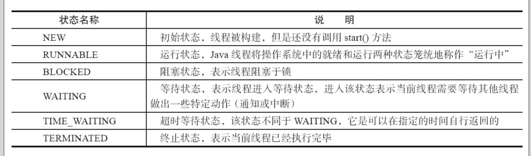
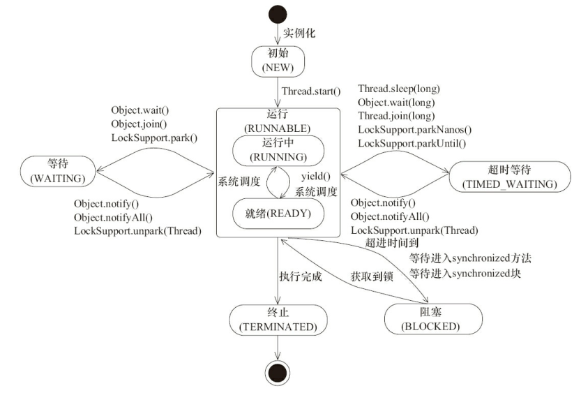
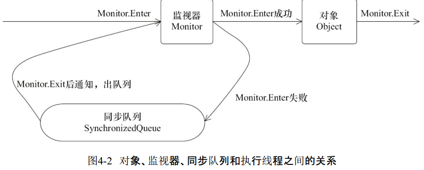
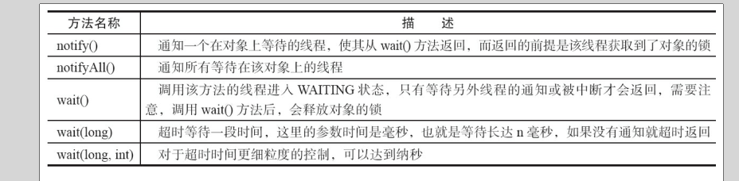
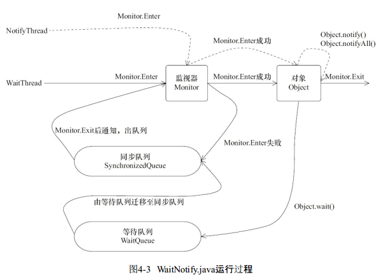
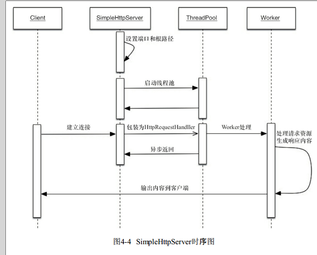

## java 并发编程的艺术

一个Java程序从main()方法开始执行，然后按照既定的代码逻辑执行，看似没有其他线程参与，但实际上Java程序天生就是多线程程序，因为执行main()方法的是一个名称为main的线程。  

在Java线程中，通过一个整型成员变量**priority**来控制优先级，优先级的范围从1~10，在线程构建的时候可以通过**setPriority(int)** 方法来修改优先级，**默认优先级是5，优先级高的线程分配时间片的数量要多于优先级低的线程**。设置线程优先级时，**针对频繁阻塞（休眠或者I/O操作）的线程需要设置较高优先级，而偏重计算（需要较多CPU时间或者偏运算）的线程则设置较低的优先级**，确保处理器不会被独占。( 数值越大优先级越高,分到时间片越多 ).

线程优先级不能作为程序正确性的依赖，因为操作系统可以完全不用理会Java线程对于优先级的设定。

线程的状态





线程创建之后，调用start()方法开始运行。当线程执行wait()方法之后，线程进入等待状态。进入等待状态的线程需要依靠其他线程的通知才能够返回到运行状态，而超时等待状态相当于在等待状态的基础上增加了超时限制，也就是超时时间到达时将会返回到运行状态。当线程调用同步方法时，在没有获取到锁的情况下，线程将会进入到阻塞状态。线程在执行Runnable的run()方法之后将会进入到终止状态。

java将操作系统中的运行和就绪两个状态合并称为 **运行状态**。阻塞状态是线程阻塞在进入synchronized关键字修饰的方法或代码块（获取锁）时的状态，但是阻塞在java.concurrent包中Lock接口的线程状态却是等待状态，因为java.concurrent包中Lock接口对于阻塞的实现均使用了LockSupport类中的相关方法

Daemon线程是一种支持型线程，因为它主要被用作程序中 **后台调度以及支持性工作**。这意味着，当一个Java虚拟机中 **不存在非Daemon线程** 的时候，Java虚拟机将会退出。可以通过调用Thread.setDaemon(true)将线程设置为Daemon线程。

Daemon属性需要在启动线程之前设置，不能在启动线程之后设置。

```java
Thread thread = new Thread(new DaemonRunner(), "DaemonRunner");
thread.setDaemon(true);
thread.start();
```

在构建Daemon线程时，不能依靠finally块中的内容来确保执行关闭或清理资源的逻辑，因为它不一定执行。

##### 启动和终止线程

在运行线程之前首先要构造一个线程对象，线程对象在构造的时候需要**提供线程所需要的属性，如线程所属的线程组、线程优先级、是否是Daemon线程**等信息。

一个新构造的线程对象是 **由其parent线程来进行空间分配的，而child线程继承了parent是否为Daemon、优先级和加载资源的contextClassLoader以及可继承的ThreadLocal，同时还会分配一个唯一的ID来标识这个child线程**。至此，一个能够运行的线程对象就初始化好了，在 **堆内存** 中等待着运行。

线程对象在初始化完成之后，调用start()方法就可以启动这个线程。线程start()方法的含义是：当前线程（即parent线程）同步告知Java虚拟机，只要线程规划器空闲，应立即启动调用start()方法的线程。最好给线程起个名字。

####### 中断

中断可以理解为线程的**一个标识位属性**，它表示一个运行中的线程是否被其他线程进行了中断操作。中断好比其他线程对该线程打了个招呼，**其他线程通过调用该线程的interrupt()方法对其进行中断操作。**

线程通过检查自身是否被中断来进行响应，线程通过法**isInterrupted()来进行判断是否被中断**，也可以调用静态方法 **Thread.interrupted()对当前线程的中断标识位进行复位。** 如果该线程已经处于终结状态，即使该线程被中断过，在调用该线程对象的isInterrupted()时依旧会返回false

从Java的API中可以看到，许多声明出InterruptedException的方法（例如Thread.sleep(long millis)方法）这些方法在抛出InterruptedException之前，Java虚拟机会**先将该线程的中断标识位清除**，然后抛出InterruptedException，此时调用isInterrupted()方法将会返回false。

Java中断机制是一种协作机制，也就是说 **通过中断并不能直接终止另一个线程，而需要被中断的线程自己处理中断**。当调用interrupt()方法的时候,只是设置了要中断线程的中断状态，而此时被中断的线程的可以通过isInterrupted()或者是interrupted（）方法判断当前线程的中断状态是否标志为中断。但是会产生一个副作用，清除当前的线程的中断状态。

Thread.currentThread().isInterrupted().

interrupt（）方法是设置线程的中断状态，** 让用户自己选择时间地点去结束线程**；而stop（）方法会在代码的运行处直接抛出一个ThreadDeath错误，这是一个java.lang.Error的子类。所以直接使用stop（）方法就有可能造成对象的不一致性。

不建议使用的原因主要有：以suspend()方法为例，在调用后，线程**不会释放已经占有的资源（比如锁） ，而是占有着资源进入睡眠状态，这样容易引发死锁问题**。同样，stop()方法在终结一个线程时**不会保证线程的资源正常释放，通常是没有给予线程完成资源释放工作的机会，因此会导致程序可能工作在不确定状态下**。

暂停和恢复操作可以用等待/通知机制来替代

##### 安全地终止线程

提到的中断状态是线程的一个标识位，而中断操作是一种简便的线程间交互方式，而这种交互方式最适合用来取消或停止任务。除了中断以外，**还可以利用一个boolean变量来控制是否需要停止任务并终止该线程**。


####### 问： 线程终止的方法

让run方法执行完毕，该线程就会正常结束;

设置标志让其终止。设一个boolean标志，并通过设置这个标志来控制循环是否退出;

使用interrupt方法终止线程;

#####　线程之间通信

关键字volatile可以用来修饰字段（成员变量），就是告知程序任何对该变量的访问均需要从共享内存中获取，而对它的改变必须同步刷新回共享内存，它能保证所有线程对变量访问的可见性。

但是，过多地使用volatile是不必要的，因为它会降低程序执行的效率。

对于 **同步块** 的实现使用了(插入指令)**monitorenter和monitorexit指令**，而　**同步方法** 则是依靠方法**修饰符上的ACC_SYNCHRONIZED**来完成的。无论采用哪种方式，其本质是**对一个对象的监视器（monitor）进行获取，而这个获取过程是排他的，也就是同一时刻只能有一个线程获取到由synchronized所保护对象的监视器**。

任意一个对象都拥有**自己的监视器**，当这个对象由同步块或者这个对象的同步方法调用时，执行方法的线程必须**先获取到该对象的监视器才能进入同步块或者同步方法，而没有获取到监视器（执行该方法）的线程将会被阻塞在同步块和同步方法的入口处，进入BLOCKED状态**。



任意线程对Object（Object由synchronized保护）的访问，首先要获得**Object的监视器**。如果获取失败，线程进入同步队列，线程状态变为**BLOCKED**。当访问Object的前驱（获得了锁的线程）释放了锁，则该释放操作**唤醒阻塞在同步队列中的线程**，使其重新尝试对监视器的获取。



等待/通知机制，是指一个线程A调用了对象O的wait()方法进入等待状态，而另一个线程B调用了对象O的notify()或者notifyAll()方法，**线程A收到通知后从对象O的wait()方法返回，进而执行后续操作。** 上述两个线程 **通过对象O来完成交互**，而对象上的wait()和notify/notifyAll()的关系就如同开关信号一样，用来完成等待方和通知方之间的交互工作。

线程通过对象进行通信交互。

1）使用 wait()、notify()和 notifyAll()时需要先**对调用对象加锁。**

2）调用wait()方法后，线程状态**由RUNNING变为WAITING**，并将当前线程放置到对象的等待队列。

3）notify()或notifyAll()方法调用后，等待线程依旧不会从wait()返回，**需要调用notify()或notifAll()的线程释放锁之后**，等待线程才有机会从wait()返回。

4）notify()方法将等待队列中的**一个**等待线程从等待队列中移到同步队列中，而notifyAll()方法则是将等待队列中**所有**的线程全部移到同步队列，被移动的线程状态由WAITING变为BLOCKED。

RUNNABLE --> WATIING --> BLOCKED

5）从wait()方法返回的前提是 **获得了调用对象的锁。**

等待/通知机制依托于同步机制，其目的就是确保等待线程从wait()方法返回时能够**感知到通知线程对变量做出的修改。**

###### 为什么要在wait, notify, notifyAll 之前获得对象的锁?

当一个线程正在某一个对象的同步方法（同步代码块）中运行时调用了这个对象的wait()方法，那么这个线程将释放该对象的**独占锁并被放入这个对象的等待队列(waitqueue)** 。注意，wait()方法强制当前线程释放对象锁。这意味着在调用某对象的wait()方法之前，当前线程必须已经获得该对象的锁。因此，线程必须在某个对象的同步方法或同步代码块中才能调用该对象的wait()方法。

当某线程调用某对象的notify()或notifyAll()方法时，任意一个(对于notify())或者所有(对于notifyAll())在该对象的等待队列中的线程，将被转移到该对象的入口队列。**接着这些队列(译者注:可能只有一个)将竞争该对象的锁，最终获得锁的线程继续执行。如果没有线程在该对象的等待队列中等待获得锁，那么notify()和notifyAll()将不起任何作用。** 在调用对象的notify()和notifyAll()方法之前，调用线程必须已经得到该对象的锁。因此，必须在某个对象的同步方法或dd同步代码块中才能调用该对象的notify()或notifyAll()方法。

对于处于某对象的等待队列中的线程，只有当其他线程调用此对象的notify()或notifyAll()方法时才有机会继续执行。

调用wait()方法的原因通常是，调用线程希望某个特殊的状态(或变量)被设置之后再继续执行。调用notify()或notifyAll()方法的原因通常是，调用线程希望告诉其他等待中的线程:"特殊状态已经被设置"。这个状态作为线程间通信的通道，它必须是一个可变的共享状态(或变量)。



###### 等待/通知的经典范式

等待方遵循如下原则。
1）获取对象的锁。
2）如果条件不满足，那么调用对象的wait()方法，被通知后仍要检查条件。
3）条件满足则执行对应的逻辑。
对应的伪代码如下。
``` java
synchronized(对象) {
  while(条件不满足) {
  对象.wait();
  }
  对应的处理逻辑
}
```

通知方遵循如下原则。
1）获得对象的锁。
2）改变条件。
3）通知所有等待在对象上的线程。
对应的伪代码如下。
``` java
synchronized(对象) {
  改变条件
  对象.notifyAll();
}
```

##### 管道输入/输出流

管道输入/输出流和普通的文件输入/输出流或者网络输入/输出流不同之处在于，它主要用于线程之间的数据传输，而传输的媒介为内存。

PipedOutputStream、PipedInputStream、
PipedReader和PipedWriter，前两种面向字节，而后两种面向字符

对于Piped类型的流，必须先要进行绑定，也就是调用connect()方法，如果没有将输入/输出流绑定起来，对于该流的访问将会抛出异常。

直接处理线程之间的关系。

如果一个线程A执行了**thread.join()** 语句，其含义是：当前线程A等待thread线程终止之后才从thread.join()返回。线程Thread除了提供**join()方法之外，还提供了join(long millis)和join(long
millis,int nanos)** 两个具备超时特性的方法。这两个超时方法表示，如果线程thread在给定的超时时间里没有终止，那么将会从该超时方法中返回。

当线程终止时，会调用线程自身的notifyAll()方法，会通知所有等待在该线程对象上的线程。


**ThreadLocal** ，即线程变量，是一个以ThreadLocal对象为键、任意对象为值的存储结构。这个结构被附带在线程上，也就是说一个线程可以根据一个ThreadLocal对象查询到绑定在这个线程上的一个值。


#####  应用实例

等待超时模式

``` java
// 对当前对象加锁
public synchronized Object get(long mills) throws InterruptedException {
  long future = System.currentTimeMillis() + mills;
  long remaining = mills;
  // 当超时大于0并且result返回值不满足要求
  while ((result == null) && remaining > 0) {
        wait(remaining);
        remaining = future - System.currentTimeMillis();
  }
  return result;
}

```

``` java
数据库连接池

public void releaseConnection(Connection connection) {
  if (connection != null) {
    synchronized (pool) {
      // 连接释放后需要进行通知，这样其他消费者能够感知到连接池中已经归还了一个连接
      pool.addLast(connection);
      pool.notifyAll();
    }
  }
}

public Connection fetchConnection(long mills) throws InterruptedException {
synchronized (pool) {
    // 完全超时
    if (mills <= 0) {
      while (pool.isEmpty()) {
        pool.wait();
      }
      return pool.removeFirst();
    } else {
      long future = System.currentTimeMillis() + mills;
      long remaining = mills;
      while (pool.isEmpty() && remaining > 0) {
        pool.wait(remaining);
        remaining = future - System.currentTimeMillis();
      }
      Connection result = null;
      if (!pool.isEmpty()) {
        result = pool.removeFirst();
      }
      return result;
    }
 }

```

##### 线程池技术

线程池技术能够很好地解决这个问题，它预先创建了若干数量的线程，并且不能由用户直接对线程的创建进行控制，在这个前提下重复使用固定或较为固定数目的线程来完成任务的执行。这样做的好处是，一方面，消除了频繁创建和消亡线程的系统资源开销，另一方面，面对过量任务的提交能够平缓的劣化。

线程池的 **本质** 就是使用了一个线程安全的工作队列连接工作者线程和客户端线程，客户端线程将任务放入工作队列后便返回，而工作者线程则不断地从工作队列上取出工作并执行。当工作队列为空时，所有的工作者线程均等待在工作队列上，当有客户端提交了一个任务之后会通知任意一个工作者线程，随着大量的任务被提交，更多的工作者线程会被唤醒。


