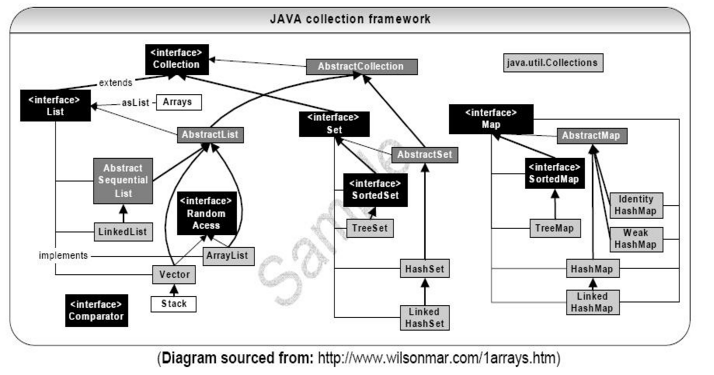

关系图



[from web side](http://blog.csdn.net/zztfj/article/details/7563262)

### List

ArrayList的内部实现为一个**Object数组**，重载的两个构造方法，默认长度为10。
增加元素：

ArrayList是怎么实现容量自增.

```java
private void grow(int minCapacity) {
// overflow-conscious code
    int oldCapacity = elementData.length;
    int newCapacity = oldCapacity + (oldCapacity >> 1);
    if (newCapacity - minCapacity < 0)
        newCapacity = minCapacity;
    if (newCapacity - MAX_ARRAY_SIZE > 0)
        newCapacity = hugeCapacity(minCapacity);
    // minCapacity is usually close to size, so this is a win:
    elementData = Arrays.copyOf(elementData, newCapacity);//返回制定大小的数组，并拷贝，语法精简  
}
```
LinkedList： 底层用**双向循环链表**实现的List

Vector: 底层用**数组**实现List接口的另一个类；
特点：重量级，占据更多的系统开销，**线程安全**；
Vector与ArrayList基本上一致，最大的差别于在一些方法上使用了**synchronized**关键字，使其变成线程安全。

HashSet：

采用**哈希算法**来实现Set接口；

唯一性保证：重复对象**equals**方法返回为true；

重复对象hashCode方法返回相同的整数，不同对象hashCode尽量保证不同（提高效率）

实际上的HashSet内部的实现为一个**HashMap**

HashSet添加一个元素时，添加的值为HashMap的Key值，而一个Object对象却为一个Value值。HashSet无序不重复的属性则来自于HashMap。Map的key值不能重复

TreeSet：

在元素添加的同时，进行排序。也要给出排序规则；

唯一性保证：根据排序规则，**compareTo** 方法返回为0，就可以认定两个对象中有一个是重复对象。

如果想把自定义类的对象存入TreeSet进行排序, 那么必须实现Comparable接口

在使用TreeSet存储对象的时候, add()方法内部就会自动调用compareTo()方法进行比较, 根据比较结果使用二叉树形式进行存储

底层结构是**二叉树(TreeMap)**　**红黑树** 实现。按照树节点进行存储和取出

Map：
元素是键值对：key唯一不可重复，value可重复；

遍历：先迭代遍历key的集合，再根据key得到value；

SortedMap：元素自动对key排序

HashMap:
轻量级，非线程安全，允许key或者value是null；

本质上是其为一个**Entry数组**,Entry以及key值一旦赋值就无法更改(final)

Hashtable：

重量级，**线程安全**，不允许key或者value是null；

与HashMap很相识，这是Hashmap为其轻量级的实现。

大量带有实际操作性的方法都为synchronized修饰。

一个对象可以容纳了多个对象（不是引用），这个集合对象主要用来管理维护一系列相似的对象。
