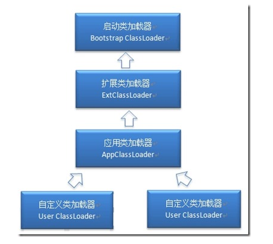

####  类的加载机制

定义：

#####  重点: class文件的加载过程:

类的加载指的是将类的 **.class** 文件中的二进制数据读入到 **内存** 中，将其放在运行时 **数据区的方法区** 内，然后在堆区创建一个**java.lang.Class对象**，用来**封装**类在方法区内的数据结构。(每个class文件对应一个Class对象)

最终产品:

位于堆区中的**Class对象**，Class对象封装了类在**方法区**内的数据结构，并且向Java程序员提供了访问**方法区内的数据结构的接口**。

类加载器预先加载，首次使用该类的时候才报告错误

Class对象是类在方法区内的数据结构的入口

##### 类的生命周期

加载、验证、准备、解析、初始化

顺序开始，但是会交叉运行，

###### 加载

任务:查找并加载类的二进制数据

加载阶段，虚拟机需要完成以下三件事情：
1. 通过一个类的全限定名来 **获取** 其定义的`二进制字节流`。
2. 将这个字节流所代表的*静态存储结构*转化为*方法区的运行时数据结构.*
3. 在Java堆中生成一个代表这个类的java.lang.Class对象，作为对方法区中这些数据的访问入口。

开发人员既可以使用系统提供的类加载器来完成加载，也可以自定义自己的类加载器来完成加载。

连接:验证，准备，解析

###### 验证

任务：

确保被加载的类的**正确性**。确保Class文件的字节流符合当前虚拟机，不会危害虚拟机自身的安全  (保证安全性)。

文件格式验证：验证字节流是否符合Class文件格式的规范；

元数据验证：对字节码描述的信息进行语义分析（注意：对比javac编译阶段的语义分析）

字节码验证：通过数据流和控制流分析，确定程序语义是合法的、符合逻辑的。

符号引用验证：确保解析动作能正确执行。

###### 准备

任务:

为类的**静态变量**分配内存，并将其初始化为默认值

准备阶段是**正式为类变量分配内存**并设置**类变量初始值**的阶段，这些内存都将在**方法区**中分配。

注意点：　

1. 这时候进行**内存分配的仅包括类变量（static）** ，而不包括实例变量，实例变量会在对象实例化时随着对象一块分配在Java堆中。

2. 这里所设置的初始值通常情况下是数据类型默认的零值（如0、0L、null、false等），而不是被在Java代码中被显式地赋予的值。
其后的初始值被封装到类的构造器中，赋值在初始化阶段才执行

3. **基本数据类型** 来说，对于类变量（static）和全局变量，如果不显式地对其赋值而直接使用，则系统会为其赋予默认的零值，而对于**局部变量**来说，在使用前必须显式地为其赋值，否则编译时不通过。

4. 同时被static和final修饰的常量，必须在**声明**的时候就为其**显式地赋值**，否则编译时不通过；

5. 只被final修饰的常量则既可以在声明时显式地为其赋值，也可以在类初始化时显式地为其赋值，总之，在使用前必须为其显式地赋值，系统不会为其赋予默认零值。　

6. 引用数据类型，系统默认赋值null

7. 数组初始化时没有对数组中的各元素赋值，其中的元素将根据对应的数据类型而被赋予默认的零值。

8. final和static修饰，那么在准备阶段变量value就会被初始化为所指定的值。

#### 解析

任务:

把类中的符号引用转换为直接引用

将**常量池**内的符号引用替换为直接引用的过程，解析动作主要针对**类或接口、
字段、类方法、接口方法、方法类型、方法句柄和调用点限定符7类符号**引用进行

```
在编译时，java类并不知道所引用的类的实际地址，因此只能使用符号引用来代替。

符号引用与虚拟机的布局无关

直接引用可以是
（1）直接指向目标的指针（比如，指向“类型”【Class对象】、类变量、类方法的直接引用可能是指向方法区的指针）
（2）相对偏移量（比如，指向实例变量、实例方法的直接引用都是偏移量）
（3）一个能间接定位到目标的句柄

直接引用是和虚拟机的布局相关的
```

####  初始化

为类的静态变量赋予正确的初始值

类变量初始化的方式：

声明类变量是指定初始值

使用静态代码块为类变量指定初始值

JVM初始化步骤

1、假如这个类还没有被加载和连接，则程序先加载并连接该类

2、假如该类的直接父类还没有被初始化，则先初始化其直接父类（先父后子）

3、假如类中有初始化语句，则系统依次执行这些初始化语句（依次执行）

初始化的时机：

只有当对类的**主动使用**的时候才会导致类的初始化。

– 创建类的实例，也就是new的方式

– 访问某个类或接口的静态变量，或者对该静态变量赋值

– 调用类的静态方法

– 反射（如Class.forName(“com.shengsiyuan.Test”)）

– 初始化某个类的子类，则其父类也会被初始化（并且只初始化一次）

结束生命周期

在如下几种情况下，Java虚拟机将结束生命周期

– 执行了System.exit()方法

– 程序正常执行结束

– 程序在执行过程中遇到了异常或错误而异常终止

– 由于操作系统出现错误而导致Java虚拟机进程终止


类加载器




java虚拟机

只存在两种不同的类加载器：**启动类加载器**,它使用C++实现,是虚拟机自身的一部分;**所有其他的类加载器** ：这些类加载器都由Java语言实现，独立于虚拟机之外，并且全部继承自抽象类**java.lang.ClassLoader**，**这些类加载器需要由启动类加载器加载到内存中之后才能去加载其他的类。**


Java开发人员的角度

启动类加载器：Bootstrap ClassLoader，负责加载存放在JDK\jre\lib(JDK代表JDK的安装目录，下同)下，或被-Xbootclasspath参数指定的路径中的，并且能被虚拟机识别的类库（如rt.jar，所有的java.\*开头的类均被Bootstrap ClassLoader加载）。**启动类加载器是无法被Java程序直接引用的。**

扩展类加载器：Extension ClassLoader，该加载器由sun.misc.Launcher$ExtClassLoader实现，它负责加载DK\jre\lib\ext目录中，或者 **由java.ext.dirs系统变量指定的路径中的所有类库（如javax.\*开头的类）**，开发者可以直接使用扩展类加载器。

应用程序类加载器：Application ClassLoader，该类加载器由sun.misc.Launcher$AppClassLoader来实现，**它负责加载用户类路径（ClassPath）所指定的类，开发者可以直接使用该类加载器，如果应用程序中没有自定义过自己的类加载器，一般情况下这个就是程序中默认的类加载器。**


编写自己的ClassLoader

1）在执行非置信代码之前，自动验证数字签名。

2）动态地创建符合用户特定需要的定制化构建类。

3）从特定的场所取得java class，例如数据库中和网络中。

jvm　类加载机制

•**全盘负责**，当一个类加载器负责加载某个Class时，该Class所**依赖的和引用的其他Class也将由该类加载器负责载入**，除非显示使用另外一个类加载器来载入

•**父类委托**，先**让父类加载器试图加载该类，只有在父类加载器无法加载该类时才尝试从自己的类路径中加载该类**

•**缓存机制**，缓存机制将会保证所有加载过的Class都会被缓存，当程序中需要使用某个Class时，类加载器先从缓存区寻找该Class，只有缓存区不存在，系统才会读取该类对应的二进制数据，并将其转换成Class对象，存入缓存区。这就是为什么**修改了Class后，必须重启JVM，程序的修改才会生效**


类加载有三种方式：

1、命令行启动应用时候由JVM初始化加载

2、通过Class.forName()方法动态加载

3、通过ClassLoader.loadClass()方法动态加载


##### Class.forName() 和 ClassLoader.loadClass()区别

Class.forName()：将类的.class文件加载到jvm中之外，还会对类进行解释，执行类中的static块；

ClassLoader.loadClass()：只干一件事情，就是将.class文件加载到jvm中，不会执行static中的内容,只有在newInstance才会去执行static块。

### 双亲委派模型

如果一个类加载器收到了类加载的请求，它首先不会自己去尝试加载这个类，而是 **把请求委托给父加载器** 去完成，依次向上，因此，所有的类加载请求最终都应该被传递到 **顶层的启动类加载器** 中，只有当父加载器在它的搜索范围中没有找到所需的类时，即无法完成该加载，子加载器才会尝试自己去加载该类。

双亲委派模型意义：

-系统类防止内存中出现多份同样的字节码，确定**加载类的唯一性
避免程序混乱**。

-保证Java程序安全稳定运行

##### 自定义类加载器　

继承自 ClassLoader 类，从上面对 loadClass 方法来分析来看，我们只需要重写 findClass 方法
