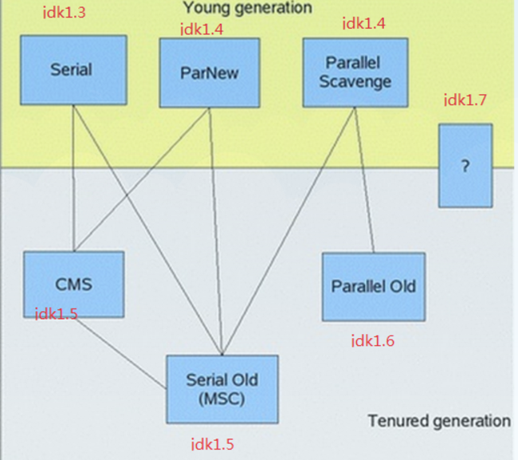

### 垃圾收集(GC)

jvm 中，程序计数器、jvm栈、本地方法栈都是 **随线程而生随线程而灭**, 实现了 **自动的内存清理** ，因此，我们的内存垃圾回收主要集中于 **java 堆和方法区** 中，在程序运行期间，这部分内存的分配和使用都是动态的.

###　对象可达性分析: 判断对象是否存在

可达性分析（Reachability Analysis）：从 **GC Roots** 开始向下搜索，搜索所走过的路径称为　**引用链**。当一个对象到GC Roots **没有任何引用链相连** 时，则证明此对象是不可用的。不可达对象。

GC Roots包括：

**jvm栈** 中引用的对象。

**方法区中类静态属性实体** 引用的对象。

方法区中 **常量** 引用的对象。

本地方法栈中 **JNI引用的对象** 。

### 垃圾收集算法

#### 标记－清除算法

算法分为“标记”和“清除”两个阶段：首先标记出所有需要回收的对象，在标记完成后统一回收掉所有被标记的对象。

主要缺点有两个：

一个是**效率问题**，标记和清除过程的效率都不高；

另外一个是**空间问题**，标记清除之后会产生 **大量不连续的内存碎片** ，空间碎片太多可能会导致，当程序在以后的运行过程中需要 **分配较大对象时无法找到足够的连续内存** 而不得不提前触发另一次垃圾收集动作。

#### 复制 算法

“复制”（Copying）的收集算法，它将可用内存按容量划分为大小相等的两块，每次只使用其中的一块。当这一块的内存用完了，就将还 **存活着的对象** 复制到另外一块上面，然后再把已使用过的内存空间一次清理掉。　

优点：不用考虑内存碎片，实现简单，运行高效.

缺点：内存缩小为原来的一半，复制长期生存的对象导致效率低。

老年代一般不选用该算法。复制代价高

#### 标记-压缩 算法

根据老年代的特点，有人提出了另外一种“标记-整理”（Mark-Compact）算法。标记过程仍然与“标记-清除”算法一样，但后续步骤不是直接对可回收对象进行清理，而是**让所有存活的对象都向一端移动，然后直接清理掉端边界以外的内存**。

#### 分代收集 算法

GC分代的基本**假设**：绝大部分对象的生命周期都非常短暂，存活时间短。

分代收集”（Generational Collection）算法，把Java堆分为新生代和老年代，这样就可以根据各个年代的特点采用最适当的收集算法

**新生代中**，每次垃圾收集时都发现有大批对象死去，只有少量存活，那就选用**复制算法**

**老年代** 中因为对象存活率高、没有额外空间对它进行分配担保，就必须使用“标记-清理”或“标记-整理”算法来进行回收。

### 垃圾收集器

垃圾收集的具体实现
..
#####  Serial 收集器
(jdk 1.3)

**串行收集器** 是最古老，最稳定以及效率高的收集器，可能会产生**较长的停顿**，**只使用一个线程** 去回收。新生代、老年代使用 **串行回收**；新生代复制算法、老年代标记-压缩；垃圾收集的过程中会Stop The World（服务暂停）

##### ParNew收集器
(jdk1.4)

新生代并行

ParNew收集器其实就是Serial收集器的 **多线程版本**。**新生代并行，老年代串行**；新生代复制算法、老年代标记-压缩

##### Parallel收集器
(jdk1.4)
Parallel Scavengea,类似ParNew收集器，Parallel收集器更关注系统的吞吐量。新生代并行，吞吐量优先的收集器。

新生代 复制算法、老年代 标记-压缩

##### Parallel Old 收集器

Parallel Old是Parallel Scavenge收集器的老年代版本，使用 **多线程和“标记－压缩”算法** 。这个收集器是在**JDK 1.6**中才开始提供 老年代并行　

#### CMS 收集器
（jdk 1.5）
CMS（Concurrent Mark Sweep）收集器是一种以**获取最短回收停顿时间为目标**的收集器

“标记-清除”算法

步骤:

初始标记（CMS initial mark）

并发标记（CMS concurrent mark）

重新标记（CMS remark）

并发清除（CMS concurrent sweep）

初始标记、重新标记这两个步骤仍然需要“Stop The World”

总体上，CMS收集器的内存回收过程是**与用户线程一起并发地执行**。老年代收集器（新生代使用ParNew）

优点:并发收集、低停顿

缺点：产生大量空间碎片、并发阶段会降低吞吐量

##### G1收集器

HotSpot开发团队赋予它的使命是未来可以替换掉JDK1.5中发布的CMS收集器。与CMS收集器相比G1收集器有以下特点。

1. 空间整合，G1收集器采用**标记整理算法**，不会产生内存空间碎片。分配大对象时不会因为无法找到连续空间而提前触发下一次GC。

2. **可预测停顿**，这是G1的另一大优势，降低停顿时间是G1和CMS的共同关注点，但 **G1除了追求低停顿外，还能建立可预测的停顿时间模型** ，能让使用者明确指定在一个长度为N毫秒的时间片段内，消耗在垃圾收集上的时间不得超过N毫秒，这几乎已经是实时Java（RTSJ）的垃圾收集器的特征了。

使用 **G1收集器时，Java堆的内存布局与其他收集器** 有很大差别，它将整个 **Java堆划分为多个大小相等的独立区域（Region）** ，虽然还保留有新生代和老年代的概念，但新生代和老年代不再是物理隔阂了，它们都是一部分（可以不连续）Region的集合。(按区域来划分)

G1收集器可以实现在基本不牺牲吞吐量的前提下完成低停顿的内存回收，这是由于它能够 **极力地避免全区域的垃圾收集**，之前的收集器进行收集的范围都是整个新生代或老年代，而G1将整个Java堆（包括新生代、老年代）**划分为多个大小固定的独立区域（Region），并且跟踪这些区域里面的垃圾堆积程度，在后台维护一个优先列表，每次根据允许的收集时间，优先回收垃圾最多的区域**（这就是Garbage First名称的来由）。区域划分及有优先级的区域回收，保证了G1收集器在有限的时间内可以获得最高的收集效率。

当新生代占用达到一定比例的时候，开始触发收集。和CMS类似，G1收集器收集老年代对象会有短暂停顿。

[参考文档](http://www.cnblogs.com/ityouknow/p/5614961.html)

#### 新生代和老年代

划分的意义:

把堆划分为新生代和老年代有2个好处：简化了新对象的分配(只在新生代分配内存),可以更有效的清除不再需要的对象(即死对象)(新生代和老年代使用不同的GC算法)

#### 新生代垃圾回收（MINUS GC）细节

把新生代 (标记整理) 进一步划分为3个区域：一个相对大点的区域，称为”伊甸园区(Eden)”；两个相对小点的区域称为”From 幸存区(survivor)”和”To 幸存区(survivor)”(8:1:1).按照规定,新对象会首先分配在 Eden 中(如果 **新对象过大，会直接分配在老年代中** )。在GC中，Eden 中的对象会被移动到survivor中，直至对象满足一定的年纪(定义为熬过GC的次数),会被移动到老年代。

新生代的 GC使用 **复制算法**。在GC前 **To 幸存区(survivor)** 保持清空,对象保存在 Eden 和 **From 幸存区(survivor)** 中

GC运行时, Eden中的幸存对象被复制到 To 幸存区(survivor)。针对 From 幸存区(survivor)中的幸存对象(上一次垃圾收集下来的对象)，会考虑对象年龄,如果年龄没达到阀值(tenuring threshold)，对象会被复制到To 幸存区(survivor)。如果达到阀值对象被复制到老年代。**复制阶段完成后，Eden 和 From 幸存区中只保存死对象，可以视为清空**。大对象直接放在老年区。

如果在复制过程中 To幸存区被填满了，**剩余的对象会被复制到老年代中**。最后  From幸存区 和 To幸存区会 **调换下名字** ，在下次GC时， To幸存区会成为From 幸存区。

JDK和垃圾收集器

jdk 7使用了 **G1收集器**

##### java回收方法区

永久代的垃圾回收主要回收两部分内容：**废弃常量和无用的类**

常量回收：没有引用该常量的时候，发生回收。

无用的类需要满足3个条件：

（1）该类所有的实例都已经被回收，即Java堆中不存在该类的任何实例；没有实例。

（2）加载该类的ClassLoader已经被回收；

（3）该类对应的java.lang.Class对象没有在任何地方被引用，无法在任何地方通过反射访问该类的方法

### java 什么时候开始垃圾收集 （重点）

1. 对象优先 **在Eden中分配，当Eden中没有足够空间** 时，虚拟机将发生一次 Minor GC，因为Java大多数对象都是朝生夕灭，所以Minor GC非常频繁，而且速度也很快；

2. Full GC，发生在老年代的GC，当 **老年代没有足够的空间时即发生 Full GC**，发生 Full GC一般都会有一次 Minor GC。大对象直接进入老年代，如很长的字符串数组，虚拟机提供一个-XX:PretenureSizeThreadhold参数，令大于这个参数值的对象直接在老年代中分配，避免在Eden区和两个Survivor区发生大量的内存拷贝；

3. 发生Minor GC时，虚拟机会检测之前每次晋升到老年代的平均大小是否大于老年代的剩余空间大小，如果大于，则进行一次 Full GC，如果小于，则查看HandlePromotionFailure设置是否允许担保失败，如果允许，那只会进行一次Minor GC，如果不允许，则改为进行一次Full GC。

#### java 堆的分配原则

1、对象优先分配在Eden区，如果 **Eden区没有足够的空间时，虚拟机执行一次Minor GC**。

2、**大对象直接进入老年代**（大对象是指需要大量连续内存空间的对象）。这样做的目的是避免在Eden区和两个Survivor区之间发生大量的内存拷贝（新生代采用复制算法收集内存）。

3、长期存活的对象进入老年代。虚拟机为每个对象定义了一个年龄计数器，如果对象经过了1次 Minor GC 那么对象会进入Survivor区，之后每经过一次Minor GC那么对象的年龄加1，知道达到阀值对象进入老年区。

4、动态判断对象的年龄。如果Survivor区中相同年龄的所有对象大小的总和大于Survivor空间的一半，年龄大于或等于该年龄的对象可以直接进入老年代。

5、**空间分配担保**。每次进行Minor GC时，JVM会计算Survivor区移至老年区的对象的平均大小，如果这个值大于老年区的剩余值大小则进行一次Full GC，如果小于检查HandlePromotionFailure设置，如果true则只进行Monitor GC,如果false则进行Full GC。
