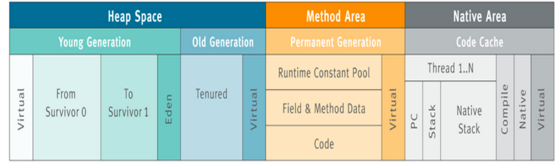
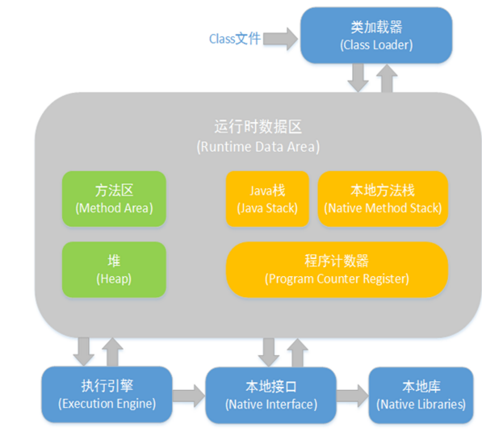

### JVM 内存模型

**JVM内存结构主要有三大块：堆内存、方法区和栈**

堆的布局

堆内存是JVM中最大的一块由年轻代和老年代组成，而**年轻代**内存又被分成三部分，Eden空间、From Survivor空间、To Survivor空间,默认情况下年轻代按照8:1:1的比例来分配。

**方法区**: 存储类信息、常量、静态变量等数据，是**线程共享的区域**，为与Java堆区分,方法区还有一个别名Non-Heap(非堆)；

**栈** 又分为java虚拟机栈和本地方法栈主要用于方法的执行。



参数控制（了解）
-Xms设置堆的最小空间大小。

-Xmx设置堆的最大空间大小。

-XX:NewSize设置新生代最小空间大小。

-XX:MaxNewSize设置新生代最大空间大小。

-XX:PermSize设置永久代最小空间大小。

-XX:MaxPermSize设置永久代最大空间大小。

-Xss设置每个线程的堆栈大小。



**方法区，堆** 是所有 **线程共享** 的内存区域，而**栈，本地方法栈**，程序计数器是 **线程所私有的** .　

### 堆　

Java堆（Java Heap）是Java虚拟机所管理的内存中最大的一块。

此内存区域的唯一目的就是 **存放对象实例**，几乎所有的对象实例都在这里分配内存。

Java堆可以处于物理上不连续的内存空间中，只要逻辑上是连续的即可。

如果在堆中没有内存完成实例分配，并且堆也无法再扩展时，将会抛出**OutOfMemoryError异常**。

#### 方法区（Method Area）

与Java堆一样，是各个 **线程共享** 的内存区域，**它用于存储已被虚拟机加载的类信息、常量、静态变量、即时编译器编译后的代码等数据**。

GC分代收集扩展至 **方法区**。

这个区域的内存回收目标主要是 **针对常量池的回收和对类型的卸载**，一般来说这个区域的回收“成绩”比较难以令人满意，尤其是类型的卸载，条件相当苛刻，但是这部分区域的回收确实是有必要的。

OutOfMemoryError 异常

#### 程序计数器

通过改变这个计数器的值来选取下一条需要执行的字节码指令，分支、循环、跳转、异常处理、线程恢复等基础功能都需要依赖这个计数器来完成。

由于Java虚拟机的多线程是通过线程轮流切换并分配处理器执行时间的方式来实现的，在任何一个确定的时刻，一个处理器（对于多核处理器来说是一个内核）只会执行一条线程中的指令。因此，为了线程切换后能恢复到正确的执行位置，每条线程都需要有一个独立的程序计数器，各条线程之间的计数器互不影响，独立存储，我们称这类内存区域为“线程私有”的内存。

线程正在执行一个java方法，这个计数器记录的是正在执行的虚拟机字节码指令的地址，如果是native方法，则为空

#### JVM栈（JVM Stacks）

与程序计数器一样，Java虚拟机栈（Java Virtual Machine Stacks）也是**线程私有的**，它的生命周期与线程相同。虚拟机栈描述的是Java方法执行的**内存模型**：每个方法被执行的时候都会同时创建一个栈帧（Stack Frame）用于存储**局部变量表、操作栈、动态链接、方法出口**等信息。每一个方法被调用直至执行完成的过程，就对应着**一个栈帧在虚拟机栈中从入栈到出栈的过程。**

当进入一个方法时，这个方法需要在帧中分配多大的局部变量空间是**完全确定的**，在方法运行期间不会改变局部变量表的大小。

异常：如果线程请求的栈深度大于虚拟机所允许的深度，将抛出StackOverflowError异常；如果虚拟机栈可以动态扩展（当前大部分的Java虚拟机都可动态扩展，只不过Java虚拟机规范中也允许固定长度的虚拟机栈），当扩展时无法申请到足够的内存时会抛出OutOfMemoryError异常。

#### 本地方法栈

而本地方法栈则是为虚拟机使用到的**Native方法服务**。

#### java 常量池

运行时常量池相对于CLass文件常量池的另外一个重要特征是具备**动态性**

并非预置入CLass文件中常量池的内容才能进入方法区运行时常量池，运行期间也可能将新的常量放入池中，这种特性被开发人员利用比较多的就是String类的intern()方法。

```java

String s1 = new String("计算机");
String s2 = s1.intern();
String s3 = "计算机";
System.out.println("s1 == s2? " + (s1 == s2));
System.out.println("s3 == s2? " + (s3 == s2));
out:
s1 == s2? false
s3 == s2? true
```
String的intern()方法会查找在常量池中是否存在一份equal相等的字符串,如果有则返回该字符串的引用,如果没有则添加自己的字符串进入常量池。


String类和常量池

```java
String s1 = "abc"
String s2 = new String("abc");
```
第一种方式是在常量池中拿对象，第二种方式是直接在堆内存空间创建一个新的对象。

String s1 = new String("xyz");  创建了两个对象。
　
