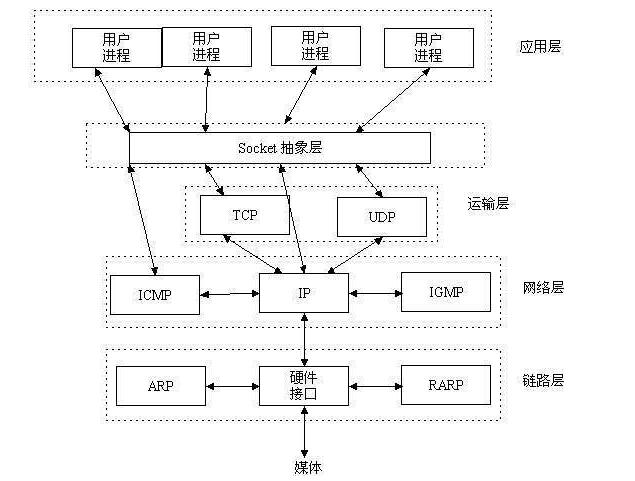
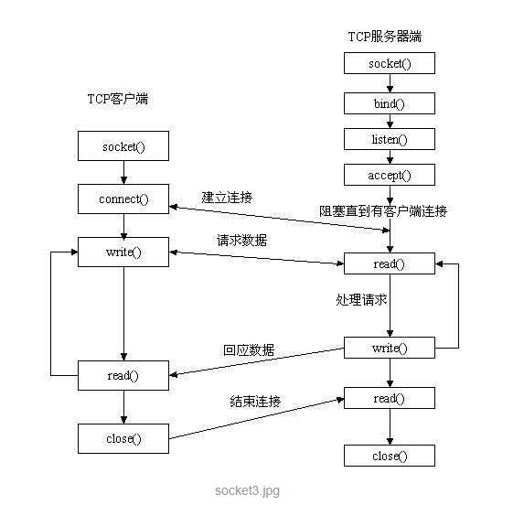

#### socket 原理

Unix的计算机处理IO是通过文件的抽象。计算机不同的进程之间也有输入输出，也就是**通信**。因此这这个通信也是通过 **文件的抽象文件** 描述符来进行。

网络上不同的计算机，也可以通信，那么就得使用网络套接字（socket）。socket就是在不同计算机之间进行**通信的一个抽象**。他工作于TCP/IP协议中应用层和传输层之间的一个抽象。

socket保证了不同计算机之间的通信，也就是网络通信。对于网站，通信模型是客户端服务器之间的通信。两个端都建立一个socket对象，然后通过socket对象对数据进行传输。通常服务器处于一个无线循环，等待客户端连接

