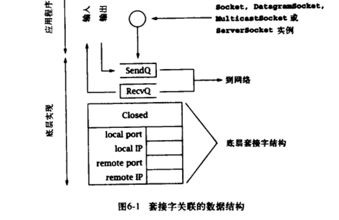
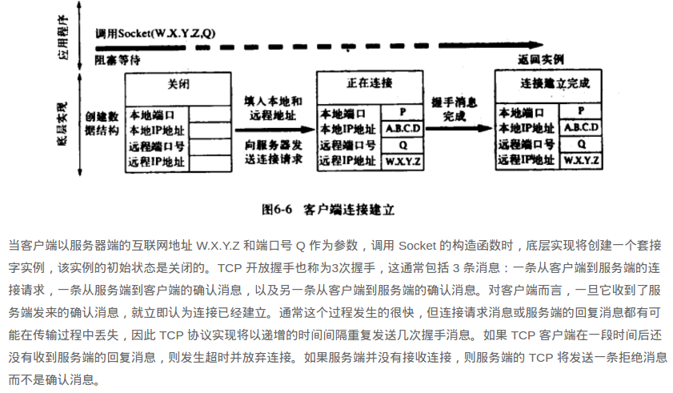
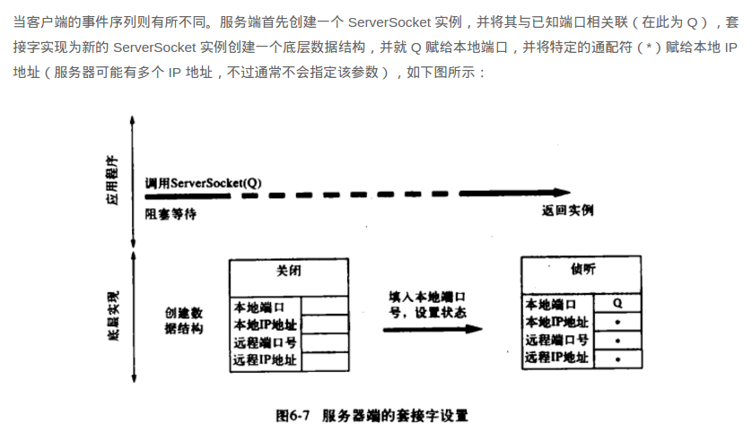
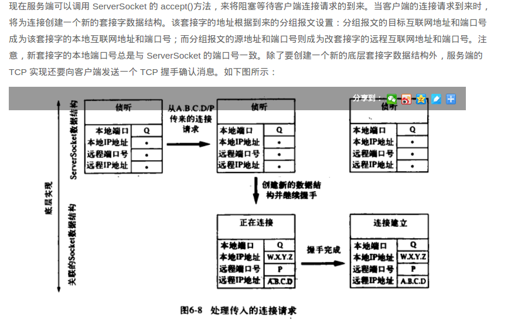
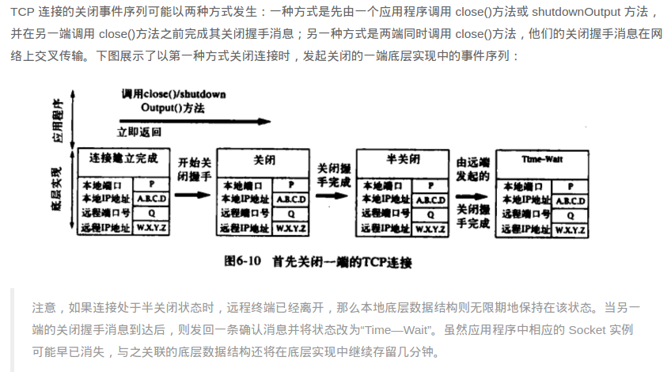
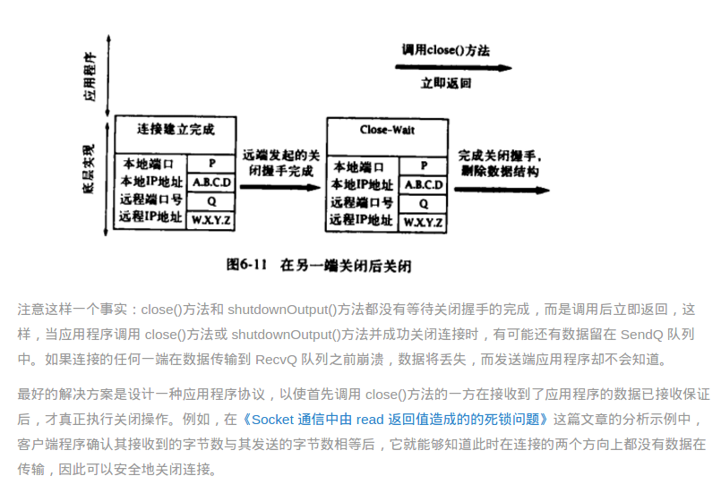

#### java_socket 实现原理

###### 数据传输

套接字结构除其他信息外还包含：

该套接字所关联的本地和远程互联网地址和端口号。

一个 FIFO（First Im First Out）队列，用于存放接收到的等待分配的数据，以及一个用于存放等待传输的数据的队列。

对于 TCP 套接字，还包含了与打开和关闭 TCP 握手相关的额定协议状态信息。

由于 TCP 提供了一种可信赖的字节流服务，任何写入 Socket 和 OutpitStream 的数据副本都必须保留，直到连接的另一端将这些数据成功接收。向输出流写数据并不意味着数据实际上已经被发送——它们只是被复制到了本地缓冲区，就算在 Socket 的 OutputStream 上进行 flush()操作，也不能保证数据能够立即发送到信道。此外，字节流服务的自身属性决定了其无法保留输入流中消息的边界信息。

TCP 连接上发送的所有字节序列在某一瞬间被分成了 3 个 FIFO 队列：

SendQ：在发送端底层实现中缓存的字节，这些字节已经写入输出流，但还没在接收端成功接收。它占用大约 37KB 内存。

RecvQ：在接收端底层实现中缓存的字节，这些字节等待分配到接收程序——即从输入流中读取。它占用大约 25KB 内存。

Delivered：接收者从输入流已经读取到的字节。

OutputStream 的 write()方法时，将向 SendQ 追加字节。

滑动窗口，保证可靠性

TCP 协议负责将字节按顺序从 SendQ 移动到 RecvQ。这里有重要的一点需要明确：这个转移过程无法由用户程序控制或直接观察到，并且在块中发生，这些块的大小在一定程度上独立于传递给 write()方法的缓冲区大小。

接收程序从 Socket 的 InputStream 读取数据时，字节就从 RecvQ 移动到 Delivered 中，而转移的块的大小依赖于 RecvQ 中的数据量和传递给 read()方法的缓冲区的大小。

######  TCP 通信中由于底层队列填满而造成的死锁问题

SendQ 和 RecvQ 缓冲队列，这两个缓冲区的容量在具体实现时会受一定的限制，虽然它们使用的实际内存大小会动态地增长和收缩，但还是需要一个硬性的限制，以防止行为异常的程序所控制的单一 TCP 连接将系统的内存全部消耗。正式由于缓冲区的容量有限，它们可能会被填满，事实也正是如此，如果与 TCP 的流量控制机制结合使用，则可能导致一种形式的死锁.

一旦 RecvQ 已满，TCP 流控制机制就会产生作用（使用流控制机制的目的是为了保证发送者不会传输太多数据，从而超出了接收系统的处理能力），它将阻止传输发送端主机的 SendQ 中的任何数据，直到接收者调用输入流的 read()方法将 RecvQ 中的数据移除一部分到 Delivered 中，从而腾出了空间。发送端可以持续地写出数据，直到 SendQ 队列被填满，如果 SendQ 队列已满时调用输出流的 write()方法，则会阻塞等待，直到有一些字节被传输到 RecvQ 队列中，如果此时 RecvQ 队列也被填满了，所有的操作都将停止，直到接收端调用了输入流的 read()方法将一些字节传输到了 Delivered 队列中。

#### TCP 套接字的生命周期

建立 TCP 连接

新的 Socket 实例创建后，就立即能用于发送和接收数据。也就是说，当 Socket 实例返回时，它已经连接到了一个远程终端，并通过协议的底层实现完成了 TCP 消息或握手信息的交换。

关闭机制的工作流程是：应用程序通过调用连接套接字的 close()方法或 shutdownOutput()方法表明数据已经发送完毕。底层 TCP 实现首先将留在 SendQ 队列中的数据传输出去（这还要依赖于另一端的 RecvQ 队列的剩余空间），然后向另一端发送一个关闭 TCP 连接的握手消息。

半关闭状态

关闭握手消息本身并没有传递给接收端应用程序，而是通过 read()方法返回 -1 来指示其在字节流中的位置。而正在关闭的 TCP 将等待其关闭握手消息的确认消息，该确认消息表明在连接上传输的所有数据已经安全地传输到了 RecvQ 中。只要收到了确认消息，该连接变成了“半关闭”状态。直到连接的另一个方向上收到了对称的握手消息后，连接才完全关闭——也就是说，连接的两端都表明它们没有数据发送了。

Time—Wait 状态最重要的作用是：只要底层套接字数据结构还存在，就不允许在相同的本地端口上关联其他套接字，尤其试图使用该端口创建新的 Socket 实例时，将抛出 IOException 异常。
