#### mysql
mysql的特点

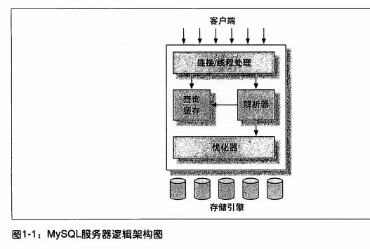

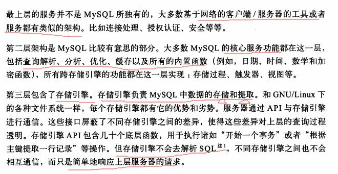

连接管理和安全

解析查询 -> 创建解析树 -> 优化

并发控制

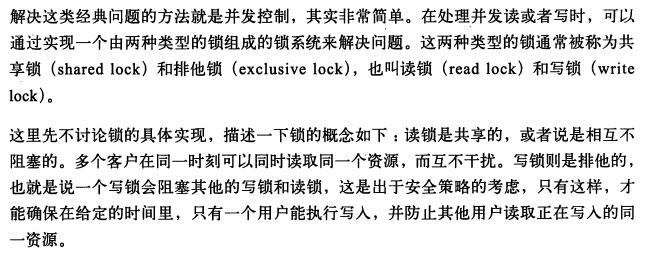

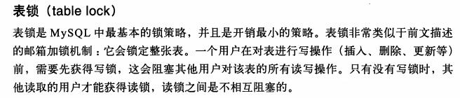

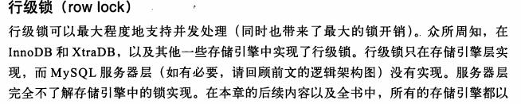

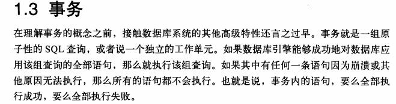

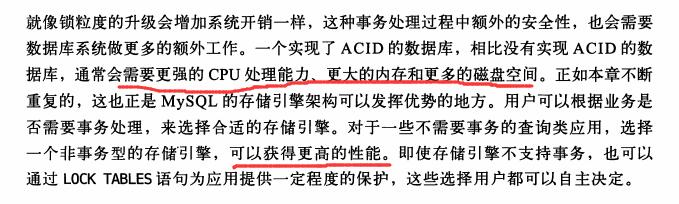

**隔离机制**

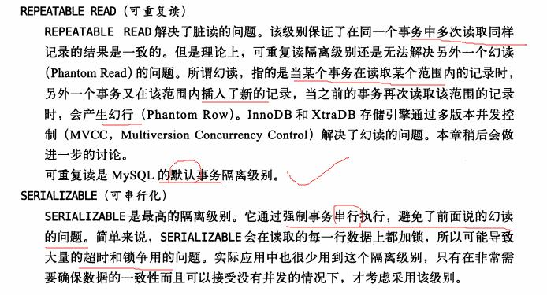

锁的情况：

**提交读** 的数据库锁情况，解决脏读

事务对当前被读取的数据加 **行级共享锁**（当读到时才加锁），**一旦读完该行** ， **立即释放该行级共享锁** （和看重复读最大的区别）；

事务在更新某数据的瞬间（就是发生更新的瞬间），必须先对其加 **行级排他锁**，直到事务结束才释放。

**可重复读** 的数据库锁情况

事务在读取某数据的瞬间（就是开始读取的瞬间），必须先对其加 行级共享锁，**直到事务结束才释放**；

事务在更新某数据的瞬间（就是发生更新的瞬间），必须先对其加 **行级排他锁，直到事务结束才释放**。

事务1在读取某行记录的整个过程中，事务2都不能修改该行数据（事务一在读取的整个过程会对数据增加共享锁，直到**事务提交才会释放锁**，所以整个过程中，任何其他事务都不能对该行数据增加排他锁。所以，可重复读能够解决不可重复读的读现象）

事务1更新某行记录时，事务2不能对这行记录做更新，直到事务1结束。（事务一在更新数据的时候，会对该行数据增加排他锁，知道事务结束才会释放锁，所以，在事务一没有提交之前，事务二都能不对数据增加共享锁进行数据的读取。所以，提交读可以解决**脏读**的现象）

事务一读取（更新）的时候，事务二只能读取，事务一直到执行完之后才会释放行级锁。

**可序列化** 的数据库锁情况

解决幻读：幻读 : 是指当事务不是独立执行（并发执行情况下）时发生的一种现象，例如第一个事务对一个表中的数据进行了修改，这种修改涉及到表中的**全部数据行**。 同时，第二个事务也修改这个表中的数据，这种修改是**向表中插入一行新数据**。那么，以后就会发生**操作第一个事务的用户发现表中还有没有修改的数据行**，就好象 发生了幻觉一样。

为什么重复读不可以解决幻读的现象？
因为重复读是行级锁实现的，就是会锁住已经存在的行，而对于新添加的行没有加锁，所有会产生幻读的现象。而序列化是使用粒度更大的表级锁来实现的。

事务在 **读取** 数据时，必须先对其加 **表级共享锁** ，直到事务结束才释放；

事务在 **更新** 数据时，必须先对其加 **表级排他锁** ，直到事务结束才释放。

事务1正在读取A表中的记录时，则事务2也能读取A表，**但不能对A表做更新、新增、删除，直到事务1结束** 。(因为事务一对表增加了表级共享锁，其他事务只能增加共享锁读取数据，不能进行其他任何操作）

事务1正在更新A表中的记录时，则事务2不能读取A表的任意记录，更不可能对A表做更新、新增、删除，直到事务1结束。（事务一对表增加了表级排他锁，其他事务不能对表增加共享锁或排他锁，也就无法进行任何操作）

注意，此处的事务一，将会对表的共享锁升级为排他锁。

##### 悲观锁和乐观锁

悲观锁：

它可以阻止一个事务以影响其他用户的方式来修改数据。如果一个事务执行的操作都某行数据应用了锁，那只有当这个事务把锁释放，其他事务才能够执行与该锁冲突的操作。

悲观锁，正如其名，它指的是对数据被外界（包括本系统当前的其他事务，以及来自外部系统的事务处理）修改持保守态度(悲观)，因此，**在整个数据处理过程中，将数据处于锁定状态**。 悲观锁的实现，往往依靠数据库提供的锁机制 （也只有数据库层提供的锁机制才能真正保证数据访问的排他性，否则，即使在本系统中实现了加锁机制，也无法保证外部系统不会修改数据）

优点和不足：

悲观并发控制实际上是“先取锁再访问”的保守策略，**为数据处理的安全提供了保证**。但是在效率方面，处理加锁的机制会让数据库 **产生额外的开销，还有增加产生死锁的机会**；另外，在只读型事务处理中由于不会产生冲突，也没必要使用锁，这样做只能 **增加系统负载**；还有会 **降低了并行性**，一个事务如果锁定了某行数据，其他事务就必须等待该事务处理完才可以处理那行数。

乐观锁：

它假设多用户并发的事务在处理时不会彼此互相影响，各事务能够在不产生锁的情况下处理各自影响的那部分数据。在提交数据更新之前，**每个事务会先检查在该事务读取数据后，有没有其他事务又修改了该数据**。如果其他事务有更新的话，正在提交的事务会进行**回滚**。

乐观锁假设认为数据一般情况下**不会造成冲突**，所以 **在数据进行提交更新的时候，才会正式对数据的冲突与否进行检测**，如果发现冲突了，则让返回用户错误的信息，让用户决定如何去做。

乐观锁并不会使用数据库提供的锁机制。一般的实现乐观锁的方式就是记录数据版本。

数据版本,为数据增加的一个版本标识。当读取数据时，将版本标识的值一同读出，数据每更新一次，同时对版本标识进行更新。**当我们提交更新的时候，判断数据库表对应记录的当前版本信息与第一次取出来的版本标识进行比对，如果数据库表当前版本号与第一次取出来的版本标识值相等，则予以更新，否则认为是过期数据。**

实现数据版本有两种方式，第一种是使用版本号，第二种是使用时间戳。

优点和不足：

乐观并发控制相信事务之间的数据竞争(data race)的概率是比较小的，因此尽可能直接做下去，直到提交的时候才去锁定，所以 **不会产生任何锁和死锁**。但如果直接简单这么做，还是有可能会遇到不可预期的结果，例如两个事务都读取了数据库的某一行，经过修改以后写回数据库，这时就遇到了问题。

参考:

[事务隔离机制](http://www.hollischuang.com/archives/943)

死锁

事务的执行顺序导致

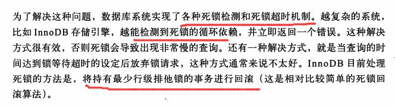

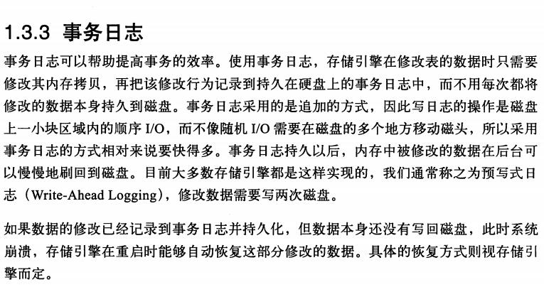

自动提交

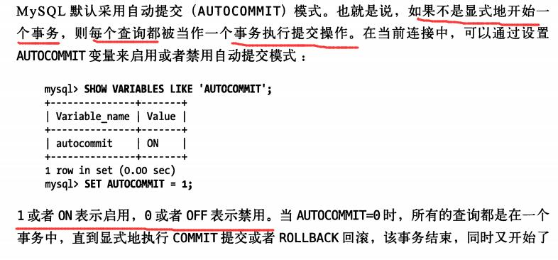

非事务型的数据不支持回滚。

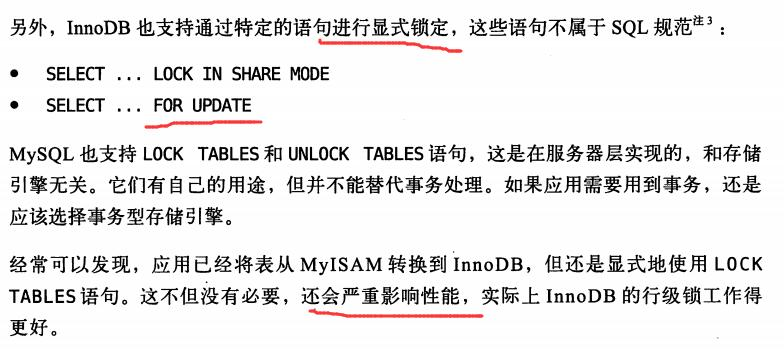

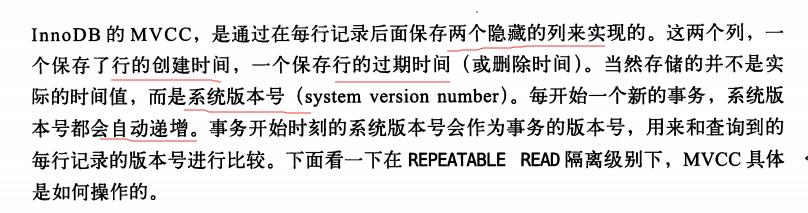

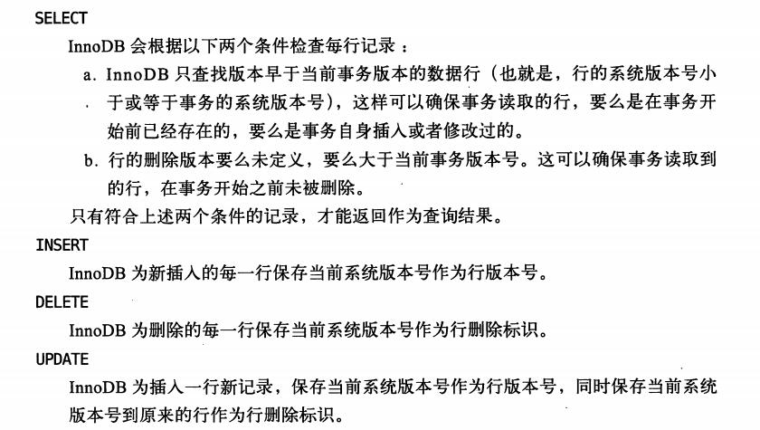

选择一个数据库
show table status like 'd_student' \G

InnoDB

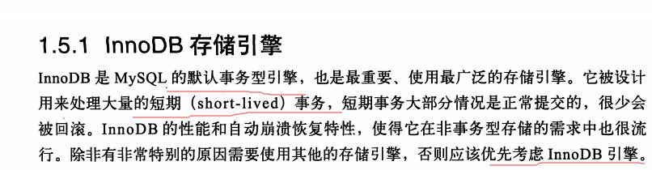

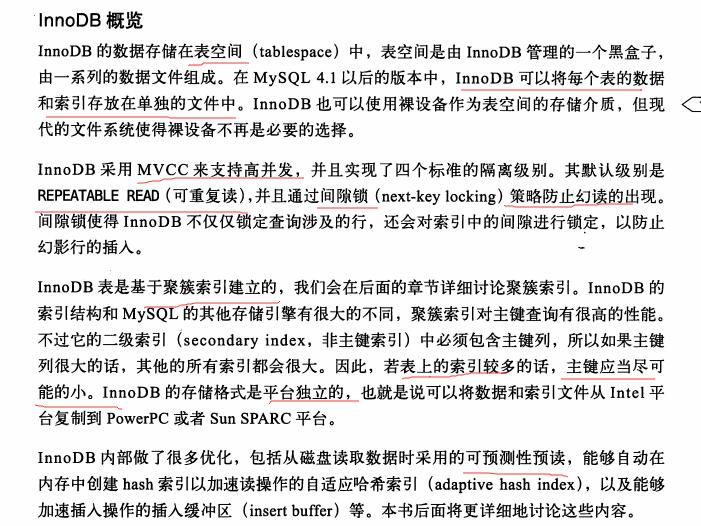

MyISAM

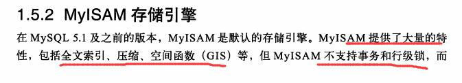

适用性：

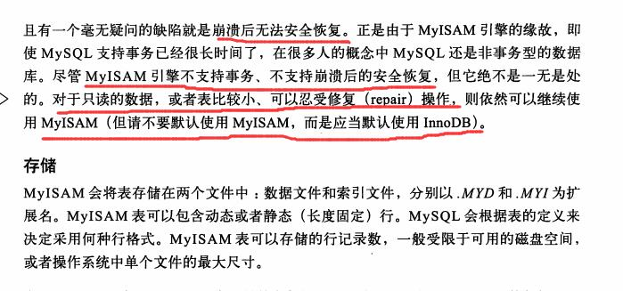

不支持事务，行级锁，崩溃后无法安全恢复。

特性

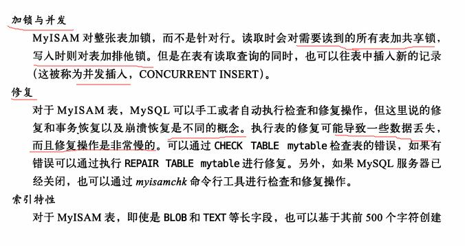
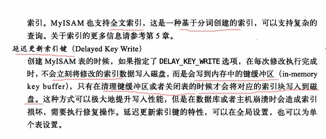

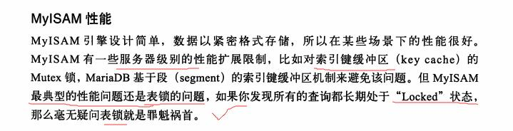

选择合适的引擎

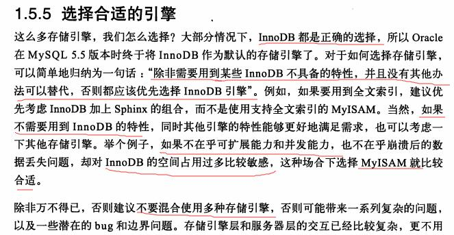

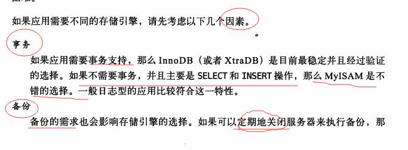

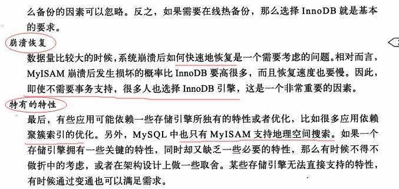

转换表的引擎

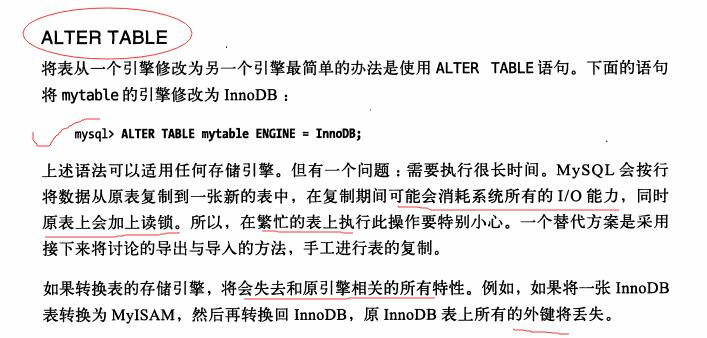

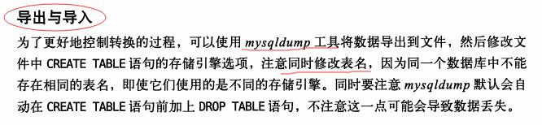

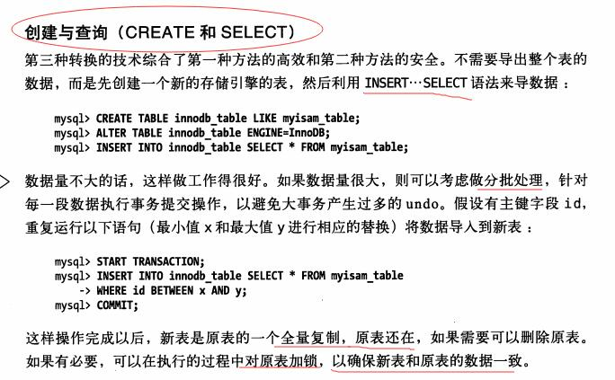

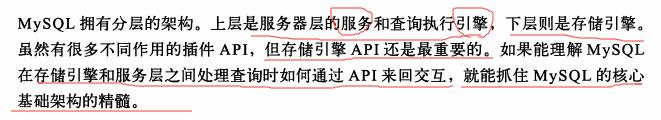

#### 创建高性能的索引

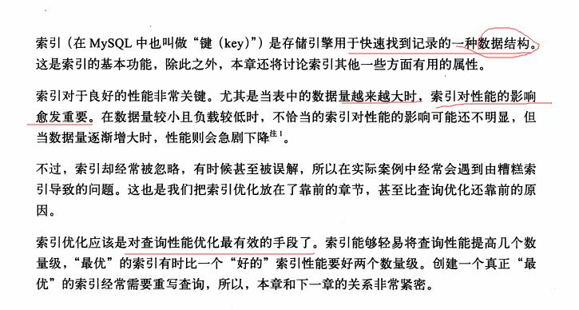

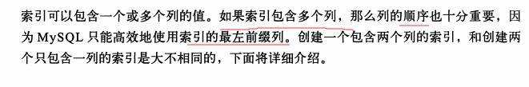

存储在引擎层

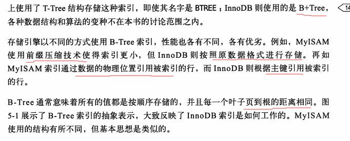

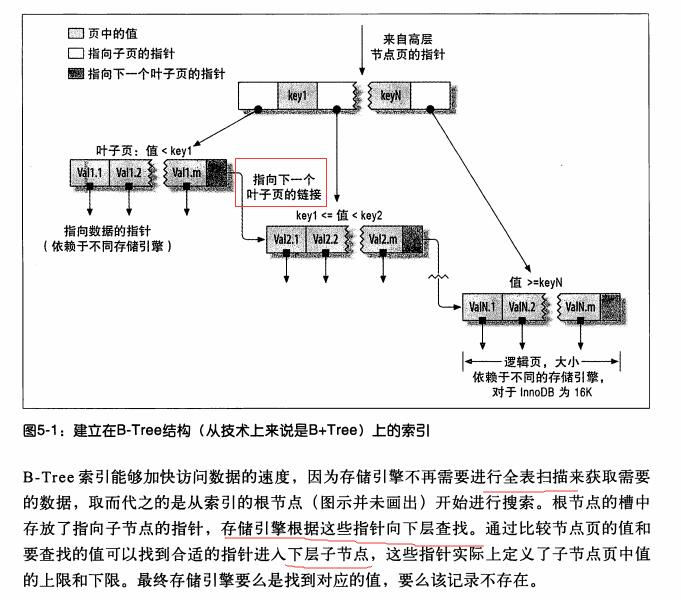

B树索引的局限性：

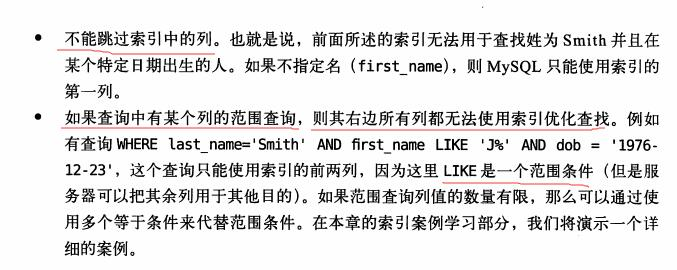

哈希索引

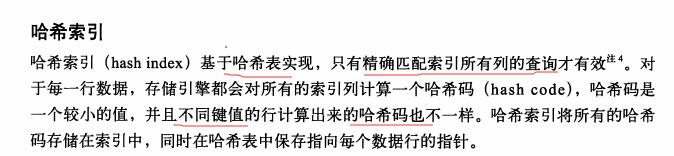

哈希索引有它的限制

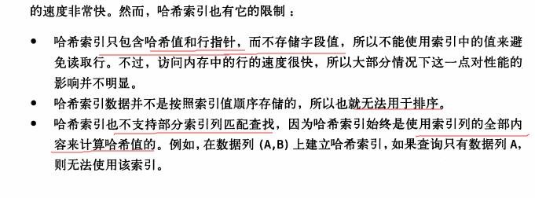

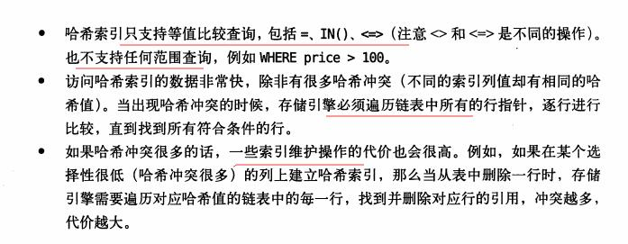

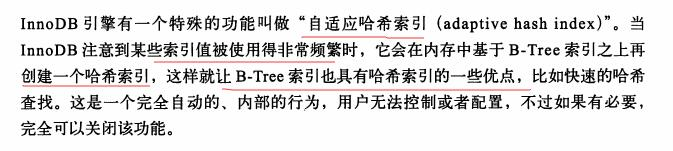

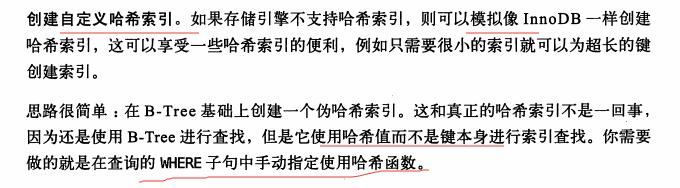

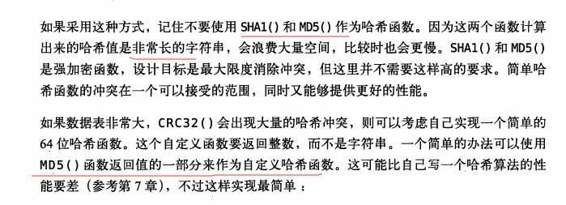

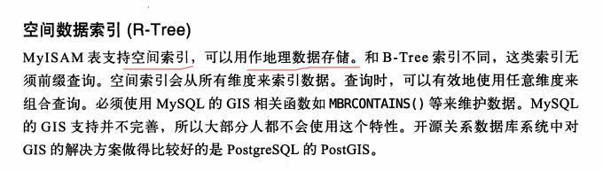

索引的优点：

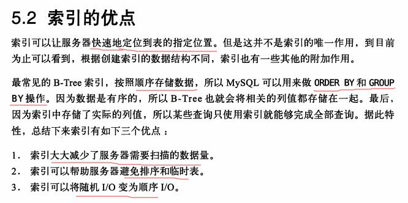

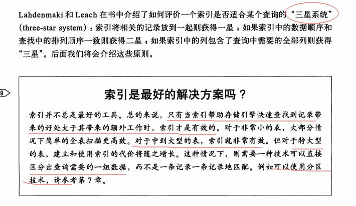

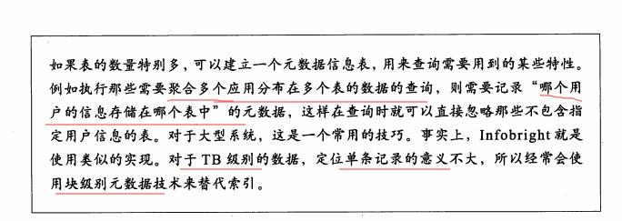

高性能索引策略

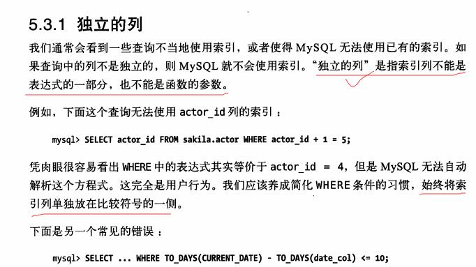

前缀索引和索引选择性

索引很长的字符串列

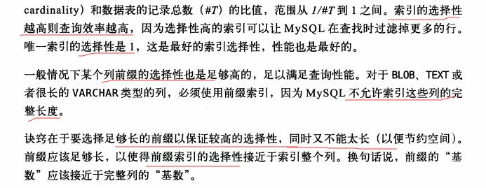

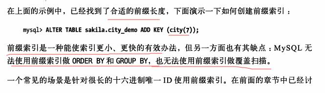

多列索引

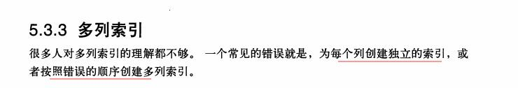

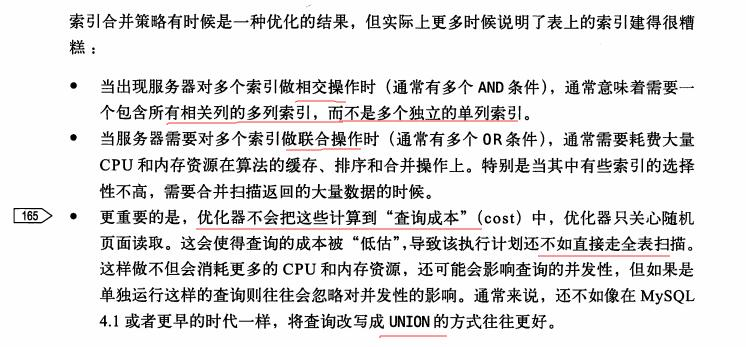

选择合适的索引序列

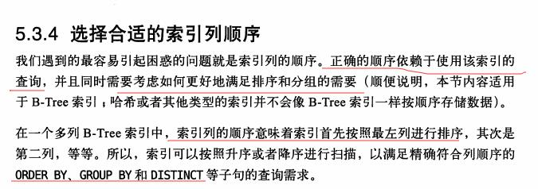

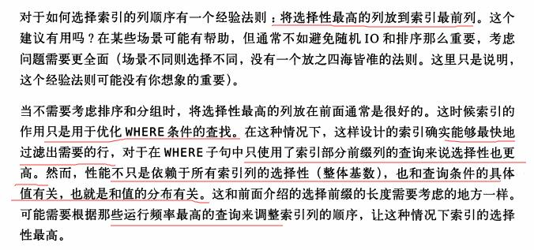

聚簇索引

InnoDB 和 MyISAM 的数据存储

二级索引

mysql中每个表都有一个聚簇索引（clustered index ），除此之外的表上的每个非聚簇索引都是二级索引，又叫辅助索引（secondary indexes）。

以InnoDB来说，每个InnoDB表具有一个特殊的索引称为聚集索引。

如果您的表上定义有主键，该主键索引是聚集索引。如果你不定义为您的表的主键时，MySQL取第一个唯一索引（unique）而且只含非空列（NOT NULL）作为主键，InnoDB使用它作为聚集索引。如果没有这样的列，InnoDB就自己产生一个这样的ID值，它有六个字节，而且是隐藏的，使其作为聚簇索引。

