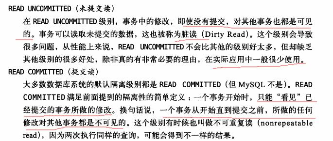

#### mysql
mysql的特点

连接管理和安全

解析查询 -> 创建解析树 -> 优化

并发控制

**隔离机制**

锁的情况：

**提交读** 的数据库锁情况，解决脏读

事务对当前被读取的数据加 **行级共享锁**（当读到时才加锁），**一旦读完该行** ， **立即释放该行级共享锁** （和看重复读最大的区别）；

事务在更新某数据的瞬间（就是发生更新的瞬间），必须先对其加 **行级排他锁**，直到事务结束才释放。

**可重复读** 的数据库锁情况

事务在读取某数据的瞬间（就是开始读取的瞬间），必须先对其加 行级共享锁，**直到事务结束才释放**；

事务在更新某数据的瞬间（就是发生更新的瞬间），必须先对其加 **行级排他锁，直到事务结束才释放**。

事务1在读取某行记录的整个过程中，事务2都不能修改该行数据（事务一在读取的整个过程会对数据增加共享锁，直到**事务提交才会释放锁**，所以整个过程中，任何其他事务都不能对该行数据增加排他锁。所以，可重复读能够解决不可重复读的读现象）

事务1更新某行记录时，事务2不能对这行记录做更新，直到事务1结束。（事务一在更新数据的时候，会对该行数据增加排他锁，知道事务结束才会释放锁，所以，在事务一没有提交之前，事务二都能不对数据增加共享锁进行数据的读取。所以，提交读可以解决**脏读**的现象）

事务一读取（更新）的时候，事务二只能读取，事务一直到执行完之后才会释放行级锁。

**可序列化** 的数据库锁情况

解决幻读：幻读 : 是指当事务不是独立执行（并发执行情况下）时发生的一种现象，例如第一个事务对一个表中的数据进行了修改，这种修改涉及到表中的**全部数据行**。 同时，第二个事务也修改这个表中的数据，这种修改是**向表中插入一行新数据**。那么，以后就会发生**操作第一个事务的用户发现表中还有没有修改的数据行**，就好象 发生了幻觉一样。

为什么重复读不可以解决幻读的现象？
因为重复读是行级锁实现的，就是会锁住已经存在的行，而对于新添加的行没有加锁，所有会产生幻读的现象。而序列化是使用粒度更大的表级锁来实现的。

事务在 **读取** 数据时，必须先对其加 **表级共享锁** ，直到事务结束才释放；

事务在 **更新** 数据时，必须先对其加 **表级排他锁** ，直到事务结束才释放。

事务1正在读取A表中的记录时，则事务2也能读取A表，**但不能对A表做更新、新增、删除，直到事务1结束** 。(因为事务一对表增加了表级共享锁，其他事务只能增加共享锁读取数据，不能进行其他任何操作）

事务1正在更新A表中的记录时，则事务2不能读取A表的任意记录，更不可能对A表做更新、新增、删除，直到事务1结束。（事务一对表增加了表级排他锁，其他事务不能对表增加共享锁或排他锁，也就无法进行任何操作）

注意，此处的事务一，将会对表的共享锁升级为排他锁。

参考:

[事务隔离机制](http://www.hollischuang.com/archives/943)

死锁

事务的执行顺序导致

自动提交

非事务型的数据不支持回滚。

选择一个数据库
show table status like 'd_student' \G

InnoDB

MyISAM

适用性：

不支持事务，行级锁，崩溃后无法安全恢复。

特性

选择合适的引擎

转换表的引擎

#### 创建高性能的索引

存储在引擎层

B树索引的局限性：

哈希索引

哈希索引有它的限制

索引的优点：

高性能索引策略

前缀索引和索引选择性

索引很长的字符串列

多列索引

选择合适的索引序列

聚簇索引

InnoDB 和 MyISAM 的数据存储

二级索引

mysql中每个表都有一个聚簇索引（clustered index ），除此之外的表上的每个非聚簇索引都是二级索引，又叫辅助索引（secondary indexes）。

以InnoDB来说，每个InnoDB表具有一个特殊的索引称为聚集索引。

如果您的表上定义有主键，该主键索引是聚集索引。如果你不定义为您的表的主键时，MySQL取第一个唯一索引（unique）而且只含非空列（NOT NULL）作为主键，InnoDB使用它作为聚集索引。如果没有这样的列，InnoDB就自己产生一个这样的ID值，它有六个字节，而且是隐藏的，使其作为聚簇索引。

