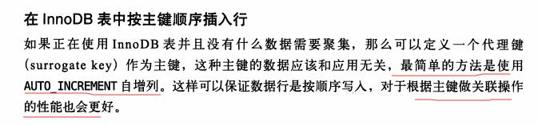

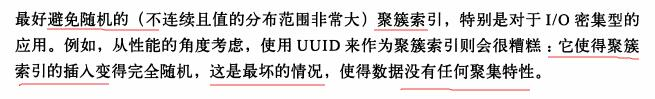

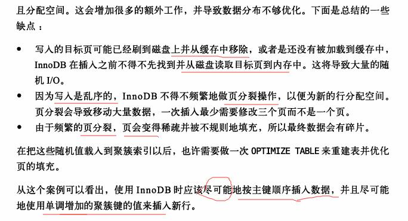

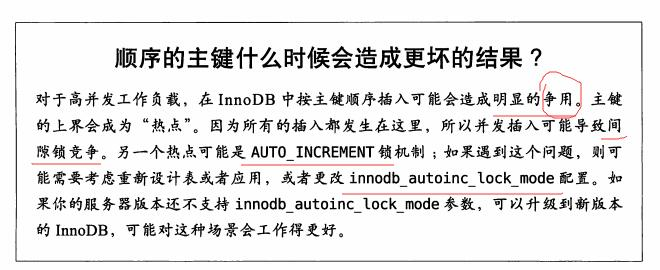

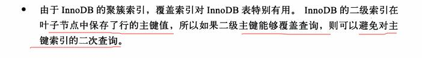

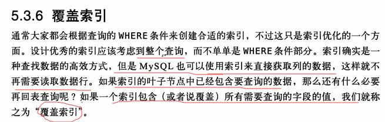

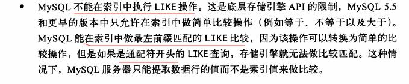

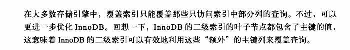

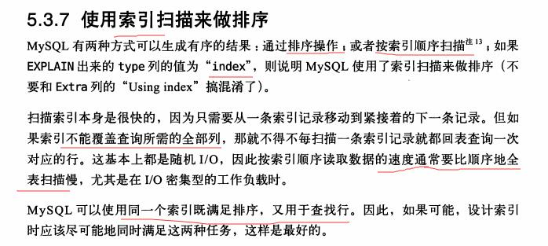

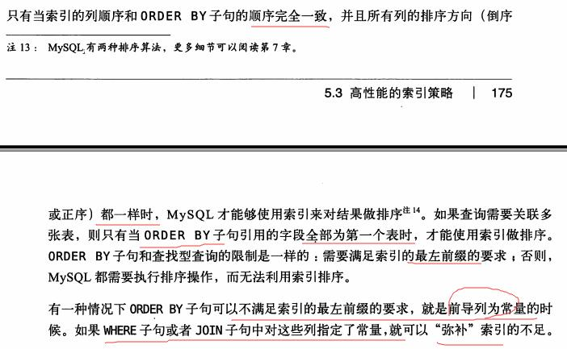

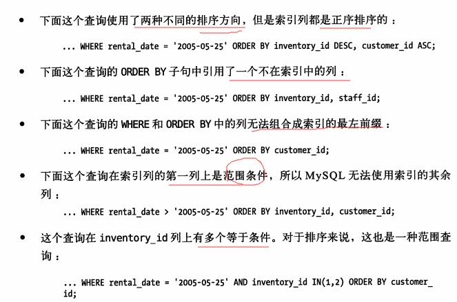

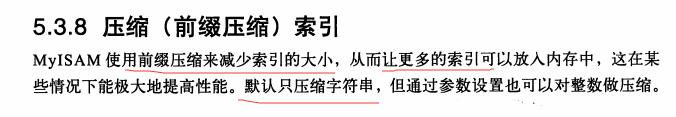

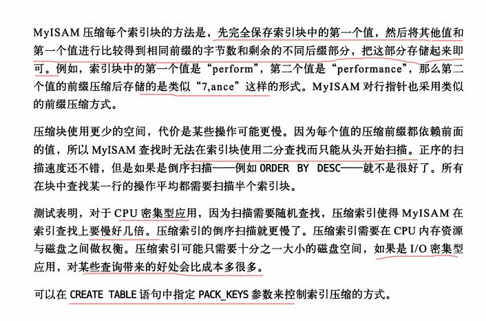

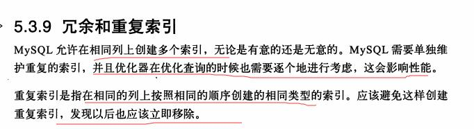

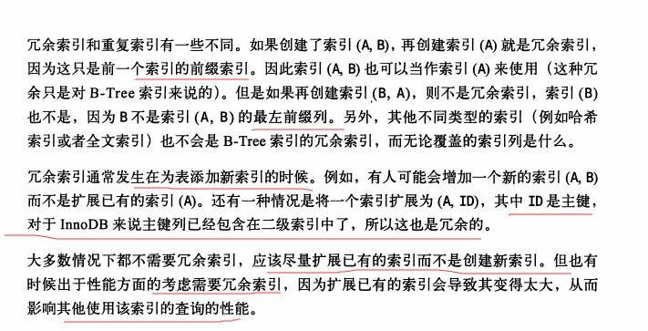

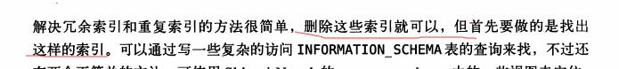

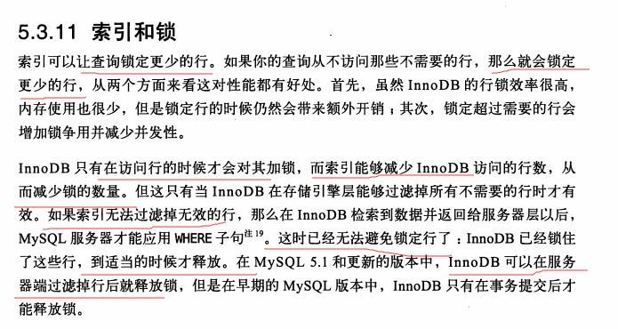

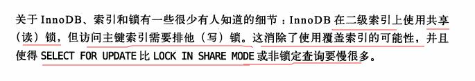

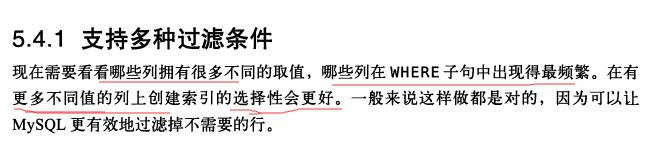

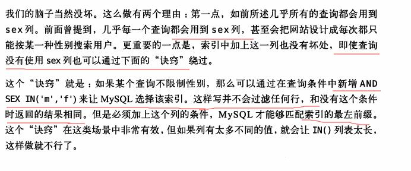

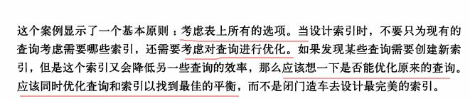

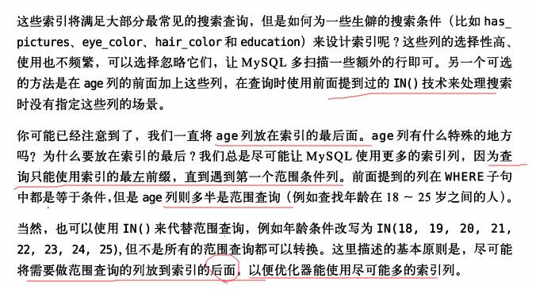

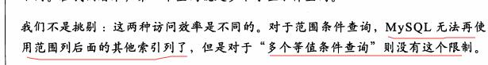

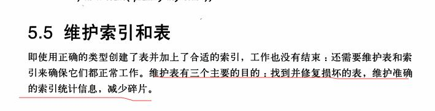

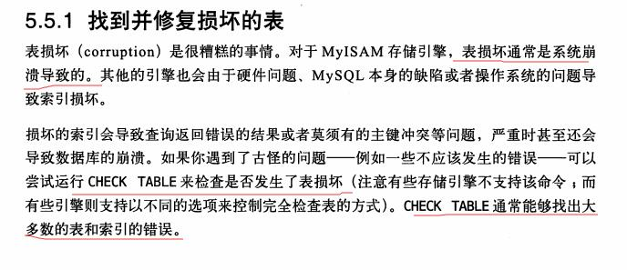

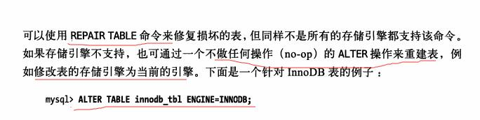

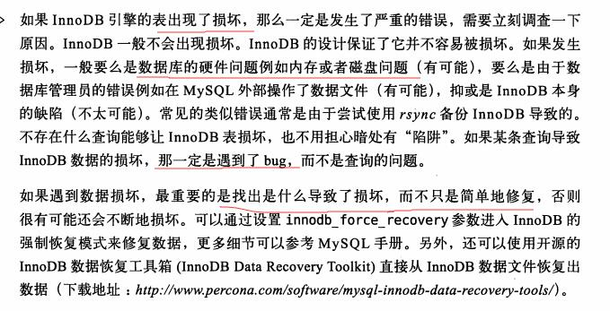

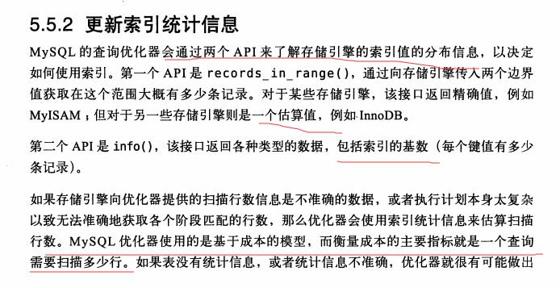

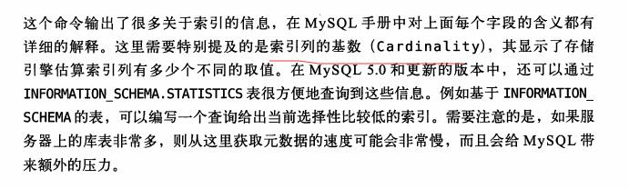

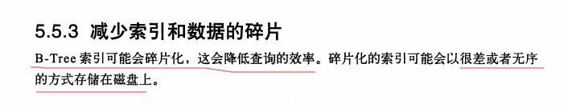

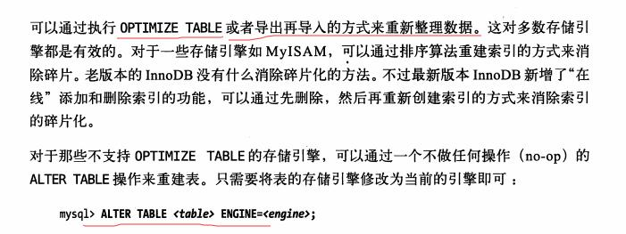

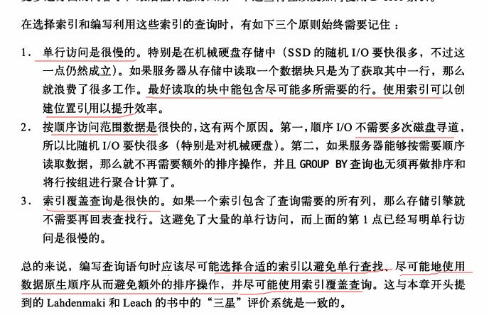

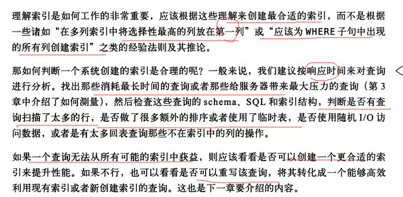

#### 查询优化

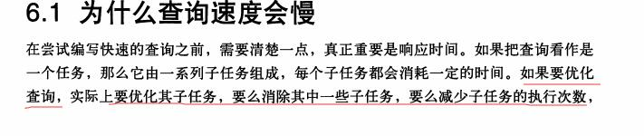

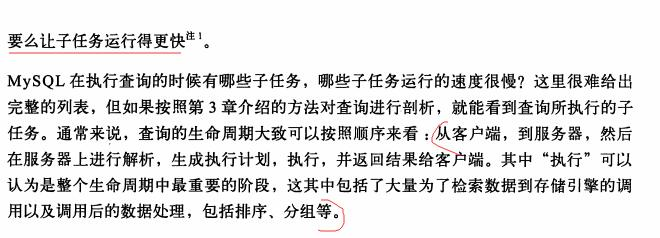

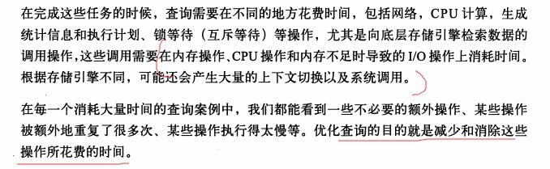

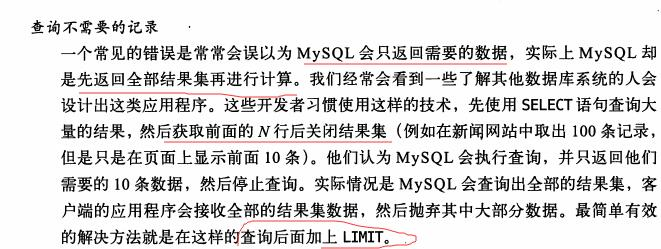

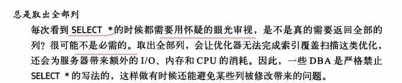

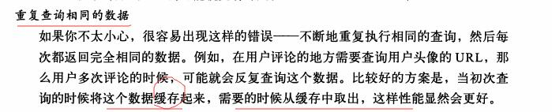

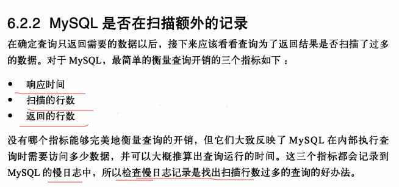

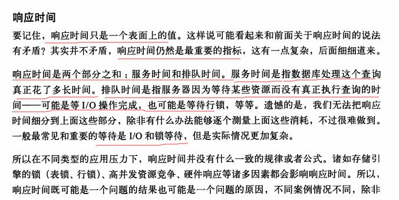

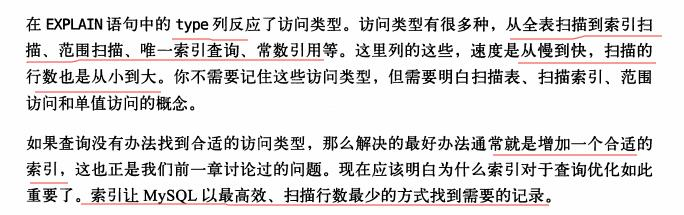

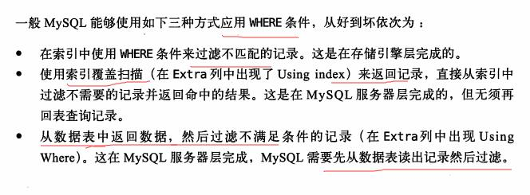

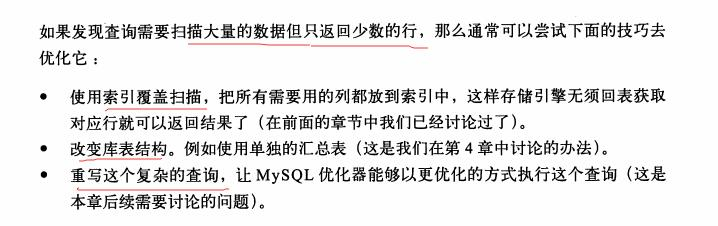

重构查询的方式

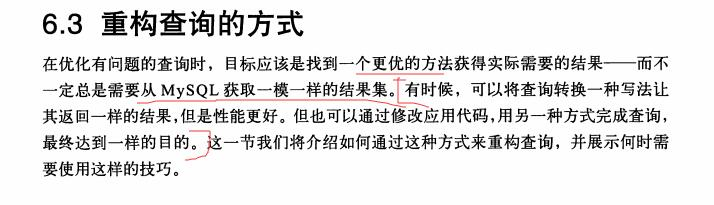

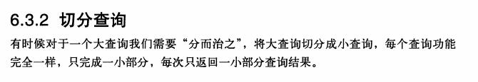

分解 关联查询

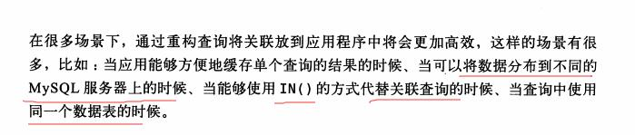

mysql的执行过程

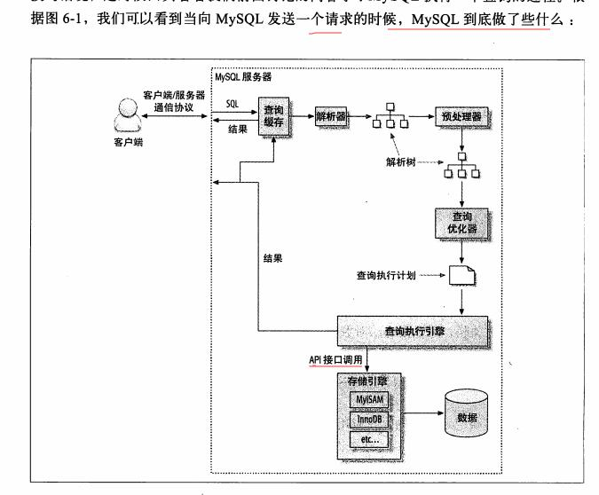

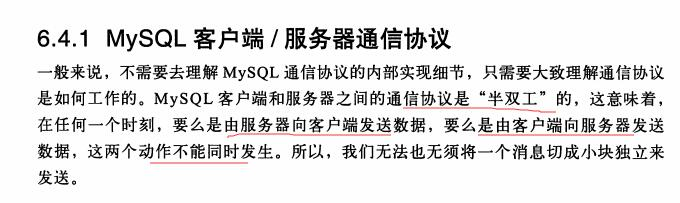

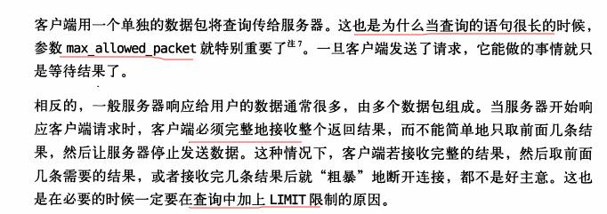

mysql状态

优化的类型

将外连接转化为内连接

使用等价变换规则

优化MAX，MIN，Count

预估并转化常数

覆盖索引扫描

子查询优化

提前终止查询

等值传播

列表IN的比较

嵌套循环关联

通过评估不同的顺序时的成本来选择一个代价最小的关联顺序。

优化特定类型的查询

优化count()查询

使用用户自定义的变量

应用：

优化的总结

