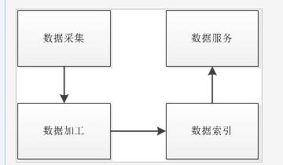

#### 58 面经收集

java collection集合，concurrent包，tcp连接，linux指令，数据库的一些很简单的问题，都没有具体考索引的实现

#### java concurrent 包 (concurrent包里面有什么东西？)

concurrent 包下面还有两个包，atomic包 和  locks 包，其中 atomic 里面有13个原子操作类（简单，高效，线程安全），
分为原子更新基本类型（boolean, integer, long）, 原子更新数组(integerarray, longarray, referenceArray)，
原子更新引用，原子更新字段。

locks 包下是关于锁的接口及实现，例如 读写锁(RetreentLock),  读写锁(RetreentReadWriteLock)

concurrent 包下还有 executor 框架(线程池)， 阻塞队列， 并发工具 countdownLatch, cyclicbarrirer, 信号量， exchanger类，
并发容器（典型的有 ConcurrentHashMap）， fork/Join 框架. 同步器

#### java 类集

见相关文档；

Set  HashSet  TreeSet

List ArrayList LinkedList

Map HashMap TreeMap ConcurrentHashMap

Collections 集合方法

##### 开放题目

####### 1.如何设计一个搜索引擎?

一个搜索引擎能够做到的最基本的事情是**接受一个查询输入，然后给出与这个查询输入相关的一些结果**。

从应用的范围层面来划分，将搜索引擎分为**普通互联网搜索引擎和网站站内搜索引擎**。

(重点)

搜索引擎的基本框架, 分成**数据采集、数据加工、数据索引、数据服务**.

**数据采集模块** 俗称网络爬虫或者网络蜘蛛。

模块应该具有2个基本功能：

1：根据网页地址（URL）获取该地址对应的网页文件。

2：**解析出网页文件中的链接地址和网页有效信息文本**。

**数据加工模块** 是搜索引擎的核心功能，它负责对数据采集模块采集的网页 **有效信息文本进行加工**，使得我们人类能看懂的文字信息能够按照设定的规则被计算机理解。

初级搜索引擎：将文本文字进行**拆解、归类**，如果是中文，还需要在拆解的时候对中文进行分词。之后将**解析结果发送给索引模块**，索引模块再进一步**加工后录入到搜索引擎的数据库中**。

如果要实现一个更加智能的高级搜索引擎，在上述步骤的基础上，还要能够实现语义理解.

数据索引模块是搜索引擎的另外一个核心.

这个模块主要功能是 **将数据加工模块的处理结果保存在一个规范的数据结构中**，这样做的目的是为了给接下去的数据服务模块提供便利，使得数据服务模块能够在极短的时间内完成对整个互联网数据的信息检索。

数据服务模块是搜索引擎对外部提供服务的接口。

它要能够对外部输入进行及时响应，并联系数据索引模块，取出用户查找内容的网页结果。

搜索引擎常常在这个模块处实现一些预测或者缓存算法，别勉对用户的每一次查询都实施一次完整的数据查找流程。

###### 垂直搜索与站内搜索

垂直搜索是针对某一特定行业领域进行搜索服务。

一般这类搜索引擎会在数据采集端进行简化，只搜取指定网站的网页资源。而在数据加工端，引擎只从网页信息中提取出特定的信息。并忽略其它信息。在数据索引模块，引擎只做简单的关键字索引，无需对语义等做处理。引擎在数据采集模块只需**被动等待信息输入**。这是因为站点的设计是可控的，在任何信息被站点的记录同时传一份副本给搜索引擎，搜索引擎便可执行其后续逻辑流程。

#### 2.

##### 3

设计一个登陆（用户名、密码）系统
类似今日头条app设计分为哪几个模块（不是58么、、、、）

##### 4

多台服务器，如何保证稳定执行 ?

如何实现负载均衡问题：

稳定性好效率高的千万级大型网站系统架构性.

来为每一个目标服务设置一个**不同的虚拟IP地址**;正因为如此，七层交换机可以同时为若干个基于TCP/IP协议的各类业务应用提供服务器系统的负载均衡服务;七层交换机可以持续不停地对用户需要访问的服务器系统资源进行合理性检查，检查范围限定在交换机的四层到七层范围内，当上网用户向目标服务器系统发出访问请求信息时，**BIG/IP协议会依照目标服务器之间的网络健康状态以及运行性能状态，自动挑选性能状态处于最优效果的服务器系统来应答用户的上网请求信息**，这样不但可以充分利用每一台服务器系统的资源，而且也会平均分配数据流量到每一台服务器系统中，避免了单台代理服务器传输性能的瓶颈以及系统故障的影响。

#### tomcat 堆的默认大小

Tomcat默认可以使用的内存为128MB

Nginx实现负载均衡的原理:

nginx用来作为反向代理服务器，放置到两台apache之前，作为用户访问的入口；

nginx仅仅处理静态页面。

动态的页面(php请求)统统都交付给后台的两台apache来处理。也就是说，可以把我们网站的**静态页面或者文件放置到nginx的目录下**；**动态的页面和数据库访问** 都保留到后台的apache服务器上。

可以在nginx中定义访问同一页面，均衡 (当然如果服务器性能不同可以定义权重来均衡)地代理到不同的后台server上。 如上的例子访问test.php页面，会均衡地代理到server1或者server2上。

常用的服务器集群和数据库集群负载均衡实现方法：

Citrix NetScaler的**硬件负载均衡交换机**做服务器集群的负载均衡。依照目标服务器之间的网络健康状态以及运行性能状态，自动挑选性能状态处于最优效果的服务器系统来。

MySQL Proxy 做MySQL服务器集群的负载均衡并实现读写分离。其实现读写分离的基本原理是**让主数据库处理事务性查询，而从数据库处理SELECT查询**。数据库复制被用来把事务性查询导致的变更同步到集群中的从数据库。（主服务器处理写功能，从服务器处理读功能，从服务器从主服务器中复制数据）

CDN (Content Delivery Network)技术: 几乎在各大网站都有使用该技术.分布式网络缓存结构（即国际上流行的web cache技术）.
