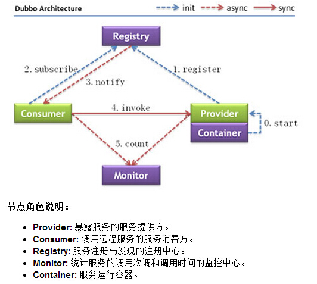

分布式服务架构

原因：

当垂直应用越来越多，应用之间交互不可避免，将**核心业务**抽取出来，作为独立的服务，逐渐形成稳定的服务中心，使前端应用能更快
速的响应多变的市场需求。
此时，用于提高业务复用及整合的 分布式服务框架(RPC) 是关键。

流动计算架构

当服务越来越多，容量的评估，小服务资源的浪费等问题逐渐显现，此时需增加一个调度中心基于访问压力实时管理集群容量，提高集群利用率。
此时，用于提高机器利用率的 资源调度和治理中心(SOA) 是关键。


#### 简单的架构



注册中心是zookeeper

在本地服务的基础上，只需做简单配置，即可完成远程化调用：

将上面的local.xml配置拆分成两份，将服务定义部分放在服务提供方remote-provider.xml，将服务引用部分放在服务消费方remote-consumer.xml。
并在提供方增加暴露服务配置<dubbo:service>，在消费方增加引用服务配置<dubbo:reference>。 


使用方法：

```xml

remote-prvider.xml
<bean id=“xxxService” class=“com.xxx.XxxServiceImpl” /> <!-- 和本地服务一样实现远程服务 -->
 
<dubbo:service interface=“com.xxx.XxxService” ref=“xxxService” /> <!-- 增加暴露远程服务配置 -->

remote-consumer.xml

<dubbo:reference id=“xxxService” interface=“com.xxx.XxxService” /> <!-- 增加引用远程服务配置 -->
 
<bean id=“xxxAction” class=“com.xxx.XxxAction”> <!-- 和本地服务一样使用远程服务 -->
    <property name=“xxxService” ref=“xxxService” />
</bean>

```

<dubbo:application/> 应用配置，用于配置当前应用信息，不管该应用是提供者还是消费者。
**<dubbo:registry/> 注册中心配置，用于配置连接注册中心相关信息。
**<dubbo:protocol/> 协议配置，用于配置提供服务的协议信息，协议由提供方指定，消费方被动接受。
**<dubbo:service/>服务配置，用于暴露一个服务，定义服务的元信息，一个服务可以用多个协议暴露，一个服务也可以注册到多个注册中心。
**<dubbo:reference/> 引用配置，用于**创建一个远程服务代理**，一个引用可以指向多个注册中心。

<dubbo:module/> 模块配置，用于配置当前模块信息，可选。

<dubbo:monitor/> 监控中心配置，用于配置连接监控中心相关信息，可选。
<dubbo:provider/> 提供方的缺省值，当ProtocolConfig和ServiceConfig某属性没有配置时，采用此缺省值，可选。
<dubbo:consumer/> 消费方缺省配置，当ReferenceConfig某属性没有配置时，采用此缺省值，可选。
<dubbo:method/> 方法配置，用于ServiceConfig和ReferenceConfig指定方法级的配置信息。
<dubbo:argument/> 用于指定方法参数配置。


注册中心基于接口名查询服务提供者的IP地址，并且能够平滑添加或删除服务提供者。

架构：

Consumer服务消费者，Provider服务提供者。Container服务容器。消费当然是invoke提供者了，invoke这条实线按照图上的说明当然同步的意思了，多说一句，在实际调用过程中，Provider的位置对于Consumer来说是透明的，上一次调用服务的位置（IP地址）和下一次调用服务的位置，是不确定的。这个地方就是实现了软负载。

服务提供者先启动start，然后注册中心注册register服务。

消费订阅subscribe服务，如果没有订阅到自己想获得的服务，它会不断的尝试订阅。新的服务注册到注册中心以后，注册中心会将这些服务通过notify到消费者。

Monitor这是一个监控，图中虚线表明Consumer 和Provider通过异步的方式发送消息至Monitor，Consumer和Provider会将信息存放在本地磁盘，平均1min会发送一次信息。Monitor在整个架构中是可选的（图中的虚线并不是可选的意思），Monitor功能需要单独配置，不配置或者配置以后，Monitor挂掉并不会影响服务的调用。


