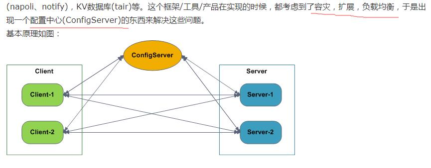
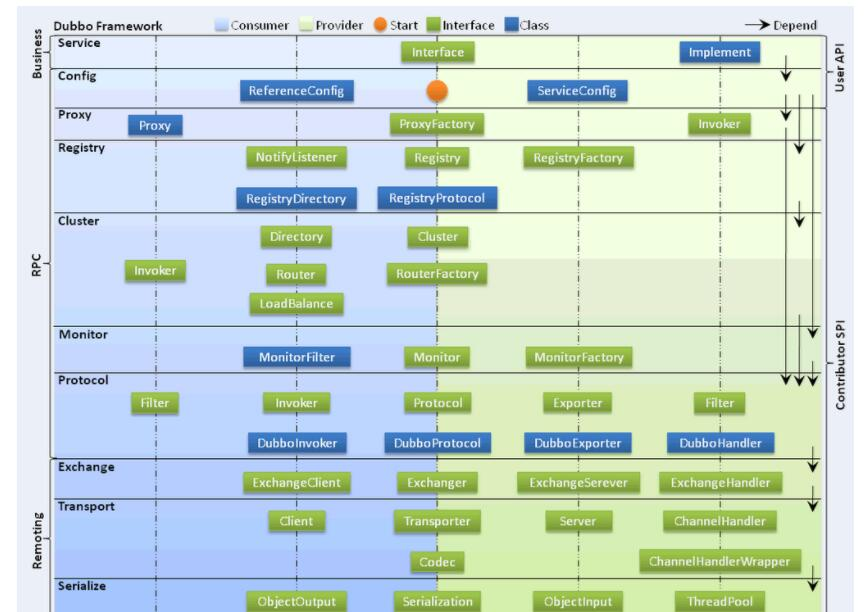
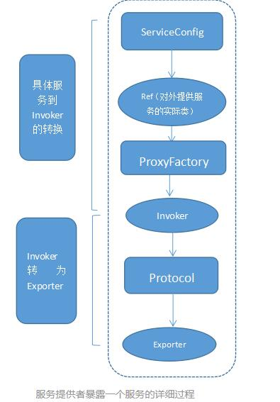

### dubbo 原理

分布式服务架构， 透明化， 高性能

原因：

当垂直应用越来越多，应用之间交互不可避免，**将核心业务抽取出来，作为独立的服务，逐渐形成稳定的服务中心，使前端应用能更快
速的响应多变的市场需求。**
（关键词：服务中心，提供更快的相应，更高的性能）

此时，用于提高业务复用及整合的分布式服务框架(RPC) 是关键。

当服务越来越多，容量的评估，小服务资源的浪费等问题逐渐显现，此时需增加一个 **调度中心基于访问压力实时管理集群容量，提高集群利用率。** 此时，用于提高机器利用率的 资源调度和治理中心(SOA) 是关键。

#### 基本架构

架构：

Consumer服务消费者

Provider服务提供者。

Container服务容器。

消费当然是invoke（是同步的）提供者了，invoke这条实线按照图上的说明当然同步的意思了，多说一句，在实际调用过程中，Provider的位置对于Consumer来说是透明的，**上一次调用服务的位置（IP地址）和下一次调用服务的位置，是不确定的**。这个地方就是实现了软负载。

注册中心是zookeeper 作用： 注册中心基于接口名查询服务**提供者的IP地址**，并且能够平滑添加或删除服务提供者。

服务提供者先启动start，然后注册中心注册register服务。

消费订阅subscribe服务，如果没有订阅到自己想获得的服务，它会不断的尝试订阅。新的服务注册到注册中心以后，注册中心会将这些服务通过notify到消费者。

Monitor这是一个监控，图中虚线表明Consumer 和Provider通过异步的方式发送消息至Monitor，Consumer和Provider会将信息存放在本地磁盘，平均1min会发送一次信息。Monitor在整个架构中是可选的（图中的虚线并不是可选的意思），Monitor功能需要单独配置，不配置或者配置以后，Monitor挂掉并不会影响服务的调用。

为什么要有配置中心？

ConfigServer

配置(注册)中心，和每个Server/Client之间会作一个实时的心跳检测（因为它们都是建立的Socket长连接），比如几秒钟检测一次。收集每个Server提供的服务的信息，每个Client的信息，整理出一个服务列表，

当某个Server不可用，那么就更新受影响的服务对应的serverAddressList，即把这个Server从serverAddressList中踢出去（从地址列表中删除），同时将推送serverAddressList给这些受影响的服务的clientAddressList里面的所有Client。如：192.168.0.3挂了，那么UserService和ProductService的serverAddressList都要把192.168.0.3删除掉，同时把新的列表告诉对应的Client 172.16.0.1，172.16.0.2，172.16.0.3；
当某个Client挂了，那么更新受影响的服务对应的clientAddressList

管理服务的对应的关系。

Client

调用服务的机器，每个Client启动时，主动与ConfigServer建立Socket长连接，并将自己的IP等相应信息发送给ConfigServer。
Client在**使用服务的时候根据服务名称去ConfigServer中获取服务提供者信息**（这样ConfigServer就知道某个服务是当前哪几个Client在使用），Client拿到这些服务提供者信息后，与它们都建立连接，后面就可以 **直接调用服务** 了，当有多个服务提供者的时候，Client根据 **一定的规则来进行负载均衡，如轮询，随机，按权重** 等。一旦Client使用的服务它对应的服务提供者有变化（服务提供者有新增，删除的情况），ConfigServer就会把最新的服务提供者列表推送给Client，Client就会依据最新的服务提供者列表重新建立连接，**新增的提供者建立连接，删除的提供者丢弃连接**。

client ->(socket) --> ConfigServer --> 获取ip，同时注册信息（方便服务挂掉后通知）。

Server

真正提供服务的机器，每个Server启动时，主动与ConfigServer建立Socket长连接，并将**自己的IP，提供的服务名称，端口等信息直接发送给ConfigServer，ConfigServer就会收集到每个Server提供的服务的信息**。

注意：

Client每次调用服务是不经过ConfigServer的，Client只是与它建立联系，从它那里获取提供服务者列表（服务的ip和端口号）而已。

调用服务-负载均衡：Client调用服务时，可以根据规则在多个服务提供者之间轮流调用服务。

服务提供者-容灾：某一个Server挂了，Client依然是可以正确的调用服务的，当前提是这个服务有至少2个服务提供者，Client能很快的感知到服务提供者的变化，并作出相应反应。

服务提供者-扩展：添加一个服务提供者很容易，而且Client会很快的感知到它的存在并使用它。

dubbo 的通信的底层实现:

Dubbo缺省协议采用单一长连接和NIO异步通讯。

Dubbo里使用到了Socket（采用apache mina框架做底层调用）来建立长连接，发送、接收数据，底层使用apache mina框架的IoSession进行发送消息。

Dubbo底层使用Socket发送消息的形式进行数据传递，结合了mina框架，使用IoSession.write()方法，这个方法调用后对于整个远程调用(从发出请求到接收到结果)来说是一个异步的，即对于当前线程来说，**将请求发送出来，线程就可以往后执行了**，至于服务端的结果，是**服务端处理完成后，再以消息的形式发送给客户端的**。

client收到很多消息，怎么知道哪个消息结果是原先哪个线程调用的？

实现的方式：（了解）

client一个线程调用远程接口，生成一个唯一的ID（比如一段随机字符串，UUID等），Dubbo是使用AtomicLong从0开始累计数字的

将打包的方法调用信息（如调用的接口名称，方法名称，参数值列表等），和处理结果的回调对象callback，全部封装在一起，组成一个对象object

向专门存放调用信息的全局ConcurrentHashMap里面put(ID, object)

将ID和打包的方法调用信息封装成一对象connRequest，使用IoSession.write(connRequest)异步发送出去

当前线程再使用callback的get()方法试图获取远程返回的结果，在get()内部，则使用synchronized获取回调对象callback的锁， 再先检测是否已经获取到结果，如果没有，然后调用callback的wait()方法，释放callback上的锁，让当前线程处于等待状态。

服务端接收到请求并处理后，将结果（此结果中包含了前面的ID，即回传）发送给客户端，客户端socket连接上专门监听消息的线程收到消息，分析结果，取到ID，再从前面的ConcurrentHashMap里面get(ID)，从而找到callback，将方法调用结果设置到callback对象里。

监听线程接着使用synchronized获取回调对象callback的锁（因为前面调用过wait()，那个线程已释放callback的锁了），再notifyAll()，唤醒前面处于等待状态的线程继续执行（callback的get()方法继续执行就能拿到调用结果了），至此，整个过程结束。

总结：

当前线程怎么让它“暂停”，等结果回来后，再向后执行？

先生成一个对象obj，在一个全局map里put(ID,obj)存放起来，再用synchronized获取obj锁，再调用obj.wait()让当前 线程处于等待状态，然后另一消息监听线程等到服务端结果来了后，再map.get(ID)找到obj，再用synchronized获取obj锁，再调用 obj.notifyAll()唤醒前面处于等待状态的线程。

怎么知道哪个消息结果是原先哪个线程调用的？

答：使用一个ID，让其唯一，然后传递给服务端，再服务端又回传回来，这样就知道结果是原先哪个线程的了。

架构及具体的运行实现的细节：

初始化 -->  解析服务 --> 服务的暴露

初始化过程细节： 第一步，就是将服务装载容器中，然后准备注册服务。和spring中启动过程类似，spring启动时，将bean装载进容器中的时候，首先要解析bean。所以dubbo也是先读配置文件解析服务。

解析服务的过程：
1）、基于dubbo.jar内的Meta-inf/spring.handlers配置，spring在遇到dubbo名称空间时，会回调DubboNamespaceHandler类。
2）、所有的dubbo标签，都统一用**DubboBeanDefinitionParser** 调用parse()方法进行解析生成BeanDefinition，基于一对一属性映射，将XML标签解析为Bean对象。生产者或者消费者初始化的时候，会将Bean对象转会为url格式，将所有Bean属性转成url的参数。 然后将URL传给Protocol扩展点，基于扩展点的Adaptive机制，根据URL的协议头，进行不同协议的服务暴露和引用。

暴露服务： 直接暴露服务端口 或者 向注册中心暴露服务

直接暴露服务接口：

当配置 or ServiceConfig解析出的URL的格式为： Dubbo：//service-host/com.xxx.TxxService?version=1.0.0 基于扩展点的Adaptiver机制，通过URL的“dubbo：//”协议头识别，直接调用DubboProtocol的export（）方法，打开服务端口。

向注册中心暴露服务：

需要将服务的IP和端口一同暴露给注册中心。 ServiceConfig解析出的url格式为： registry://registry-host/com.alibaba.dubbo.registry.RegistryService?export=URL.encode(“dubbo://service-host/com.xxx.TxxService?version=1.0.0”)
基于扩展点的Adaptive机制，通过URL的“registry：//”协议头识别，调用RegistryProtocol的export方法，将export参数中的提供者URL先注册到注册中心，再重新传给Protocol扩展点进行暴露： Dubbo：//service-host/com.xxx.TxxService?version=1.0.0

引用服务： 直接引用服务 ,  从注册中心发现引用服务

暴露服务的主过程：

首先ServiceConfig类拿到对外提供服务的实际类ref，然后将ProxyFactory类的getInvoker方法使用ref生成一个AbstractProxyInvoker实例，到这一步就完成具体服务到invoker的转化。接下来就是Invoker转换到Exporter的过程。**Dubbo处理服务暴露的关键就在Invoker转换到Exporter的过程**，下面我们以Dubbo和rmi这两种典型协议的实现来进行说明： Dubbo的实现： Dubbo协议的Invoker转为Exporter发生在DubboProtocol类的export方法，**它主要是打开socket侦听服务，并接收客户端发来的各种请求**，通讯细节由dubbo自己实现。 Rmi的实现： RMI协议的Invoker转为Exporter发生在RmiProtocol类的export方法，他通过Spring或Dubbo或JDK来实现服务，通讯细节由JDK底层来实现。

获取服务的过程：

首先ReferenceConfig类的init方法调用Protocol的refer方法生成Invoker实例。接下来把Invoker转为客户端需要的接口。
