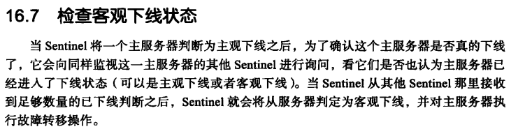
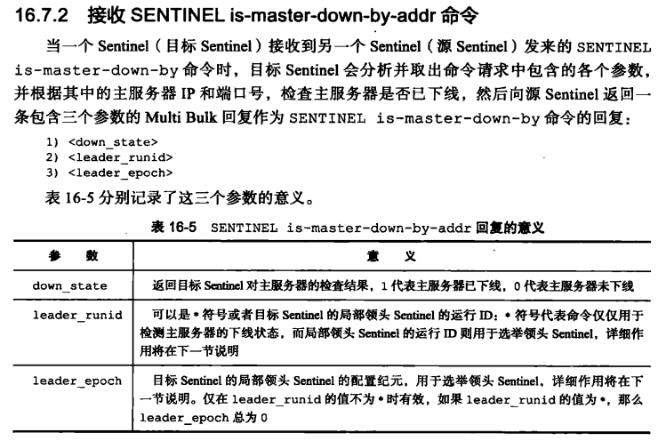

####  复制模式


/usr/local/bin/redis-server  redis服务程序

/usr/local/bin/redis-cli redis客户端

PIDFILE=/var/run/redis_${REDISPORT}.pid

pid 文件位置


1. Redis默认不是以守护进程的方式运行，可以通过该配置项修改，使用yes启用守护进程
    daemonize no
2. 当Redis以守护进程方式运行时，Redis默认会把pid写入/var/run/redis.pid文件，可以通过pidfile指定
    pidfile /var/run/redis.pid


ftp 配置 21

```
anonymous_enable=NO             # 关闭匿名登录
local_enable=YES        # 允许本地用户登录
write_enable=YES        # 启用可以修改文件的 FTP 命令
local_umask=022             # 本地用户创建文件的 umask 值
dirmessage_enable=YES           # 当用户第一次进入新目录时显示提示消息
xferlog_enable=YES      # 一个存有详细的上传和下载信息的日志文件
connect_from_port_20=YES        # 在服务器上针对 PORT 类型的连接使用端口 20（FTP 数据）
xferlog_std_format=YES          # 保持标准日志文件格式
listen=NO               # 阻止 vsftpd 在独立模式下运行
listen_ipv6=YES             # vsftpd 将监听 ipv6 而不是 IPv4，你可以根据你的网络情况设置
pam_service_name=vsftpd         # vsftpd 将使用的 PAM 验证设备的名字
userlist_enable=YES             # 允许 vsftpd 加载用户名字列表
tcp_wrappers=YES        # 打开 tcp 包装器
allow_writeable_chroot=YES

```

命令
```
# systemctl start vsftpd
# systemctl enable vsftpd
# service vsftpd start

```


slaveof ip port
此数据库将成为发送目的数据库的从服务器


配置

```
slaveof 192.168.1.1 6379
```

Sub slaves instead will always receive the replication stream identical to the one sent by the top-level master to the intermediate slaves

主服务器设置密码的时候，从服务器需要

redis-cli 中：

config set masterauth <password>

或者在配置文件中:

masterauth <password>


命令传播


新版的复制功能

PSYNC


部分重同步的实现


服务器运行ID


同步


心跳检测


A--> B --> C

如果 B 挂掉了，C 将不会收到 A 更新操作。而将B重新连接以后，将会重新连接

哨兵模式








选举和故障转移


