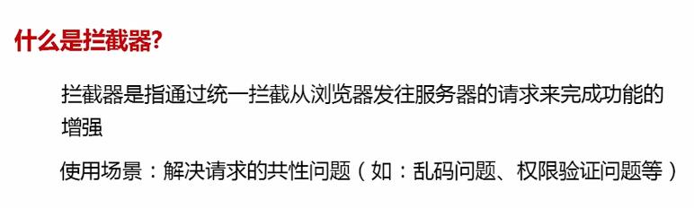
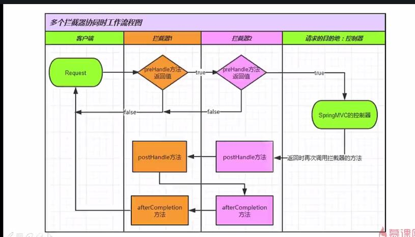
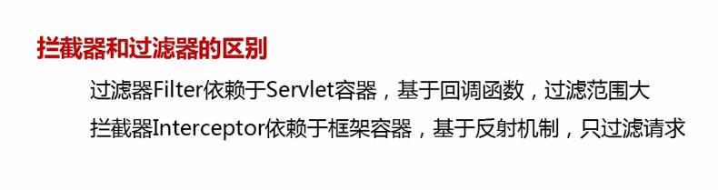
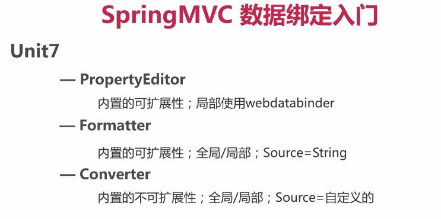

#### 拦截器

拦截器的概念

拦截器的工作原理

interceptor 拦截器  filter 过滤器

多个拦截器的执行顺序

除了继承 Handlerinterceptor 方法以外，还可以实现WebRequestInterceptor 接口， 但是它的preHandle方法没有返回值无法终止请求。   

拦截器的使用场景：处理所有请求的共性问题

乱码问题
登录权限问题

拦截器和过滤器的区别:

filer 还可以过滤一些资源，过滤的范围比较大 一般配置在web.xml中

interceptor 配置在spring的配置当中。

