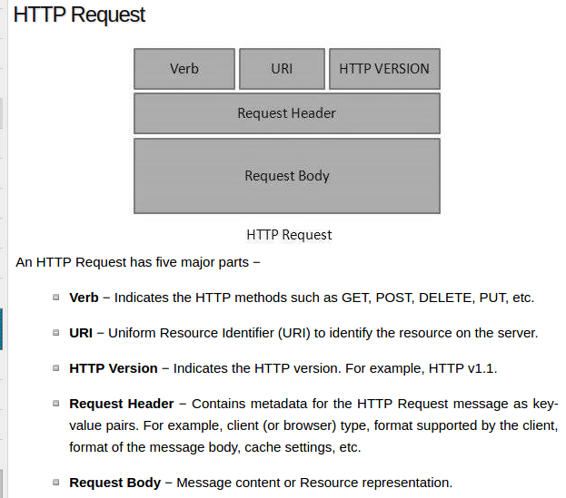
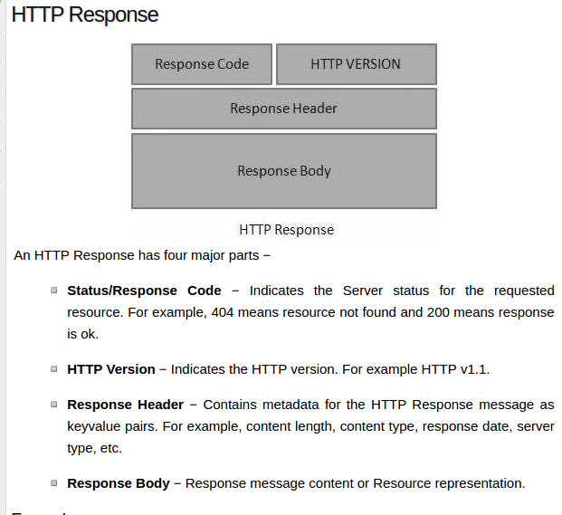
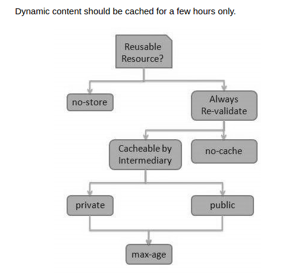

### restful web service

[introduction](https://www.tutorialspoint.com/restful/restful_introduction.htm)

REST stands for REpresentational State Transfer.
REST is a web standards based architecture and uses HTTP Protocol for data communication.
It revolves around resources where **every component is a resource and a resource is accessed by a common interface** using HTTP standard methods

In REST architecture,**a REST Server simply provides access to resources and the REST client accesses and presents the resources**

each resource is identified by URIs/ Global IDs.

REST uses various representations to represent a resource where Text, JSON, XML. The most popular representations of resources are XML and JSON.

A web service is a collection of open protocols and standards used for exchanging data between applications or systems

Software applications written in various programming languages and running **on various platforms** can use web services to exchange data over computer networks like the Internet in a manner similar to inter-process communication on a single computer.

RESTful Web Services. These web services use HTTP methods to implement the concept of REST architecture.A RESTful web service usually defines a URI (Uniform Resource Identifier), which is a service that provides resource representation such as JSON and a set of HTTP Methods.

REST architecture treats every content as a resource.

Representation of Resources
A resource in REST is a similar Object in Object Oriented Programming or is like an Entity in a Database. Once a resource is identified then its representation is to be decided using a standard format so that the server can send the resource in the above said format and client can understand the same format.

RESTful Web Services make use of HTTP protocols as a medium of communication between client and server.

Http 请求

A client sends a message in form of a HTTP Request and the server responds in the form of an HTTP Response






>address:<protocol>://<service-name>/<ResourceType>/<ResourceID>

Another important attribute of a request is VERB which identifies the **operation** to be performed on the resource.

URI命名规范

避免使用get等操作在URI中，用_而不是-，尽量使用小写。

Verbs 资源操作

GET operations are read only and are safe.

PUT and DELETE operations are idempotent means their result will always same no matter how many times these operations are invoked.

PUT and POST operation are nearly same with the difference lying only in the result where PUT operation is idempotent and POST operation can cause different result

``` java
@Override
   public boolean equals(Object object){
      if(object == null){
         return false;
      }else if(!(object instanceof User)){
         return false;
      }else {
         User user = (User)object;
         if(id == user.getId()
            && name.equals(user.name)
            && profession.equals(user.profession)
         ){
            return true;
         }			
      }
      return false;
   }
```

service 服务代码

``` java
@Path("/UserService")
public class UserService {

   UserDao userDao = new UserDao();
   private static final String SUCCESS_RESULT="<result>success</result>";
   private static final String FAILURE_RESULT="<result>failure</result>";


   @GET
   @Path("/users")
   @Produces(MediaType.APPLICATION_XML)
   public List<User> getUsers(){
      return userDao.getAllUsers();
   }

   @GET
   @Path("/users/{userid}")
   @Produces(MediaType.APPLICATION_XML)
   public User getUser(@PathParam("userid") int userid){
      return userDao.getUser(userid);
   }

   @POST
   @Path("/users")
   @Produces(MediaType.APPLICATION_XML)
   @Consumes(MediaType.APPLICATION_FORM_URLENCODED)
   public String createUser(@FormParam("id") int id,
      @FormParam("name") String name,
      @FormParam("profession") String profession,
      @Context HttpServletResponse servletResponse) throws IOException{
      User user = new User(id, name, profession);
      int result = userDao.addUser(user);
      if(result == 1){
         return SUCCESS_RESULT;
      }
      return FAILURE_RESULT;
   }

   @PUT
   @Path("/users")
   @Produces(MediaType.APPLICATION_XML)
   @Consumes(MediaType.APPLICATION_FORM_URLENCODED)
   public String updateUser(@FormParam("id") int id,
      @FormParam("name") String name,
      @FormParam("profession") String profession,
      @Context HttpServletResponse servletResponse) throws IOException{
      User user = new User(id, name, profession);
      int result = userDao.updateUser(user);
      if(result == 1){
         return SUCCESS_RESULT;
      }
      return FAILURE_RESULT;
   }

   @DELETE
   @Path("/users/{userid}")
   @Produces(MediaType.APPLICATION_XML)
   public String deleteUser(@PathParam("userid") int userid){
      int result = userDao.deleteUser(userid);
      if(result == 1){
         return SUCCESS_RESULT;
      }
      return FAILURE_RESULT;
   }

   @OPTIONS
   @Path("/users")
   @Produces(MediaType.APPLICATION_XML)
   public String getSupportedOperations(){
      return "<operations>GET, PUT, POST, DELETE</operations>";
   }
}

```

As per the REST architecture, a RESTful Web Service should not keep a client state on the server. This restriction is called **Statelessness.**（无状态）

缓存 (Caching)

Caching refers to storing the server response in the client itself, so that a client need not make a server request for the same resource again and again. A server response should have information about how caching is to be done, so that a client caches the response for a time-period or never caches the server response.



[javaee 6 tutorial](http://docs.oracle.com/javaee/6/tutorial/doc/gijqy.html)


POJO means Plain Old Java Object.

**It refers to a Java object (instance of definition) that isn't bogged down by framework extensions.**


JAX-RS stands for JAVA API for RESTful Web Services.

@Path: Relative path of the resource class/method.

@Get HTTP Get request, used to fetch resource.

@PUT HTTP PUT request, used to create resource.

@POST HTTP POST request, used to create/update resource.

@DELETE HTTP DELETE request, used to delete resource.

@HEAD HTTP HEAD request, used to get status of method availability.

@Produces States the **HTTP Response generated by web service.** For example, APPLICATION/XML, TEXT/HTML, APPLICATION/JSON etc.

@Consumes  States the **HTTP Request type.** For example, application/x-www-formurlencoded to accept form data in HTTP body during POST request.


@PathParam Binds the parameter passed to the method to a value in path.

@QueryPara Binds the parameter passed to method to a query parameter in the path.

@MatrixParam Binds the parameter passed to the method to a HTTP matrix parameter in path.

@HeaderParam Binds the parameter passed to the method to a HTTP header.

@CookieParam Binds the parameter passed to the method to a Cookie.

@FormParam Binds the parameter passed to the method to a form value.

@DefaultValue Assigns a default value to a parameter passed to the method.

@Context Context of the resource. For example, HTTPRequest as a context.

runtime reflection will generate the helper classes and artifacts for the resource
