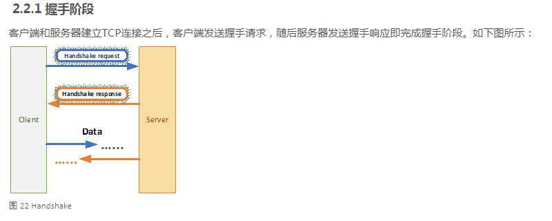
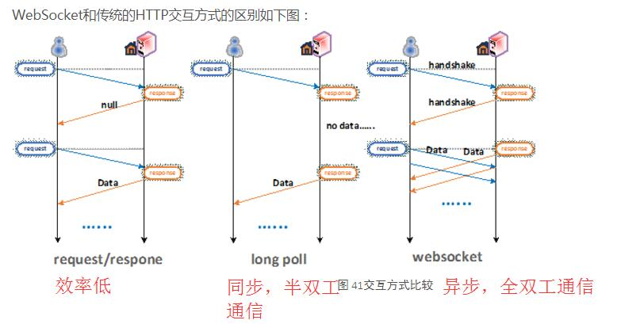

##### websocket

WebSocket用于在Web浏览器和服务器之间进行任意的**双向数据传输**的一种技术。WebSocket协议**基于TCP协议实现**，包含初始的握手过程，以及后续的**多次数据帧双向传输**过程。(全双工通信，异步)

其目的是在**WebSocket应用和WebSocket服务器进行频繁双向通信**时，可以使服务器**避免打开多个HTTP连接**进行工作来节约资源，提高了工作效率和资源利用率。(长连接)

全双工的长连接

特点：

基于TCP实现;

是一种全双向的通信, 具有底层socket的特点;

节约带宽，节省服务器资源

#### 应用

1. 当服务器有更新时，需要立即将数据发送给客户端，这就是基于服务器端的推送技术。

2. 多人在线聊天

3. 多人的数据操作的在线实时同步

###### 和轮循，长连接的区别

1)轮询：客户端设置一个时间间隔，时间到以后，向服务器发送request询问有无新数据，服务器立即返回response，如果有更新则携带更新的数据。不断发送 http request

2)长连接(long poll): 和轮询相似，但是为 **阻塞模式的轮询** ，客户端请求新的数据request, **服务器会阻塞请求**，直到有新数据后才返回response给客户端；然后客户端再重复此过程。

这两种方式的特点，不断的建立HTTP连接，然后发送请求request，之后服务器等待处理。服务端体现的是一种**被动性**，同时这种处理方式，**非常耗费网络带宽和服务器资源**。

###### WebSocket技术的优点：

1）通过第一次HTTP Request建立了连接之后，**后续的数据交换都不用再重新发送 HTTP Request，节省了带宽资源**；

2) WebSocket的连接是双向通信的连接，在同一个TCP连接上，既可以发送，也可以接收;

3)具有多路复用的功能(multiplexing)，也即几个不同的URI可以复用同一个WebSocket连接。这些特点非常类似TCP连接，但是因为它借用了HTTP协议的一些概念，所以被称为了WebSocket。

##### WebSocket协议运作方式

协议分为：握手阶段 和 数据通信阶段。

WebSocket为应用层协议，其定义在TCP/IP协议栈之上。WebSocket连接服务器的URI以**"ws"或者"wss"**开头。ws开头的默认TCP端口为80，wss开头的默认端口为443**。

###### 握手阶段

客户端和服务器建立TCP连接之后，客户端发送握手请求，随后服务器发送握手响应即完成握手阶段。

websocket 可基于 HTTP 建立, 即 ws 协议, 也可基于 HTTPS 建立, 即 wss 协议, 果然是复用了 HTTP 的基础设施。

websocket 一开始还是按 HTTP 协议通信, 随后才转换成 websocket。

由于 websocket 收发消息的含义在建立 websocket 连接时便已经确认, 收发消息时可以省去很多头信息和参数, 包括标识会话的 cookie 信息, 有效节约带宽。

需要关闭连接时，任意一方直接发送类型为关闭帧(Close frame)的控制帧数据给对方即可。

###### 数据通信阶段

WebSocket的数据在发送时，被组织为依次序的一串数据帧(data frame)，然后进行传送。

传送的帧类型分为两类：**数据帧(data frame)和控制帧(Control frame)**。

数据帧可以携带**文本数据或者二进制数据**；控制帧包含**关闭帧(Close frame)和Ping/Pong帧**。

Ping/Pong帧： Ping帧 和 Pong帧 用于连接的**保活(keepalive)或者诊断对端是否在线**。这两种帧的发送和接收不对WEB应用公开接口，由实现WebSocket协议的底层应用(例如浏览器)来实现它。

###### 连接关闭

任何一端发送关闭帧给对方，即可关闭连接。关闭连接时通常都带有关闭连接的状态码(status code)。

1000 连接正常关闭; 1002 端点因为协议错误而中断连接;

和其他协议的区别：

##### 项目的实现

java的实现：

java 定义了一套 javax.servlet-api, 一个 HttpServlet 就是一个 HTTP 服务。java websocket 并非基于 servlet-api 简单扩展, 而是新定义了一套 javax.websocket-api。一个 websocket 服务对应一个 Endpoint。与ServletContext 对应, websocket-api 也定义了 WebSocketContainer, 而编程方式注册 websocket 的接口是继承自WebSocketContainer 的 ServerContainer。一个 websocket 可以接受并管理多个连接, 因此可被视作一个 server。主流 servlet 容器都支持 websocket, 如 tomcat, jetty 等。

**Endpoint 是有状态的, 容器为每个会话创建一个 Endpoint 对象实例, 维护当前会话状态信息**。 所以注册 Endpoint 必须使用类而不能使用对象, 且 Endpoint 类必须有无参构建函数。而 Servlet 是无状态的, 可以使用 Servlet 实例注册, 多连接**多线程均只有一个 Servlet 对象实例** (servlet是线程不安全的，只能在方法里面使用)。

websocket 连接是**有状态的, 必须使用长连接**,  一个连接天然就是一个 **会话 session**。 HTTP 连接是无状态的, Servlet 借助 cookie 管理会话, 对是否长连接无感知。 注意: websocket 长连接与 HTTP 长连接有很大不同。HTTP 长连接只是**为了向同一服务器发送请求时复用已有的 TCP 连接, 优化性能, 发送请求带不同的 cookie 就可能关联不同的 HTTP session**。 一个 websocket 长连接**只为一个会话服务, 只能收发该会话的消息**。 HTTP 长连接转化为 websocket 后, 就不能再用于发送 HTTP 请求。

HTTP（1.0, 1.1 支持异步请求） 请求是**串行的**, 一个 HTTP 长连接必须在上一个请求响应返回后, 才能继续发送请求。 websocket 双方可以自由收发消息, 不必等待, 刚收到的消息未必与刚发出去的消息对应。 收发消息的含义应该在建立 websocket 连接时便已经确认。

spring 的实现

到 java websocket-api 要求使用 Endpoint class 注册 websocket, 然后由 **Servlet 容器为每个连接创建 Endpoint 对象实例**, 这样就很难将 Endpoint 实例纳入 spring 容器中。spring 对 websocket 的处理与使用 DispatcherServlet 处理 HTTP 请求类似。spring 定义了 WebSocketHandler 接口处理 websocket 请求, 类似 HTTP 的 HttpRequestHandler。然后 **spring 拦截所有托管的 websocket 请求, 分发到 WebSocketHandler 上**。唯一的缺点是 WebSocketHandler 与HttpRequestHandler 一样是无状态的单例, 不能直接保存单个会话状态, 然而这并没有关系。

[newcode for websocket](https://www.nowcoder.com/discuss/21019)

项目中采用了 tomcat 来实现 websocket.

##### 提高 websocket 的连接的数目

服务器的参数调优: 一般会修改两个文件，/etc/sysctl.conf和/etc/security/limits.conf， 用来配置TCP/IP参数和最大文件描述符。

应用运行时调优:Java 应用内存调优, 服务器使用12G内存，吞吐率优先的垃圾回收器：
