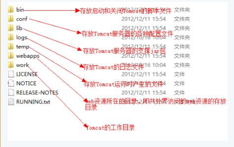

#### Tomcat web 容器

Tomcat依赖<CATALINA_HOME>/conf/server.xml这个配置文件启动server（一个Tomcat实例，核心就是启动容器Catalina）。

Tomcat部署Webapp时，依赖context.xml和web.xml 两个配置文件部署web应用。

tomcat根目录在tomcat中叫<CATALINA_HOME>

<CATALINA_HOME>/bin：存放各种平台下启动和关闭Tomcat的脚本文件.其中有个档是catalina.bat,打开这个windows配置文件,在
非注释行加入JDK路径,例如 : SET  JAVA_HOME=C:\j2sdk1.4.2_06 保存后,就配置好tomcat环境了. 

startup.bat是windows下启动tomcat的文件. shutdown.bat是关闭tomcat的文件.

<CATALINA_HOME>/conf：存放不同的配置文件（如：server.xml和web.xml）； 

　　server.xml文件:该文件用于配置和server相关的信息，比如**tomcat启动的端口号、配置host主机、配置Context**

　　web.xml文件：**部署描述文件，这个web.xml中描述了一些默认的servlet，部署每个webapp时，都会调用这个文件，配置该web应用的默认servlet。**

　　tomcat-users.xml文件：配置tomcat的用户密码与权限。

　　context.xml：定义web应用的默认行为。
<CATALINA_HOME>/lib：存放Tomcat运行需要的库文件（JARS）； 
<CATALINA_HOME>/logs：存放Tomcat执行时的LOG文件； 
<CATALINA_HOME>/temp: 运行时产生的文件。
<CATALINA_HOME>/webapps：Tomcat的主要Web发布目录（包括应用程序示例）； 
<CATALINA_HOME>/work：存放jsp编译后产生的class文件； 

#### 技术的架构

Tomcat Server 

Tomcat的一个实例，通常一个JVM只能包含一个Tomcat实例。因此一台物理服务器上可以在启动多个JVM的情况下在每一个JVM中启动一个Tomcat实例。每个实例分属于一个独立的管理端口。这是一个Tomcat **顶级组件**。

Service

一个服务组件通常包含一个引擎(Enginne, 负责处理所有Connector所获得的客户请求)和与此引擎相关联的一个或多个连接器(Connect)。给服务器命名可以方便管理员在日志文件中识别不同服务产生的日志。一个server可以包含多个service组件，但通常情况下只为一个service指派一个server。

connector

一个Connector将在某个指定端口上**侦听客户请求**，并将获得的请求交给Engine来处理，从Engine处获得回应并返回客户
TOMCAT有两个典型的Connector: 直接侦听来自browser的http请求 ; 来自其它WebServer的请求

Coyote Http/1.1 Connector 在端口8080处侦听来自客户browser的http请求
Coyote JK2 Connector 在端口8009处侦听来自其它WebServer(Apache)的servlet/jsp代理请求

server -->  service --> connector --> engine --> virtual host --> context --> servlet

Engine

处理请求的Servlet引擎组件，即Catalina Servlet引擎. Engine下可以配置多个虚拟主机Virtual Host，每个虚拟主机都有一个域名, 当Engine获得一个请求时，它把该请求匹配到某个Host上，然后把该请求交给该Host来处理
,并将请求处理后的结果返回给响应客户端,Engine有一个默认虚拟主机，当请求无法匹配到任何一个Host上的时候，将交给该默认Host来处理

Host

代表一个Virtual Host，虚拟主机,**每个虚拟主机和某个网络域名Domain Name相匹配.每个虚拟主机下都可以部署(deploy)一个或者多个Web App**，每个Web App对应于一个**Context**，有一个Context path,**当Host获得一个请求时，将把该请求匹配到某个Context上**，然后把该请求交给该Context来处理.匹配的方法是“最长匹配”，所以一个path==”"的Context将成为该Host的默认Context.所有无法和其它Context的路径名匹配的请求都将最终和该默认Context匹配.

Context

一个Context对应于 **一个Web Application**，一个Web Application**由一个或者多个Servlet组成**
Context在创建的时候将根据配置文件和CATALINAHOME/conf/web.xml和WEBAPP_HOME/WEB-INF/web.xml载入Servlet类
**当Context获得请求时，将在自己的映射表(mapping table)中寻找相匹配的Servlet类**
如果找到，则执行该类，获得请求的回应，并返回。

##### Tomcat 的启动过程。

【Tomcat的启动过程】

1. Tomcat 先根据/conf/server.xml 下的配置启动Server，再加载Service，对于与Engine相匹配的Host，每个Host 下面都有一个或多个Context。

注意：Context 既可配置在server.xml 下，也可配置成一单独的文件，放在conf\Catalina\localhost 下，简称应用配置文件。

2. Web Application 对应一个Context，每个Web Application 由一个或多个Servlet 组成。当一个Web Application 被初始化的时候，它将用自己的ClassLoader 对象载入部署配置文件web.xml 中定义的每个Servlet 类：

**它首先载入在$CATALINA_HOME/conf/web.xml中部署的 Servlet 类，然后载入在自己的 Web Application 根目录下WEB-INF/web.xml 中部署的Servlet类。**

web.xml 文件有两部分：Servlet 类定义 (<servlet>) 和Servlet 映射定义 (<servlet-mapping>)。

** 每个被载入的Servlet 类都有一个名字，且被填入该Context 的映射表(mapping table)中，和某种URL 路径对应。当该Context 获得请求时，将查询mapping table，找到被请求的Servlet，并执行以获得请求响应。**

对于Tomcat 来说，主要就是以下三种文件：conf下的 server.xml、web.xml，以及项目下的 web.xml，加载就是读取这些配置文件

##### Tomcat部署webapp

一个Context对应于一个Web App，每个Web App是由一个或者多个servlet组成的。

当一个 Web App被初始化的时候，便会为这个webapp创建一个context对象，并把这个context对象 **注册到指定虚拟主机（host）**上，接着，它将用自己的ClassLoader对象载入“部署配置文件web.xml”中定义的每个servlet类。它首先载入在$CATALINA_HOME/conf/web.xml中部署的servlet类，然后载入在自己的Web App根目录下的WEB-INF/web.xml中部署的servlet类。

web.xml文件有两部分：servlet类定义 和 servlet映射定义

每个被载入的servlet类都有一个名字，且被填入该Context的映射表(mapping table)中，和某种URL PATTERN对应。当该Context获得请求时，将查询mapping table，找到被请求的servlet，并执行以获得请求回应

而 context.xml 文件则不然， tomcat 服务器会定时去扫描这个文件。一旦发现文件被修改（时间戳改变了），就会自动重新加载这个文件，而不需要重启服务器 。

#####  context.xml 的三个作用范围

1. tomcat server级别：

在/conf/context.xml里配置。（因为这个context.xml是每个webapp都会读取的，所以在这个文件里面定义的节点都是全局性的，即每个webapp都会出现）

2. Host级别：（有多个虚拟主机的时候才会用到）

在/conf/Catalina/${hostName}里添加context.xml，继而进行配置

3. web app 级别：（这个context.xml是对应各自特定webapp的，属于webapp内部）

在/conf/Catalina/里添加hostName里添加{webAppName}.xml，继而进行配置（这个Context）

##### Tomcat Server处理一个http请求的过程

假设来自客户的请求为：

http://localhost:8080/wsota/wsota_index.jsp

1. 请求被发送到本机端口8080，被在那里侦听的Coyote HTTP/1.1 Connector获得 (Connect 侦听到)
2. Connector把该请求交给它所在的Service的Engine来处理，并等待来自Engine的回应 (交给 engine 进行处理)
3. Engine获得请求localhost/wsota/wsota_index.jsp，匹配它所拥有的所有虚拟主机Host (engine 匹配 host 主机)
4. Engine匹配到名为localhost的Host（即使匹配不到也把请求交给该Host处理，因为该Host被定义为该Engine的默认主机）
5. localhost Host获得请求/wsota/wsota_index.jsp，匹配它所拥有的所有Context.(host 根据 contextpath 找到 context)
6. path=”/wsota”的Context获得请求/wsota_index.jsp，在它的mapping table中寻找对应的servlet 
7. Context匹配到URL PATTERN为*.jsp的servlet，对应于JspServlet类 (将查询mapping table，找到被请求的servlet, 交给servlet 执行请求) 
8. 构造HttpServletRequest对象和HttpServletResponse对象，作为参数调用JspServlet的doGet或doPost方法
	( 构造 request 对象和 response 对象来调用 servlet 执行 )
9. Context把执行完了之后的HttpServletResponse对象返回给Host。（将执行结果返回给 host）
10. Host把HttpServletResponse对象返回给Engine (由host 返回给engine)
11. Engine把HttpServletResponse对象返回给Connector (返回给 connector )
12. Connector把HttpServletResponse对象返回给客户browser ( connector 将对象返回给browser )

#### 源码解析

从 Service 接口中定义的方法中可以看出，它主要是为了关联 Connector 和 Container，同时会初始化它下面的其它组件，注意接口中它并没有规定一定要控制它下面的组件的生命周期。

所有组件的生命周期在一个 Lifecycle(使组件具有生命周期) 的接口中控制。
 
Connector 组件是 Tomcat 中两个核心组件之一，它的主要任务是**负责接收浏览器的发过来的 tcp 连接请求，创建一个 Request 和 Response 对象分别用于和请求端交换数据，然后会产生一个线程来处理这个请求并把产生的 Request 和 Response 对象传给处理这个请求的线程**，处理这个请求的线程就是 Container 组件要做的事了。

多线程的处理是 Connector 设计的核心。

Servlet 容器“Container”

Container 是容器的父接口，所有子容器都必须实现这个接口，Container 容器的设计用的是典型的责任链的设计模式，它有四个子容器组件构成，分别是：** Engine、Host、Context、Wrapper**，这四个组件不是平行的，而是父子关系，Engine 包含 Host,Host 包含 Context，Context 包含 Wrapper。通常一个 Servlet class 对应一个 Wrapper，如果有多个 Servlet 就可以定义多个 Wrapper，如果有多个 Wrapper 就要定义一个更高的 Container 了

容器的总体设计
Context 还可以定义在父容器 Host 中，Host 不是必须的，但是要运行 war 程序，就必须要 Host，因为 war 中必有 web.xml 文件，这个文件的解析就需要 Host 了，如果要有多个 Host 就要定义一个 top 容器 Engine 了。而 Engine 没有父容器了，一个 Engine 代表一个完整的 Servlet 引擎。

[源码解析 Tomcat ](https://www.ibm.com/developerworks/cn/java/j-lo-tomcat1/index.html)
